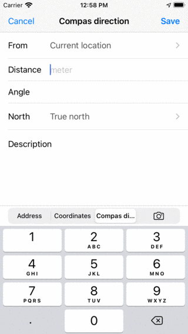
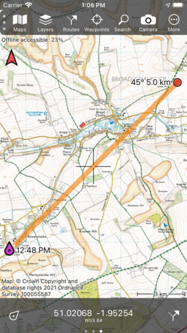
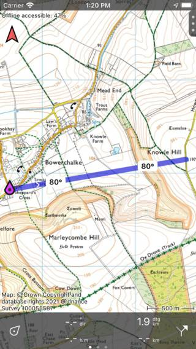

.. _ss-compass-direction:

Compass direction
=================
A compass direction is a line of a certain length from a certain point in a certain direction.

Creating a compass direction
~~~~~~~~~~~~~~~~~~~~~~~~~~~~
To add a compass direction to the map, tap :ref:`Menu <sec-menu>` > Search and select the tab 'Compass direction' above the keyboard.

The compass direction screen will appear like in the figure below:

   
   *The compass direction screen.*

In the compass direction screen you can subsequently add the following fields:

- *From*: Here you can set the starting point of the compass direction. Most often it is your current location. If you tap this field you can enter another location or coordinates.
- *Distance*: Here you can enter the length of the compass direction in the displayed units.
- *Angle*: Here you can enter the angle with respect to the true north or magnetic north. If you do not enter a value, the value of the direction in which you point your device is used. This value is displayed in lighter color as a placeholder in this field.
- *North*: Here you can set the kind of north the angle is referring to. If you are entering a reading of a compass, you might want to set it to magnetic north, so that a correct magnetic declination correction can be applied.
- *Description*: Optionally you can add a description.

If you have entered all values, you can tap 'Save'. The compass direction will be saved, and can be found back in the :ref:`routes screen <sec-routes-load>`. You will return to the main screen and the compass direction will be shown as a route on the map. 

As an example we now create a compass direction direction of 5000 m with a direction of 45 degrees with respect to the true north. The result is displayed in the figure below:

   *A compass direction was added to the map.*

If you are using compass directions it might also be useful to :ref:`enable the true north arrow <ss-settings-true-north>`. This is an arrow on the main screen that shows the direction of the true north on the map. 

The :ref:`direction you are travelling in <ss-speed>` can also be displayed on the dashboard.

Finding a compass direction
~~~~~~~~~~~~~~~~~~~~~~~~~~~
To find a compass direction, you first have to :ref:`enable the route course markers <ss-settings-route-course-markers>` in the settings. 

Then you can :ref:`plan a route to a point <sec-route-plan>`, for example with the transportation means 'Crow fly'.

If you do that and return to the main screen, the route with the compass direction is shown on the map. An example is shown below:

   
   *Finding a compass direction.*
   
In the example above, we have planned a 'Crow fly' route from our current location to the Knowle Hill.
The route course markers are displayed on the route. From these markers we can see that we have to travel in 80 degrees with respect to the true north to get from our current location to the Knowle Hill.

