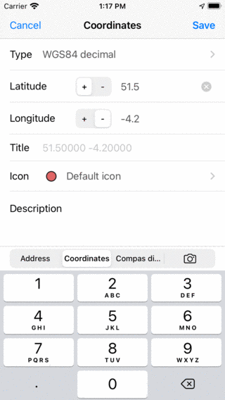
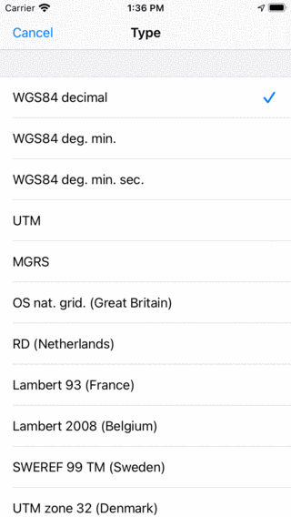
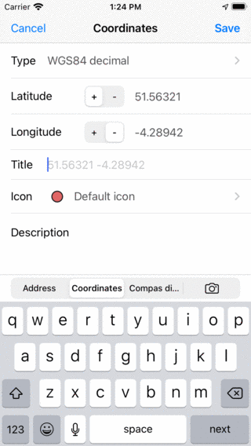
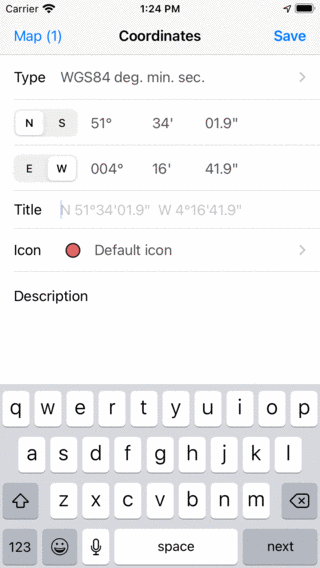
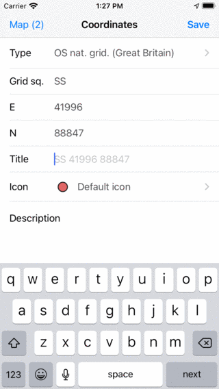
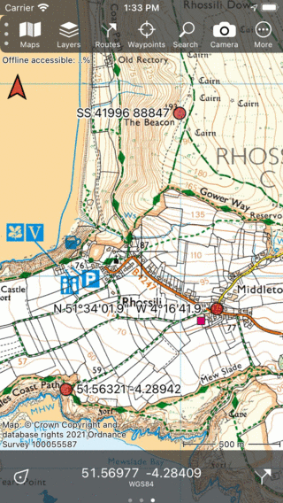
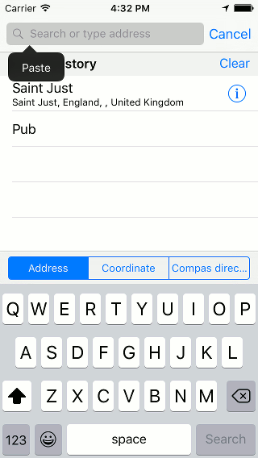
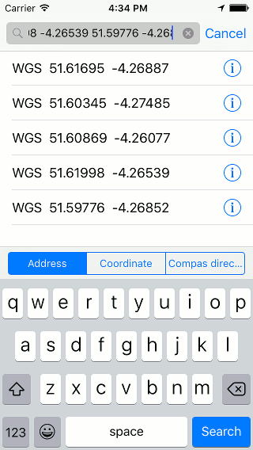
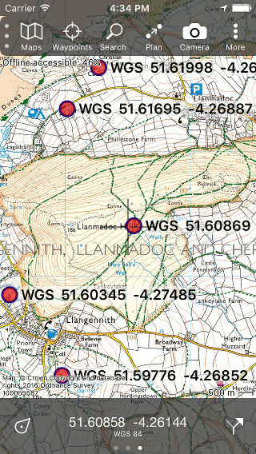

.. _sec-entering-coordinates:

Entering coordinates
====================
To enter coordinates you first have to tap :ref:`Menu <sec-menu>` > Search. Then tap the 'Enter coordinates' item in the pop-up that appears. An example is shown in the figure below:

   *The coordinates input screen.*

.. _ss-coordinates-type:

Coordinates type
~~~~~~~~~~~~~~~~
To enter coordinates you have first to make sure that the right coordinates type has
been set. If you press the ‘Type’ cell a screen will appear in which you can
change the coordinates type, like in the figure below: 

   *Choosing the coordinates type.*

You can choose between different coordinates types, including:
`WGS84 <https://en.wikipedia.org/wiki/WGS84>`_ decimal, `WGS84 <https://en.wikipedia.org/wiki/WGS84>`_ degrees minutes `WGS84 <https://en.wikipedia.org/wiki/WGS84>`_ degrees minutes seconds, `UTM <https://en.wikipedia.org/wiki/UTM>`_ and `MGRS <https://en.wikipedia.org/wiki/MGRS>`_. Next to that you can use various country specific coordinate systems.

.. _ss-coordinates-enter:

Entering coordinates
~~~~~~~~~~~~~~~~~~~~
If you have set the right coordinates type, you can enter the coordinates.

Depending on the position of the center of the map, the first digits of the coordinates are already entered. This makes it faster to enter coordinates
if the coordinates are not located far from the center of the map.

As an example we now will enter the WGS84 coordinates '51.56321 -4.28942':

   *Entering the coordinates 51.56321 -4.28942.
   
Optionally you can enter a title. As long as we do not enter a title, the suggested placeholder title will be used as a title for the waypoint. Next you could set the :ref:`icon <ss-waypoint-icons>` and enter a description.

If you tap ‘Save’ the coordinates will be saved as a :ref:`waypoint <sec-wp>`. The coordinates screen will be cleared, so that you can enter the next coordinates. The first digits will now be based on the previous input. On the top left of the screen a Map button will appear, with with you can return to the map. The number behind map tells you how many coordinates have been entered.

As an example we will now enter the coordinates: N 51°34’01.9” W 4°16’41.9”. To enter these coordinates we had to change the type to WGS degree, minutes, seconds. An example is shown below:

   *Entering the coordinates N 51°34’01.9” W 4°16’41.9”.*

Again we are happy with the suggested title and press save. The coordinates will be saved and the coordinates screen will be cleared, so that you can enter the next coordinates.

Now will we enter the Ordnance Survey National Grid coordinates SS 41996 88847, as is illustrated below.

   *Entering the coordinates SS 41996 88847.*

After pressing ‘Save’ the coordinates will be saved and the coordinates screen will again be cleared.

Displaying on map
~~~~~~~~~~~~~~~~~
After entering the coordinates, you can return to the map screen by
pressing the map button on the top left. The number of successfully entered
coordinates is displayed on the map button. After entering the three 
coordinates in the examples above and tapping 'Map' the main screen looks as follows:

   *Three entered coordinates are put as waypoints on the map.*

Entering a list of coordinates
~~~~~~~~~~~~~~~~~~~~~~~~~~~~~~
If you have received a list of coordinates in text format, you could enter them one-by-one via the coordinates input screen, 
as is explained above.

It could however be easier to select and copy these coordinates. Then select the tab ‘Address’ and then press long on the search box. 
A paste button will appear as is illustrated in the figure below:

   *Pasting a list of coordinates into the address search box.*

If you press ‘Paste’ the list of coordinates will be inserted and processed.
The resulting coordinates will be displayed in the list below the search
box, as is illustrated in the figure below:

   *A list of coordinates has been pasted into the search box.*

You can now load individual coordinates on the map, by tapping them. By pressing long on a result you can make a selection of results that you would like to load on the map. If you press ‘Search’ on the bottom right, all results will be loaded on the map, like in the figure below:

   *A list of coordinates has been placed on the map.*

