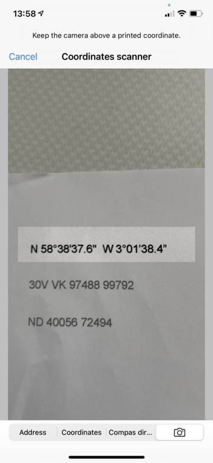
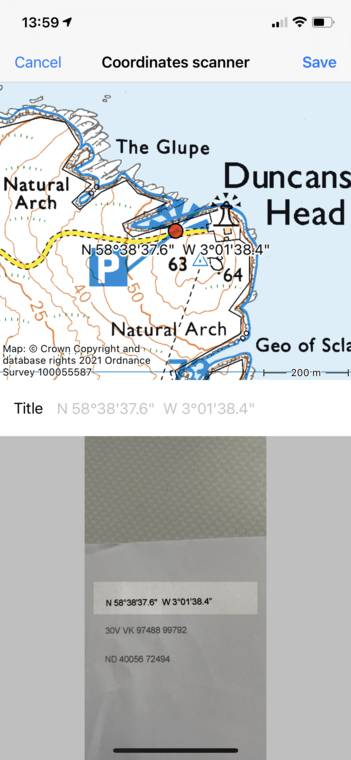
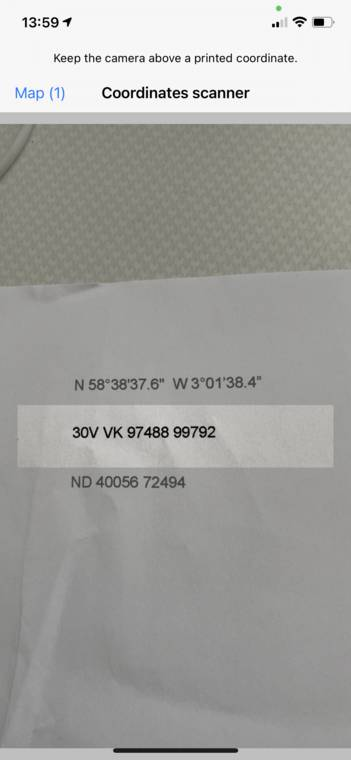
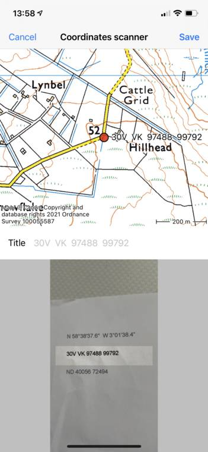
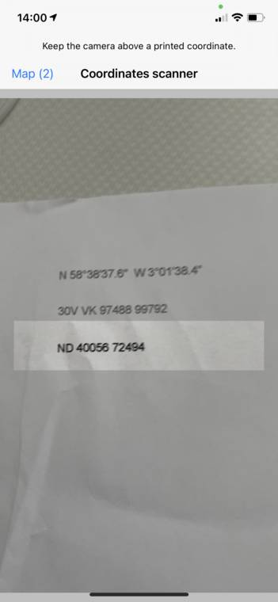
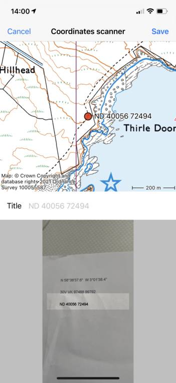
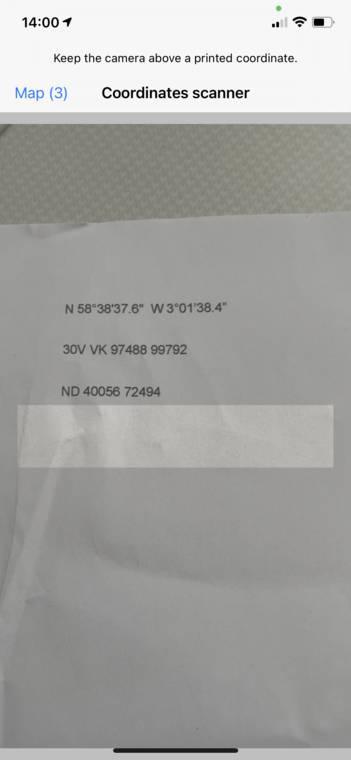
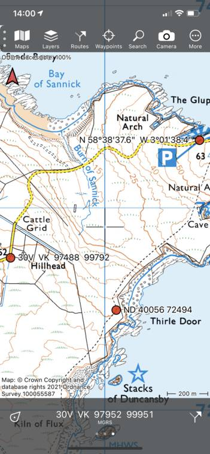

.. _sec-scanning-coordinates:

Scanning coordinates
====================

Topo GPS contains a coordinates scanner. The coordinates scanner can scan coordinates and show them on the map. You obtain the best results by scanning coordinates printed on paper. Scanning coordinates shown on a display is also possible. Scanning handwritten coordinates does not function very well.

The coordinates scanner is most often much faster any more accurate than :ref:`entering the coordinates <sec-entering-coordinates>`. 

To open the coordinates scanner, tap :ref:`Menu <sec-menu>` > Search. Then select the 'Camera' tab in the bottom.

To use the coordinates scanner you need to give Topo GPS permission to access your camera in the iOS Settings.

If you open the coordinates scanner you see the image of the camera. In the center there is a lighter rectangle. Place the rectangle above a coordinate. You can zoom in and out with two fingers to focus the rectangle on the coordinate. An example is shown below:

   
   *Scanning coordinates*
   

   
   *Scanning coordinates*
   

   
   *Scanning coordinates*
   

   
   *Scanning coordinates*
   

   
   *Scanning coordinates*
   

   
   *Scanning coordinates*
   

   
   *Scanning coordinates*
   

   
   *Scanning coordinates*
   

