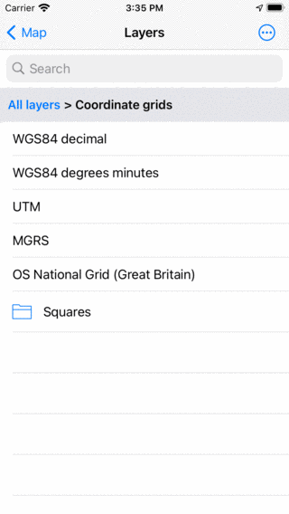
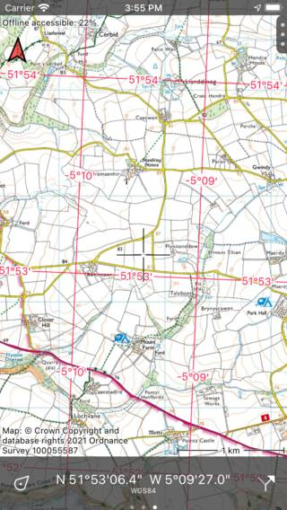
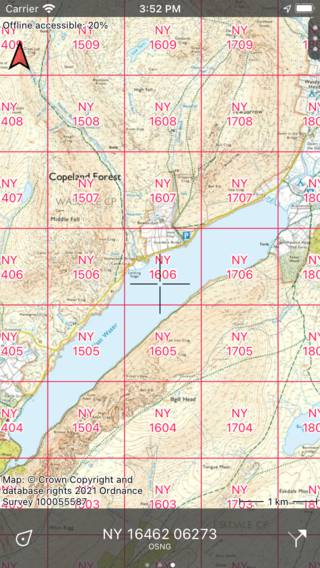
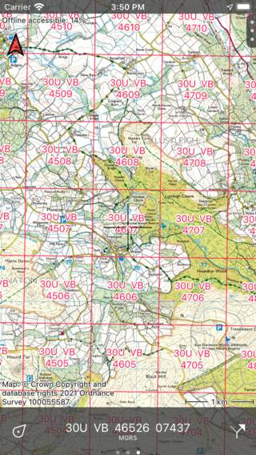
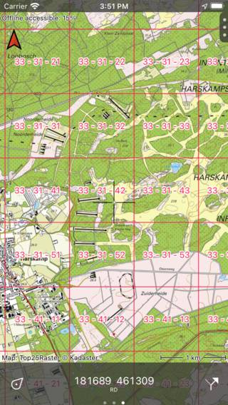

.. _sec-coordinate-grids:

Coordinate grids
================
Coordinate grids are a collection of curves at regular intervals that show a coordinate system.

To add a coordinate grid to the map, go to :ref:`Menu <sec-menu>` > Layers > Coordinate grids. The following screen will appear:

   *Coordinate grids in the layers screen.*

If you tap a coordinate grid it will be loaded map and you will return to the main screen.
If you return to the coordinate grids screen, the loaded grid will have a grey background. If you tap it, it will be removed from the map.

Sliding the dashboard to the :ref:`coordinates panel <ss-coordinates-panel>` is useful for read off the coordinates from the map.

In the figures below several examples of coordinates grids are displayed.

   *WGS84 degree minutes coordinates grid.*
   

   *Ordnance Survey National Grid coordinates grid.*
   

   *MGRS coordinates grid.*
   

   *RD atlasblokken coordinates grid.*
   
   

