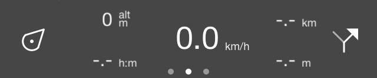
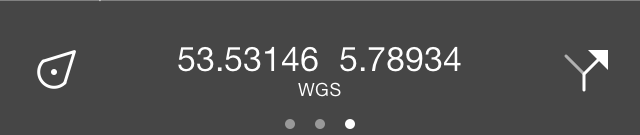
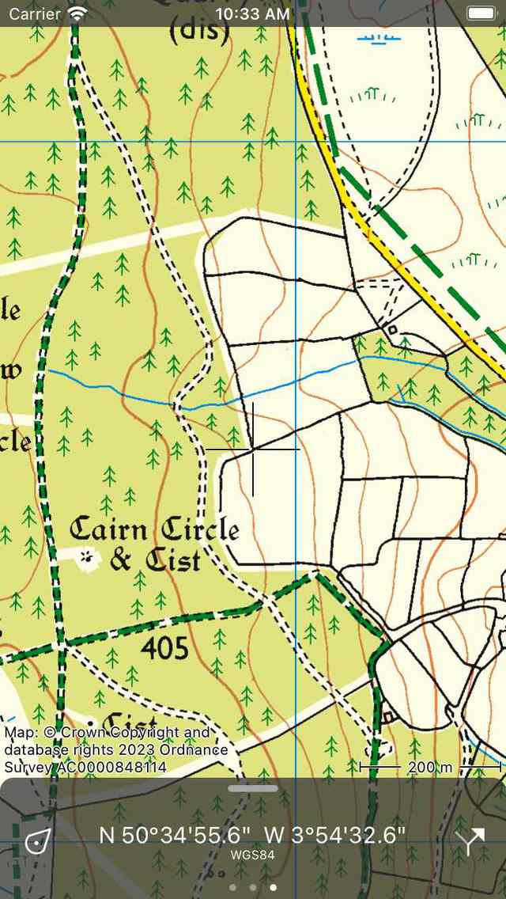
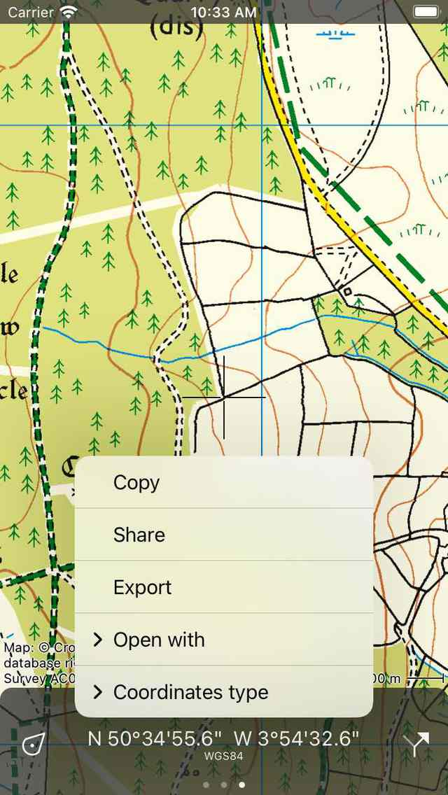
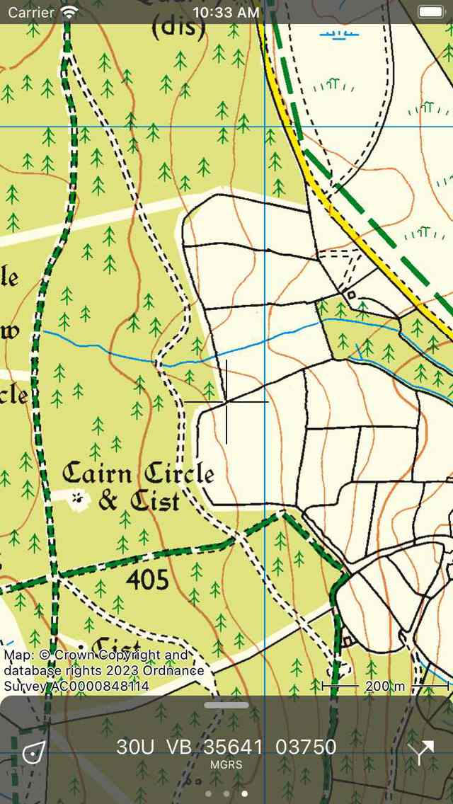

.. _sec-dashboard:

Dashboard
=========
The bottom bar in the :ref:`main screen <sec-main-screen>` is the dashboard:

   *The dashboard on the bottom of the main screen.*

The dashboard consists out of three items: the :ref:`position button <ss-position-button>`, 
a :ref:`panel <ss-panel>` with counters and the :ref:`route button <ss-route-button>`. These items are discussed in more detail below.
If you swipe the dashboard updward, the :ref:`menu <sec-menu>` will become visible.

.. _ss-position-button:

Position button
---------------
By tapping the position button on the left hand side of the dashboard you can :ref:`center <ss-map-center>` and :ref:`rotate <ss-map-rotate>` the map.

If you press long on the position button, the :ref:`current location screen <ss-current-location-screen>` will appear. In this screen you can find the coordinates of your current location among other things.

.. _ss-route-button:

Route button
------------
By tapping the route button on the right hand side of the dashboard (arrowed icon) the :ref:`routes pop-up <sec-routes-screen>` will appear. Via this pop-up you can do everything with routes, like loading, planning, generating, and importing routes.

It is possible to change the button on the right hand side of the dashboard via :ref:`Menu > More > Settings > Dashboard <sec-settings-dashboard>`. For example if you take a lot of photo's you might want to set it to 'Camera'. All functions are also always accessible via the :ref:`menu <sec-menu>`.

.. _ss-panel:

Panels
------

In the center of the dashboard you can find a panel with counters. There
are three panels

- The :ref:`hiking panel <ss-hiking-panel>`. 
- The :ref:`cycling panel <ss-cycling-panel>`. 
- The :ref:`coordinate panel <ss-coordinate-panel>`. 

The circles below the panel indicate the selected panel. By swiping a panel with one finger to the left or
the right you can load the next or previous panel.

The units of the meters on the dashboard can be changed via :ref:`
Menu > More > Settings > Units <sec-settings-units>`. You can choose between metric, imperial, and nautical units.

.. _ss-hiking-panel:

Hiking panel
------------
The hiking panel is ideal for walking and is shown below:

   *The dashboard with the hiking panel.*

The four counters on the hiking panel are subsequently the :ref:`speedo/alti/direction meter <ss-speed>`,
the :ref:`route distance meter <ss-route-distance>`, the :ref:`record timer <ss-rec-timer>`
and the :ref:`record distance meter <ss-rec-distance>`.

.. _ss-speed:

Speedometer, altimeter and direction meter
~~~~~~~~~~~~~~~~~~~~~~~~~~~~~~~~~~~~~~~~~~
The speedometer (km/h symbol top left) indicates the your current speed.

If tap the speedometer the average speed while recording a route will be shown. This is indicated by the symbol
'avg' direct above the 'km/h' symbol.

If tap press the speedometer once more, your maximum speed while recording a route will be shown. This is indicated by the
symbol 'max' just above the 'km/h' symbol.

If you finish recording a route and start a new recording, the average and maximum speeds will be reset.

If you press the speedometer once more it turns into an altimeter. Your altitude in meters above sea level will be shown. This is indicated
by the symbol 'alt'.

If you tap the altimeter, the direction meter with the symbol 'dir' will be shown. This indicates the current direction with respect to the true north.
The direction is the compass direction in which you point your device if you are standing still. If you move it is the direction of movement.

If you tap the direction meter, it will turn in the speedometer.

.. _ss-route-distance:

Route distance meter
~~~~~~~~~~~~~~~~~~~~
The route distance meter (-.- km top right) indicates the length of all routes that are :ref:`loaded <sec-routes-load>` on the map, including planned routes. 
If a route has been loaded the symbol 'rte' appears just above the 'km/h' to indicate that this is the distance of a loaded route.

If routes have been loaded and you tap the route distance meter, the map will be centered on the loaded routes.

If you are on a route, the route distance meter will automatically change to distance to go (dtg). If the 'dtg' symbol is shown the meter indicates the distance to the end of the current route. If you tap the meter in that case, the map will be centered on the route that you are currently following.

.. _ss-rec-timer:

Record timer
~~~~~~~~~~~~
The record timer (--:-- h:m bottom left) indicates the time you are :ref:`recording <sec-route-record>` a route.

If you tap the record timer you can start, pause and stop a :ref:`route recording <sec-route-record>`. 
If you are recording a route the symbol 'rec' appears just above the 'h:m' to indicate a recording is active.

.. _ss-rec-distance:

Record distance meter
~~~~~~~~~~~~~~~~~~~~~
The record distance meter (-.- km bottom right) indicates the length of a route that is being :ref:`recorded <sec-route-record>`. 
By starting a recording you can see with the record distance meter how far you have been traveling. Above the 'km' symbol
appears the symbol 'rec' to indicate that this is the recorded distance.

If you tap the record distance meter while recording a route, the recorded route will be centered on the map.

.. _ss-cycling-panel:

Cycling panel
-------------
In the cycling panel your speed is somewhat more emphasized and your altitude
can be seen directly. The cycling panel looks as follows: 

   *The dashboard with the cycling panel.*

In the center you will find the :ref:`speedometer <ss-speed>` that functions
in the same way as in the hiking panel. Tapping this meter will also change it.

On the top left you will find the altimeter, that indicates your altitude above sea level in meters. This 
is indicated by the symbol 'alt'. Tapping this meter can also change it, exactly like the :ref:`speedometer <ss-speed>`.

In the bottom left the :ref:`record timer <ss-rec-timer>` is located.

The :ref:`route distance meter <ss-route-distance>` is located in the top right.

The :ref:`record distance meter <ss-rec-distance>` can be found in the bottom right.

.. _ss-coordinate-panel:

Coordinates panel
-----------------
With the coordinates panel you can straightforwardly read off coordinates from the map. 
To open the coordinates panel, :ref:`slide the panels in the dashboard <ss-panel>` to the left.
An example of the coordinates panel is displayed below:

   
   *The dashboard with the coordinates panel.*

If the coordinates panel is loaded, a cross appears in the middle of the map,
as is illustrated below:

   *The map with the coordinate panel.*

The coordinates that are displayed on the coordinates panel are the coordinates of the point in the middle of the cross. In the example above the coordinates are displayed in WGS84 degree minutes seconds format. Below you can read how to change this format.

By :ref:`moving the map <ss-modifying-map-screen>` you can position the middle of the cross to the point of which
you want to determine the coordinates. To quickly determine the coordinates of your current position,
you can center the map by pressing the :ref:`position button <ss-position-button>` on the left hand side of the dashboard.

If you tap the coordinates on the coordinates panel, a pop-up will appear with which you can carry out actions with the coordinates.
An example of the pop-up is shown in the figure below:

   *The coordinates panel pop-up.*

The following actions are possible:

- Copy: The coordinates are copied to the clipboard. You can paste it somewhere in another app. If you have enabled `Universal clipboard <https://support.apple.com/en-us/HT209460>`_ then it is even possible to paste the coordinates in another Apple device in this way.'
- Share: The textual representation of the coordinates can be shared with another app.
- Export: The coordinates and/or the map can be exported in a specific geodata format like gpx.
- Open with: You can open the coordinates in another popular app. Currently you can choose between Apple Maps, Google Maps or Wikipedia. If you choose a maps app, the maps app will be opened exactly at the location you are currently viewing in Topo GPS. If you choose 'Wikipedia', the Wikipedia app or website will open and will display information of the location nearest to the middle of the cross. This can be useful if you want to look up information about a specific site on the map.
- Type coordinates: Here you can change the type of the coordinates visible on the coordinates panel. Several types are listed in the pop-up. If the one you need is not shown, you could choose 'More' to open the 'Displayed coordinates types' screen. Here you should enable the coordinates you want to see in the type coordinates pop-up screen. Then go back, tap the coordinates, tap 'Type coordinates', and tap the coordinates type you just have enabled. If the coordinates type you need is not shown in the displayed coordinates types screen, it might not be supported by Topo GPS. Contact support@topo-gps.com about this and we might add it to the Topo GPS app. In the figure below an example is shown in which the coordinates type was changed to MGRS.

   *The coordinates in the coordinates panel were changed to MGRS.*

