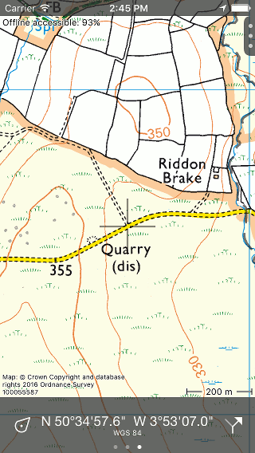

.. _sec-dashboard:

Dashboard
=========
On the bottom of the :ref:`map screen <sec-map>` you will find the dashboard as you can see in the figure below.

.. figure:: ../_static/dashboard1.png
   :height: 140px
   :width: 640px
   :alt: Dashboard Topo GPS

   *The dashboard on the bottom of the map screen.*

With the dashboard you can operate Topo GPS. On the dashboard information about the speed, time and distance is displayed. 

The dashboard consists out of three panels: the :ref:`subsec-ps`, a :ref:`panel <subsec-paneel>` with counters and the :ref:`route button <subsec-routeknop>`.  These panels are discussed in more detail below.

.. _subsec-ps:

Position marker icon
--------------------
By pressing the position marker icon in the bottom left you can :ref:`center <subsec-centreren>` and :ref:`rotate <subsec-roteren>` the map.

If you press long on the position marker icon, the :ref:`location information screen <ss-pm_pi>` will appear. In this screen you can find the coordinates of your current location among other things.

.. _subsec-route-button:

Route button
-------------
By pressing the route button on the right of the dashboard (arrowed icon) you can :ref:`add routes to the map <ss-route-load>`.

If you press long on the route button you will enter a screen in which you can import routes.

.. _subsec-paneel:

Panels
-------

In the center of the dashboard you can find a panel with counters. There
are three panels

- The :ref:`hiking panel <ss-wandelpaneel>`. 
- The :ref:`cycling panel <ss-fietspaneel>`. 
- The :ref:`coordinate panel <ss-coordinatenpaneel>`. 

The circles below the panel indicate the selected panel. By swiping a panel with one finger to the left or
the right you can load the next or previous panel.

.. _ss-wandelpaneel:

Hiking panel
------------
The hiking panel is ideal for walking and is shown below:

.. figure:: ../_static/dashboard1.png
   :height: 134px
   :width: 640px
   :alt: Dashboard Topo GPS

   *The dashboard with the hiking panel.*

The four counters on the hiking panel are subsequently the :ref:`speedo- and altimeter <subsec-snelheid>`,
the :ref:`route distance meter <subsec-routeafstand>`, the :ref:`record clock <subsec-klok>`
and the :ref:`record distance meter <subsec-opneemafstand>`.

.. _subsec-snelheid:

Speedometer and altimeter
~~~~~~~~~~~~~~~~~~~~~~~~~
The speedometer (km/h symbol top left) indicates the your current speed.

If you press on the speedometer the average speed while recording a route will be shown. This is indicated by the symbol
'avg' direct above the 'km/h' symbol.

If you press the speedometer once more, your maximum speed while recording a route will be shown. This is indicated by the
symbol 'max' just above the 'km/h' symbol.

If you finish recording a route and start a new recording, the average and maximum speeds will be reset.

If you press the speedometer once more it turns into an altimeter. Your altitude in meters above sea level will be shown. This is indicated
by the symbol 'alt'.

If you press the altimeter, your current speed will be shown again.

.. _subsec-routeafstand:

Route distance meter
~~~~~~~~~~~~~~~~~~~~
The route distance meter (-.- km top right) indicates the length of all routes that are :ref:`loaded <subsec-route_laden>` on the map, including planned routes. 
If a route is loaded the symbol 'rte' appears just above the 'km/h' to indicate that this is the distance of a loaded route.

If a route is loaded and you press the route distance meter, the route will be centered on the map. 

If the `route planner <sec-route-planner>` is opened, the route distance meter indicates only the length of the planned route.

.. _subsec-klok:

Record clock
~~~~~~~~~~~~~
The record clock (--:-- h:m bottom left) indicates the time you are :ref:`recording <subsec-route_opnemen>` a route.

If you press the record clock you can start, pause and stop a recording. You can find more information in the section
:ref:`subsec-route_opnemen`. If you are recording a route the symbol 'rec' appears just above the 'h:m' to indicate
a recording.

.. _subsec-opneemafstand:

Record distance meter
~~~~~~~~~~~~~~~~~~~~~
The record distance meter (-.- km bottom right) indicates the length of a route that is being :ref:`recorded <subsec-route_record>`. 
By starting a recording you can see with the record distance meter how far you have been traveling. Above the 'km/h' symbol
appears the symbol 'rec' to indicate that this is the recorded distance.

If you press the record distance meter while recording a route, the recorded route will be centered on the map.

.. _ss-fietspaneel:

Cycling panel
-------------
In the cycling panel your speed is somewhat more emphasized and your altitude
can be seen directly. The cycling panel looks as follows: 

.. figure:: ../_static/dashboard2.png
   :height: 134px
   :width: 640px
   :alt: Dashboard Topo GPS

   *The dashboard with the cycling panel.*

In the center you will find the :ref:`speedometer <subsec-snelheid>` that functions
in the same way as in the hiking panel (without an altimeter).

On the top left you will find the altimeter, that indicates your altitude above sea level in meters. This 
is indicated by the symbol 'alt'.

In the bottom left the :ref:`record clock <subsec-klok>` is located.

The :ref:`route distance meter <subsec-routeafstand>` is located in the top right.

The :ref:`record distance meter <subsec-opneemafstand>` can be found in the bottom right.

.. _ss-coordinatenpaneel:

Coordinate panel
------------------
Using the coordinate panel you can straightforwardly  read off coordinates from the map. An example of the coordinate panel is displayed below

.. figure:: ../_static/dashboard3.png
   :height: 135px
   :width: 640px
   :alt: Dashboard Topo GPS
   
   *The dashboard with the coordinate panel.*

If the coordinate panel is loaded, a cross appears in the middle of the map,
as you can see below:

   *The map with the coordinate panel.*

The coordinate that is displayed on the coordinate panel is the coordinate of the point in the middle of the cross.

By moving the map around you can easily position the middle of the cross to the point from which
you want to determine the coordinate. To quickly determine the coordinates of your current position,
you can center the map by pressing the :ref:`position marker icon <subsec-ps>` on the left hand side of the dashboard.

If you press the coordinate on the panel, the coordinate will be shown in a different format or system.

Subsequently these are

- WGS longitude latitude, decimal.
- WGS longitude latitude, degree minutes.
- WGS longitude latitude, degree minutes seconds.
- UTM.
- MGRS.
- Other local coordinate systems. For example NZTM2000 is displayed when pointed on New Zealand and OSNG coordinates for Great Britain.

