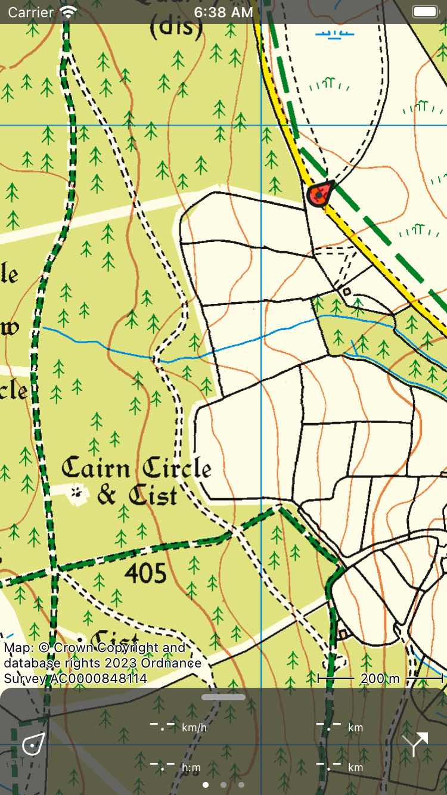

.. _sec-main-screen:

Main screen
===========
If you open the Topo GPS app a screen with a map will be displayed. This is the main screen. An example is shown below: 

   *The main screen of Topo GPS. The red marker indicates your current location.*

On the bottom of the main screen you can find a bar with meters which is the :ref:`dashboard <sec-dashboard>`.
If you pull the dashboard upwards the :ref:`menu <sec-menu>` will appear. 

The red marker with the arrow in indicates :ref:`your current location on the map <sec-posmarker>`. 

The label on the upper left side of the map indicates the percentage offline accessible map tiles of the area that is currently displayed. By tapping this label you can :ref:`download maps for offline use <sec-cache>`. 

On the bottom right corner of the map you can find a scale indicator. Using the scale indicator you can quickly estimate the distance between two points on the map. You can also use the :ref:`map ruler <ss-map-ruler>` to measure distances and angles more precisely.

On the bottom left corner of the map you will find the copyright information of the current map. If you tap this label the map information screen will open. In the bottom you can select a tab with detailed :ref:`copyright information <ss-map-copyright>`. If available also a :ref:`legend <ss-legend>` tab is available. For some maps their is also a map error tab, which you can use to report feedback on the map.

.. toctree::
   :maxdepth: 2

   your_location
   menu
   dashboard
   screen_orientation
