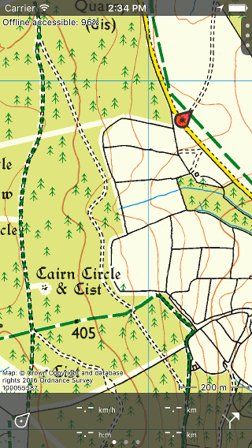

.. _sec-main-screen:

Main screen
===========
If you open the Topo GPS app a screen with a map will be displayed at first. This is the main screen. An example is shown below: 

   *The main screen of Topo GPS. The red marker indicates your current location.*

On the top left of the main screen you can find a handle with which you can open the :ref:`menu <sec-menu>`. 
The bottom bar with the meters is the :ref:`dashboard <sec-dashboard>`.

The red marker with the arrow in indicates :ref:`your current location on the map <sec-posmarker>`. 

The label on the upper left side of the map indicates the percentage offline accessible map tiles of the area that is currently displayed. By tapping this label you can :ref:`download maps for offline use <sec-cache>`.

On the bottom right corner of the map you can find a scale indicator. In the figure above the black horizontal line indicates a distance of 200 m. Using the scale indicator you can quickly estimate the distance between two points on the map. 

On the bottom left corner of the map you will find the copyright
information of the current map. If you press on the label you can view
more detailed :ref:`information <ss-copyright>` and a :ref:`legend
<ss-legend>` if available.

.. toctree::
   :maxdepth: 2

   your_location
   menu
   dashboard
   screen-orientation
