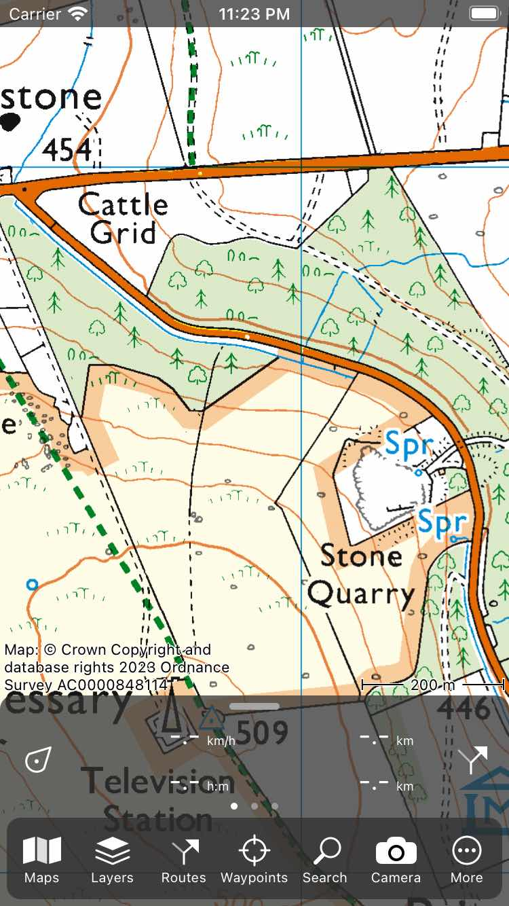
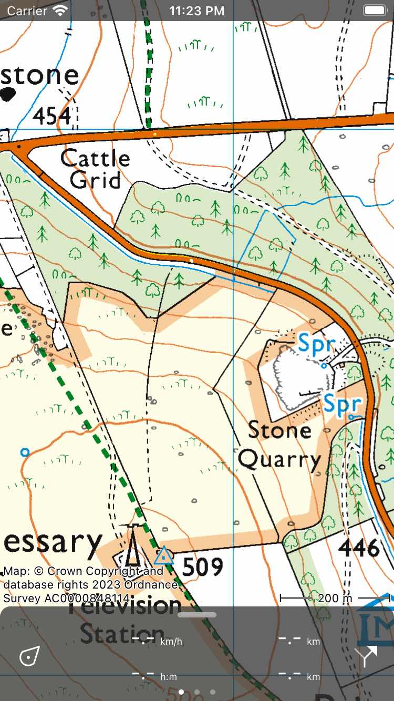

.. _sec-menu:

Menu
====
The menu of Topo GPS can be used to access the most important functions of Topo GPS. The menu is located in the bottom of the main map screen.

To open the menu you have to swipe the dashboard in the bottom of the screen upwards. Or you can tap the handle bar on the top of the dashboard of the screen.

The menu then appears as in the screen below.

   *The opened menu.*

The menu contains the following items:

- :ref:`Maps <sec-change-map>` - If you tap this item, the maps popup will be opened. In the maps popup you can :ref:`change the current map <sec-change-map>` and :ref:`Export the contents of the current visible map <sec-export-visible-map>`. 
- :ref:`Layers <sec-layers>` - If you tap this item, the layers screen will be opened. In this screen you can add layers to the map like for example the long distance bicycle route layer.
- :ref:`Waypoints <sec-wp>` - If you tap this item, the waypoints screen will be opened. Here you can do everything with waypoints like loading them on the map.
- Search - If you tap this item the search popup will be shown. Here you can :ref:`search addresses and places <sec-search-addresses>` and :ref:`enter <sec-entering-coordinates>` and :ref:`scan <sec-scanning-coordinates>` coordinates.
- :ref:`Routes <sec-routes>` - If you tap this item, :ref:`the routes popup <sec-routes-popup>` will be opened. Here you can view your saved routes, import shared routes, generate a route, plan a route, and record a route. Because routes are very important in Topo GPS you can also open the routes popup from the dashboard by tapping :ref:`the route button <ss-route-button>` on the bottom right of the screen. 
- :ref:`Camera <sec-camera>` - If you tap this button, the camera will be opened. If you take a photo a waypoint will be created at your current location and the photo will be added to this waypoint.
- More - If you tap this item the more popup will be shown. Via the more popup you can import files, open the :ref:`settings <ss-settings>` screen, and the Topo GPS info screen.

To close the menu you have to swipe the dashboard downwards. You can also tap the handle bar on the top of the dashboard. If the menu is closed the main screen looks as follows:

   *The closed menu.*
