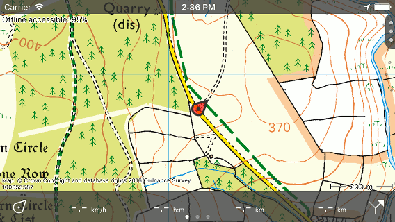

.. _subsec-screen-orientation:

Screen orientation
~~~~~~~~~~~~~~~~~~
By rotating your device you can change the screen orientation from portrait to landscape. An example of landscape mode is displayed below:

   *Main screen in landscape mode.*

If you do not want the screen to rotate if you rotate your device, you can lock the
screen orientation in the :ref:`settings <ss-settings>` (Menu > More > Settings > Display orientation > Lock).

