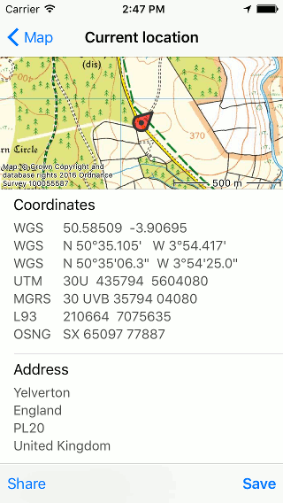
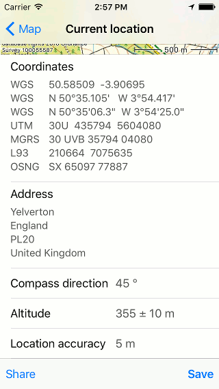
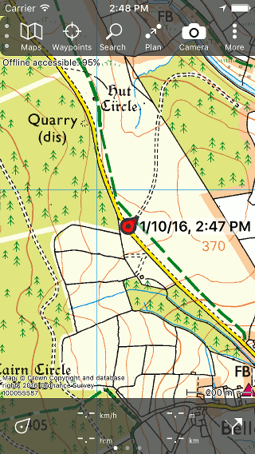

.. _sec-posmarker:

Your location
=============
Your location will be displayed on the :ref:`map <sec-map>` with
the position marker:

.. figure:: ../_static/posmarker.png
   :height: 150px
   :width: 150px
   :alt: Positiemarker Topo GPS

   *The position marker.*

If you stand still, the position marker points in the direction in which you point your device.
If you are moving, the position marker points in the direction in which you are moving.

The arrow in the status bar next to the battery icon, indicates that the location services are currently in use. This can cause faster battery consumption than usual. Therefore pay attention to the battery level when using Topo GPS.

.. _ss-pm_pi:

Location information screen
---------------------------
If you tap the position marker, the location information screen will appear. You can also open this screen by pressing long on the :ref:`position marker icon <subsec-ps>` on the dashboard.

An example of the location information screen is displayed below:

   *The top of the location information screen.*

Elements location information screen
~~~~~~~~~~~~~~~~~~~~~~~~~~~~~~~~~~~~
In the location information screen you find subsequently:

* A map of the surroundings of your current location. You can also zoom and move this map.

* Your location in the following globale coordinate systems:

  - WGS84 decimal: `World Geodetic System 1984 <http://en.wikipedia.org/wiki/WGS84>`_

  - WGS84 degree minutes: `World Geodetic System 1984 <http://en.wikipedia.org/wiki/WGS84>`_

  - WGS84 degree minutes seconds: `World Geodetic System 1984 <http://en.wikipedia.org/wiki/WGS84>`_

  - UTM: `Universal Transversal Mercator projection <http://en.wikipedia.org/wiki/UTM>`_

  - MGRS: `Military Grid Reference System <http://en.wikipedia.org/wiki/MGRS>`_

* Depending on your location, your location could be displayed in other country-specific coordinate systems. For example if your are located in Great Britain, Ordnance Survey National Grid coordinates are shown. And if you are in New Zealand, NZTM2000 coordinates are added. 

* Your location translated to an address. This only functions if you are connected to the internet. Furthermore you should have enabled the option :ref:`‘Addresses - Find automatically’ <settings-addresses>` in the :ref:`settings <ss-settings>`.

   *The bottom of the location information screen.*

* The compass direction in which you point your device in degrees. This direction is relative to the true (geographic) north. 
   
* Your altitude in meters including the accuracy.

* The accuracy of the location in meter. This accuracy means that your true location has a high probability of being inside a circle with a radius equal to the accuracy around the given location. If the GPS signal is good the location accuracy is 5 m or less.

.. _ss-pm_wp:

Saving current location
~~~~~~~~~~~~~~~~~~~~~~~
By pressing ‘Save’ in the bottom right of the location information screen you can save your current position as a :ref:`waypoint <sec-wp>`. The waypoint will be given a title based on the current time and date and it will be put on the map as you can see below:

   *Saving your current location as a waypoint.* 

Sharing current location
~~~~~~~~~~~~~~~~~~~~~~~~
By pressing 'Share' on the bottom left of the location information screen you can share your location using several apps, such as e-mail. iMessage and Facebook.
