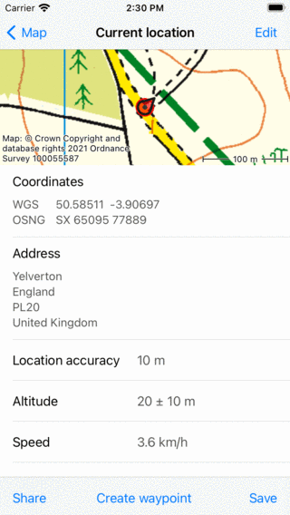
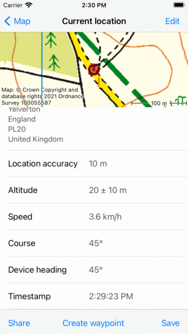
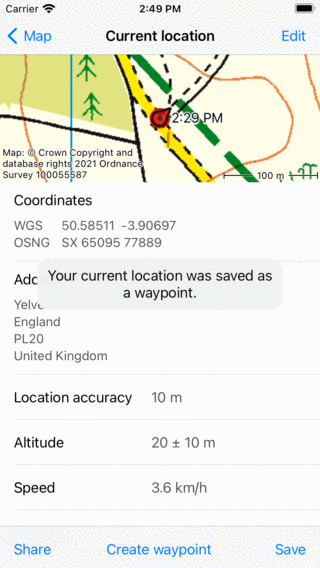

.. _sec-posmarker:

Your location
=============
Your location is displayed on the :ref:`map <sec-map>` with the position marker:

   *The position marker*

If you are standing still, the position marker points in the direction in which you point your device.
If you are moving, the position marker points in the direction in which you are moving.

The arrow in the status bar next to the battery icon, indicates that the location services are currently in use. This can cause faster battery consumption than usual. Therefore pay attention to the battery level when using Topo GPS.

The default position marker icon is red, you can change it to another color via :ref:`Menu <ss-menu>` > More > Settings > Styles > Position. This might to increase the visibility of the position marker ont the map.

To center the map on your location, tap the center button on the left hand side of the :ref:`dashboard <sec-dashboard>`.

Recommended iOS Settings
------------------------
To enable location access for Topo GPS, first make sure that iOS Settings > Privacy > Location Services is enabled. Then in the
same screen give Topo GPS access to precise location while using the app. Or go to iOS Settings > Topo GPS. 

It is also recommended to go to iOS Settings > Privacy > Location Services > Scroll to bottom > System and 
enable the settings 'Compass calibration' and 'Movement and distance calibration'.

.. _ss-current-location-screen:

Current location screen
-----------------------
If you tap your position marker on the map, the current location screen will appear. 
You can also open this screen by pressing long on the :ref:`position marker icon <subsec-ps>` on the :ref:`dashboard <sec-dashboard>`.

The current location screen shows details of your current location. In the current location screen you can also save your current location
into a waypoint and export your current location with the buttons in the bottom toolbar. An example of the current location screen is displayed below:

   *The current location screen (top part).*
   

   *The current location screen (bottom part).*
   
In the location information screen you find subsequently the following information:

- *Map*: A map of the surroundings of your current location. You can also zoom and move this map.
- *Coordinates*: The coordinates of your current location in various formats. You can change the displayed coordinate systems by tapping 'Edit' in the top right of the current location screen and then Displayed coordinates types. If you press long on a coordinate you can select it, and then press 'Share' to share the coordinates in textual format.
- *Address*: The approximate address of your location. If you move this address will be updated automatically. If you press long on the address you can select and share it. If you press 'Edit' you can disabled automatic lookup of addresses in the current location screen.
- *Location accuracy*: The accuracy of the location determination. This accuracy means that your true location has a high probability of being inside a circle with a radius equal to the accuracy. If the GPS signal is good the location accuracy is 5 m or less.
- *Altitude*: The current altitude of the device above the WGS84 geoid with the accuracy.
- *Speed*: The current speed of the device.
- *Course*: The direction which respect to the true north in which the device is moving.
- *Device heading*: The direction with respect to the true north in which the device is pointing.
- *Timestamp*: The exact time at which the displayed location was obtained.

Changing current location screen
~~~~~~~~~~~~~~~~~~~~~~~~~~~~~~~~
By tapping 'Edit' on the top right of the current location screen you can edit the order of the elements appearing in the current location screen. 

By dragging the handles on the right hand side the order of the elements can be modified. 

By tapping 'Displayed coordinate types' the displayed coordinate types can be set so that only coordinate systems which are of interested to you are displayed.

By tapping 'Waypoint title' you can change the automatic title of a waypoint.

.. _ss-current-location-save:

Saving current location
~~~~~~~~~~~~~~~~~~~~~~~
By tapping ‘Save’ in the bottom right of the current location screen you can save your current position as a :ref:`waypoint <sec-wp>`. The waypoint will be given a title based on settings which you can change by tapping 'Edit > Waypoint title' in the current location screen.
The automatic waypoint title can be set to either:

- *Time*: The current time
- *Date and time*: The current date and time
- *Number (next: ..)*: A number. If you press 'Reset' it will be reset to 1. This setting is useful if you want to save your location several times and number the waypoints.

If you press 'Save' your current position will be saved immediately as a waypoint and added to the map. A pop-up will show that the waypoint was saved sucessfully as you can see in the figure below:

   *Saving your current location as a waypoint.* 

.. _ss-current-location-create:

Creating waypoint on current location
~~~~~~~~~~~~~~~~~~~~~~~~~~~~~~~~~~~~~
By tapping 'Create waypoint' in the bottom toolbar of the current location screen you can create a waypoint at the current location. The difference between tapping 'Save' is that it is slower, but you now also can enter the title, description and change the icon. Exactly the same screen appears in the case if you :ref:`create a waypoint from the map <ss-waypoint-create-map>`.

Sharing current location
~~~~~~~~~~~~~~~~~~~~~~~~
By pressing 'Share' on the bottom left of the current location screen you can share your location. An export pop-up will appear exactly as what happens when :ref:`exporting waypoints <ss-waypoints-exporting>`.
