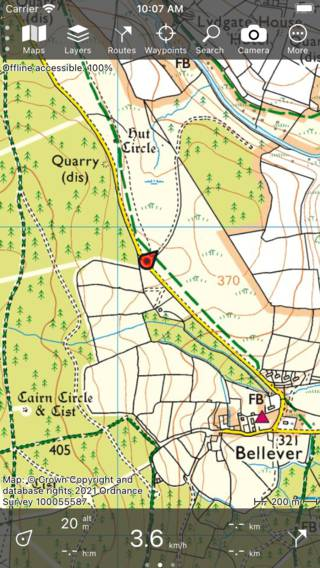
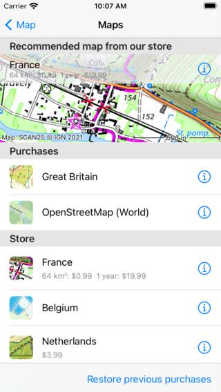
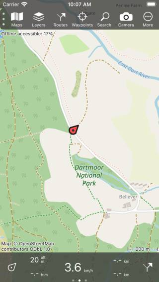
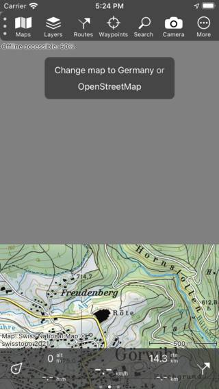
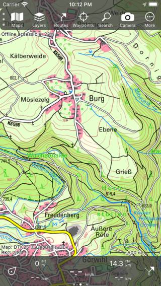

.. _sec-change-map:

Changing current map
====================

In the maps screen (:ref:`Menu <sec-menu>` > Maps) you can change the current map and :ref:`purchase additional maps <sec-purchase-maps>`.

Suppose we the main map is currently the topographic map of Great Britain, as in the example below.

   
   *The main screen with the topographic map of Great Britain.*
   
We now want to change it to the OpenStreetMap map. For that we open the maps screen (:ref:`Menu <sec-menu>` > Maps).
An example of the map screen is shown below:

   
   *The maps screen in which you can change the map and purchase additonal maps.*
   
The maps screen consists of two sections, the purchases and the :ref:`store <sec-purchase-maps>`. All purchased maps are accessible. If you tap
on an map item in the purchases section the map will be opened immediately and you will return to the main screen.

In the example above, the OpenStreetMap map was :ref:`purchased <sec-purchase-maps>`. If we tap the OpenStreetMap item, the main map will be changed to OpenStreetMap and we will return to the main screen automatically as in the example below.

   
   *The map in the main screen was changed to OpenStreetMap.*

If the newly choosen map has coverage in the previously shown area, the newly opened map is zoomed to the previously shown area. Otherwise, the newly opened map is zoomed to the area it covers.

Scrolling out of covered area
~~~~~~~~~~~~~~~~~~~~~~~~~~~~~
If you scroll out of the covered area of the map, a pop-up will appear in the top of the main screen which suggests you to change the map to a suitable map for that area. In the figure below you can see an example of that pop-up:

   
   *A pop-up suggests to change the current map.*

In the example above the user has scrolled to the northern border of the topographic map of Switzerland. In the top of the screen the background is gray, because that part is not covered by the map. The pop-up suggests an alternative map, in this case the topographic map of Germany or OpenStreetMap. If you tap one of these maps and you have purchased it, the tapped map will be openend and zoomed to the current visible area. If you have not purchased the tapped map, the purchase window will be shown. In the example below, the map has been changed to the topographic map of Germany.

   
   *The current map was changed to Germany after tapping on the suggested map.*

Automatic map change
~~~~~~~~~~~~~~~~~~~~
If you load a route or waypoints on the map, or tap the center button in on the dashboard, the app will check if the items are located on the current map. If not, the map will change automatically to the best suitable map. If the suitable map is not accessible, a screen will appear in which you are presented the suggested map. In this screen you could also buy the suggested map.
