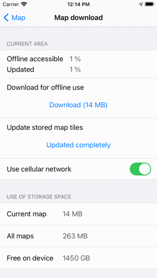

Gray map screen
===============

The map consist out of of map tiles. Sometimes it might happen that not all tiles are available. Then the map screen will be partly or completely gray as in the example below.

.. figure:: ../_static/map-problem1.png  
   :height: 568px
   :width: 320px
   :alt: Gray map Topo GPS

   *The map screen is gray, no map is shown.*

The reason of a gray map could be problems with the internet connection, or that you have scrolled out of the coverage region.

Internet connection issues
~~~~~~~~~~~~~~~~~~~~~~~~~~
If you are not scrolled out of the region the map covers, the gray screen is caused by internet connection issues. Normally the map tiles should be downloaded automatically. Sometimes, this will not happen, for example if you have only a cellular connection and you have disabled cellular downloading of map tiles.

To see why the maps are not being downloaded, tap the offline accessible button on the top left of the screen to open the map download screen:

   
   *The map download screen.*
   
In the map download screen you could tap 'Download' and see what happens. Also you could enable 'Use cellular network' to allow cellular downloads of map tiles. You also might want to enable cellular access for Topo GPS in the iOS Settings. You can read more about the map download screen in the section :ref:`sec-cache`.

Scrolled out of coverage region
~~~~~~~~~~~~~~~~~~~~~~~~~~~~~~~
If you are scrolled out of the region the map covers, most often a pop-up will appear in the top of the map which suggests you to change the map. You might also tap the center button on the :ref:`dashboard <sec-dashboard>` to return the map to your location. Or :ref:`zoom out <ss-map-zoom>` to find back the coverage region.
Alternatively, you could change the map via :ref:`Menu <sec-menu>` > Maps.
