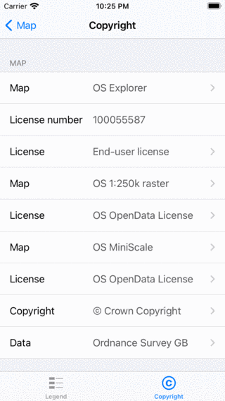

.. _ss-map-copyright:

Map copyright
=============
To view the copyright information of a map, you have to press the map copyright button on the bottom left of the map screen. 
This is that button on which it says: ‘Map: ....’. Next you have to select the tab ‘Copyright’ in the bottom.

The map copyright screen of the topographic map of Great Britain is displayed in the figure below:

   *The map copyright screen of the topographic map of Great Britain.*

