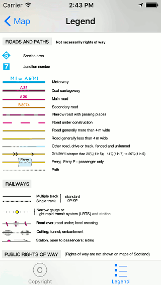

.. _ss-legend:

Map legend
==========
A legend gives an explanation for the symbols on the map.

To view the legend, you have to tap the map copyright button. The map copyright button is the button on which it says: ‘Map: ....’ in the bottom left of the map. Next you have to select the tab ‘Legend’ in the bottom of the screen that appears. You can also view the Legend via :ref:`Menu <ss-menu>` > More by selecting the tab ‘Legend’ in the bottom.

If you open the legend of the topographic map of Great Britain you will see the following screen:

   *The legend screen of the topographic map of Great Britain.*

You can scroll down in the legend to view more symbols. Most legends are translated to the language the Topo GPS app is using.
