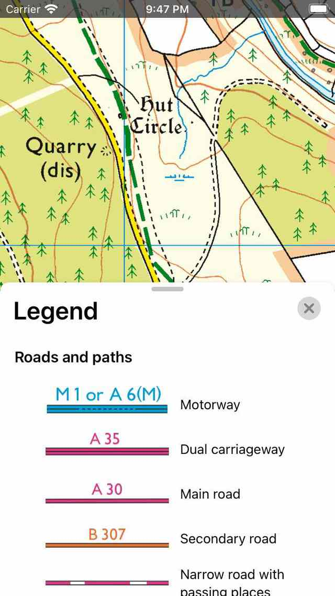

.. _ss-legend:

Map legend
==========
A legend gives an explanation for the symbols on the map.

To view the legend, you have to tap the map copyright button. The map copyright button is the button on which it says: ‘Map: ....’ in the bottom left of the map. A pop-up appears in which you can tap 'Legend'.

Alternatively you can tap 'Maps' in :ref:`Menu <sec-menu>`. Then tap 'Legend' in the pop-up that appears.

If you open the legend of a typical map you will see the following screen:

   *The map legend screen.*

The map and the legend are displayed simultaneously, so that you more easily can lookup the meaning of symbols on the map.
You can scroll down in the legend to view more symbols. If you pull the handle in the legend pop-up upwards, the legend will be enlarged.

Most legends are translated to the language the Topo GPS app is using.
