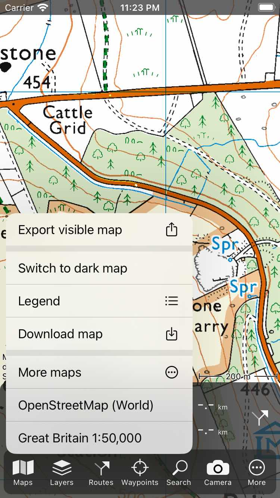

.. _ss-maps-popup:

Maps pop-up
-----------

If you tap 'Maps' in the :ref:`Menu <sec-menu>` the maps pop-up will be shown. An example is shown in the figure below:

   
   *The maps pop-up.*
   
The maps pop-up contains the following items:

- Export visibible map: If you tap this item, the export pop-up will appear. By selecting geodata you can export the waypoints and routes currently visible on the main screen. By selecting map you can export a jpg, png or pdf image of the currently visible screen. By enabling the switch 'Annotate map' you can add notes to this map before sharing it.
- Print map: If you tap this item, you can :ref:`print <ss-map-print>` the visible area of the map.
- Switch to dark/light map: You can change the style of the map to dark or light. A dark style might be useful if you are using Topo GPS at night. The style can also be changed in the settings via :ref:`Menu > More > Settings > Styles > Map <sec-settings-styles>`.
- Legend. If a legend is available, tapping this item will show the :ref:`map legend <ss-legend>`.
- Download maps. If you tap this item, you can :ref:`download maps for offline use <sec-cache>`.
- More maps. If you tap this item, you can change the map and purchase additional maps. 
- Other maps. The other maps possibly shown below the 'More maps' items are maps that also can be used in the current visible area. If you tap them, the map will be switched immediately to the choosen map.

The fastest way to interact with the maps pop-up is to tap the 'Maps' item in the menu, hold your finger on the screen, move it to the desired item in the maps pop-up and then release it.
