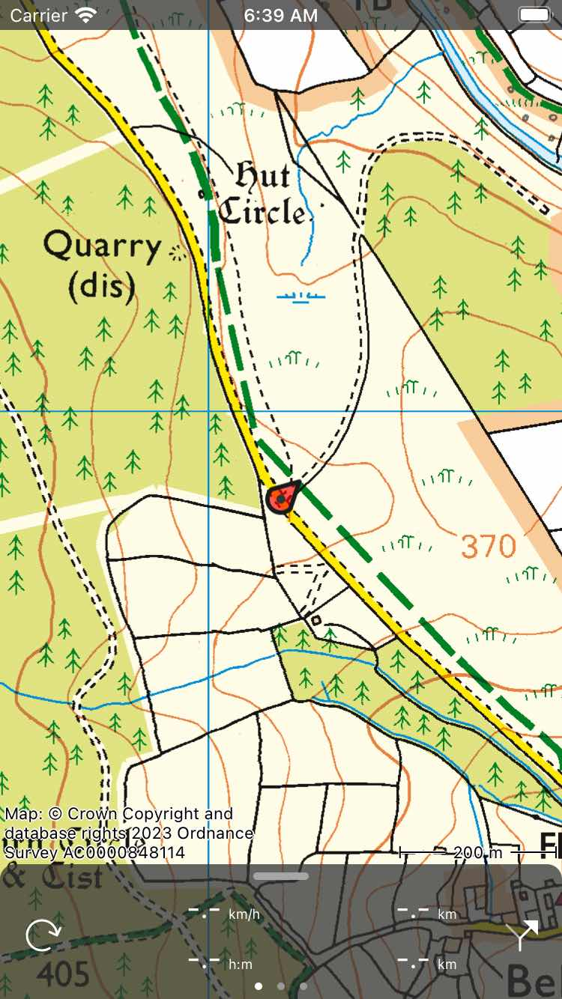
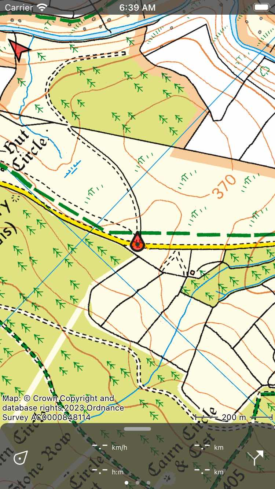
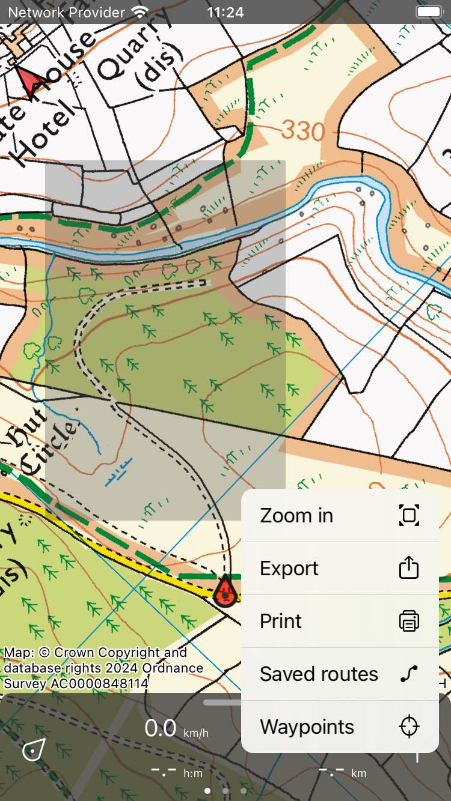

.. _ss-modifying-map-screen:

Modifying map screen
--------------------
You can modify the map in the :ref:`main screen <sec-main-screen>` by :ref:`scrolling <ss-map-scroll>`, :ref:`zooming <ss-map-zoom>`, :ref:`centering <ss-map-center>` and :ref:`rotating <ss-map-rotate>` the map.

.. _ss-map-scroll:

Scroll
~~~~~~
To scroll the map you have to hold a finger on the map. When you move your finger, the map will be moved as well. You can also move the map by making a quick swipe with your finger on the map.

For MacOS, you can scroll by pressing and holding the mouse button or trackpad button and moving around. Or put two fingers on the trackpad and move around. Or use the arrow keys. For the last option, the map has to have focus. This can be changed by pressing the tab key.

.. _ss-map-zoom:

Zoom
~~~~
You can zoom the map in or out in two ways:

- *Zooming in:* Tap one finger on the bottom of the map. Or hold two fingers on the map and bring them together.
- *Zooming out:* Tap one finger on the top of the map. Or hold two fingers on the map and move them away from each other.

If you do not like zooming in with one tap on the bottom of the map and zooming out with one tap at the top, you can
swap this in the via :ref:`Menu <sec-menu>` > More > Settings > :ref:`Single tap zoom <sec-settings-single-tap-zoom>`. 
You can also change there bottom/top into left/right.

At some point it is not possible to zoom in further. If you want to enable additional zoom, you can do this by enabling the setting :ref:`Menu > More > Settings > Map > Additional zoom in <sec-settings-map>`. The drawback is that then map will become grainy when zoomed in far.

For MacOS, you can zoom with two fingers just like in iOS if you have a trackpad. You can also zoom using the keyboard. It is then important that the map has focus. Please press the 'tab' key to change focus. Using the keyboard you can zoom in the following ways:

- Command +, Command -. Or + - keys. You can tap it one time, but also hold it to zoom further.
- Option key + arrow up, arrow down
- Press and hold shift and press and hold mouse button / trackpad button and move up or down.

.. _ss-map-center:

Center
~~~~~~
By tapping the position marker icon on the bottom left of the main screen, the map will be centered on your current location. An example
is shown in the figure below.
 

   *A centered map.*

If you are moving, the map will stay centered automatically. The map will move automatically with your movement.

The map stays auto centered as long as you do not move the map manually. To zoom in or out while keeping the map centered,
tap on the bottom or top of the map. Zooming with two fingers will cancel the automatic centering.

Centering the map on your location only works if you have given Topo GPS access to your location. You can do this in the settings app. 
Go to Settings > Privacy > Location services > Topo GPS.

If you have centered the map on your location, the position marker icon on the dashboard will be changed to a rotation icon.

If you use a keyboard you can also tap 'c' to center the map.

.. _ss-map-rotate:

Rotate
~~~~~~
You can rotate the map in two ways, :ref:`automatically <ss-map-autorotate>` and :ref:`manually <ss-map-manual-rotate>`. 

.. _ss-map-autorotate:

Automatic rotation
******************
By tapping once on the position marker icon on the bottom left of the screen, the icon turns into a rotation icon as you can see in the figure below. If you tap this rotation icon, the map will be automatically rotated in your direction.

The map is rotated such that the top of the map indicates the direction in which you point your device if your are standing still. If you are moving the top of the map will indicate the direction in which you move. An example is shown in the figure below:

   *A rotated map.*

Rotating the map can be useful when you are following a route. Left and right on the map are than also left and right in reality. In addition the position maker will stay centered on the map.

If the map is rotated, an north arrow will appear on the top left of the screen. This arrow indicates the direction of the true north on the map. If you press this arrow the rotation will be cancelled.

You can cancel rotation by pressing the position marker button on the dashboard. 

If you move the map or zoom with two fingers automatic rotation will be switched off. The current rotation angle will then not longer changed and the map will not longer be centered at your current location. To zoom the map in or out while keeping the automatic rotation active, tap on the bottom or top of the map screen.

.. _ss-map-manual-rotate:

Manual rotation
***************
If you put two fingers on the screen and make a rotation gesture by moving the two finger clockwise or counter-clockwise, the map will be rotated around the point that lies in between the two fingers. An example of a rotated map is displayed in figure above. You can rotate the map in every desired direction. 

If the map is rotated, an north arrow will appear on the top left of the screen. This arrow indicates the direction of the true north on the map. If you press this arrow the rotation will be cancelled.

If you zoom the map or move the map the map stays rotated.

Manual rotation can be cancelled by pressing the north arrow. It is also possible to undo the rotation by manually rotating back to the normal situation.

On MacOS, you can only rotate the map using a trackpad.

.. _ss-map-select:

Selecting part of map
~~~~~~~~~~~~~~~~~~~~~
If you press and hold two fingers simulatenously on the map a gray overlay will appear between the two fingers. If you move your fingers around you can change the size and position of this overlay. In MacOS, press and hold the command key and press and hold the trackpad or mouse button and move the pointer.

If you release your fingers you have selected a part of the map indicated by the overlay area. Now a pop-up will automatically appear as in the image below. In this pop-up you have the following options:

- *Zoom*: This will zoom the map to the selected area.
- *Export*: This allows you to share the points and routes shown on the map in the selected area. You can also use it to share a map of the selected area.
- *Print*: With this option you can print the selected area. 
- *Saved routes*: This will show you your saved routes which have either the start or end point or both in the selected area.
- *Waypoints*: This will show you the list of waypoints in the selected area.

   *A part of the map has been selected.*

Long press
~~~~~~~~~~
If you press long on the map an icon will appear which you can drag to a certain location. If you release it, you can :ref:`create a waypoint <ss-waypoint-create-map>` on that location. If you accidentally pressed long on the map, drag the icon to the top of or the bottom of the main screen. The icon will disappear and the waypoint creation screen will not be shown.

If you put a second finger on the map after the waypoint creation icon has appeared, the :ref:`map ruler <ss-map-ruler>` will be shown. You can use the map ruler to measure distances and angles.
