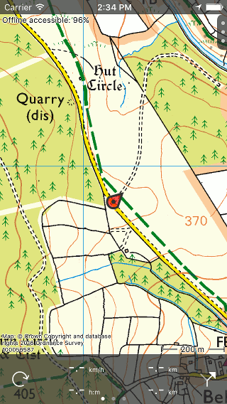

.. _ss-modifying-map-screen:

Modifying map screen
--------------------
You can modify the map in the :ref:`main screen <sec-main-screen>` by :ref:`moving <ss-map-move>`, :ref:`zooming <ss-map-zoom>`, :ref:`centering <ss-map-center>` and :ref:`rotating <ss-map-rotate>` the map.

.. _ss-map_move:

Move
~~~~
To move the map you have to hold a finger on the map. When you move your finger, the map will be moved as well. You can also move the map by making a quick swipe with your finger on the map.

.. _ss-map-zoom:

Zoom
~~~~
You can zoom the map in or out in two ways:

- *Zooming in:* Tap one finger on the bottom of the map. Or hold two fingers on the map and bring them together.
- *Zooming out:* Tap one finger on the top of the map. Or hold two fingers on the map and move them away from each other.

If you do not like zooming in with one tap on the bottom of the map and zooming out with one tap at the top, you can
swap this in the via :ref:`Menu <sec-menu>` > More > :ref:`Settings <ss-settings-onetapzoom>`. You can also change there bottom/top into left/right.

.. _ss-map-center:

Center
~~~~~~
By tapping the position marker icon on the bottom left of the main screen, the map will be centered on your current location. An example
is shown in the figure below.
 

   *A centered map.*

If you are moving, the map will stay centered automatically. The map will move automatically with your movement.

The map stays auto centered as long as you do not move the map manually. To zoom in or out while keeping the map centered,
tap on the bottom or top of the map. Zooming with two fingers will cancel the automatic centering.

Centering the map on your location only works if you have given Topo GPS access to your location. You can do this in the settings app. 
Go to Settings > Privacy > Location services > Topo GPS.

If you have centered the map on your location, the position marker icon on the dashboard will be changed to a rotation icon.

.. _ss-map-rotate:

Rotate
~~~~~~
You can rotate the map in two ways, :ref:`automatically <ss-map-autorotate>` and :ref:`manually <ss-map-manual-rotate>`. 

.. _ss-map-autorotate:

Automatic rotation
******************
By tapping once on the position marker icon on the bottom left of the screen, the icon turns into a rotation icon as you can see in the figure below. If you tap this rotation icon, the map will be automatically rotated in your direction.

The map is rotated such that the top of the map indicates the direction in which you point your device if your are standing still. If you are moving the top of the map will indicate the direction in which you move. An example is shown in the figure below:

.. figure:: ../_static/map3.png  
   :alt: Rotated map Topo GPS

   *A rotated map.*

Rotating the map can be useful when you are following a route. Left and right on the map are than also left and right in reality. In addition the position maker will stay centered on the map.

If the map is rotated, an north arrow will appear on the top left of the screen. This arrow indicates the direction of the true north on the map. If you press this arrow the rotation will be cancelled.

You can cancel rotation by pressing the position marker button on the dashboard. 

If you move the map or zoom with two fingers automatic rotation will be switched off. The current rotation angle will then not longer changed and the map will not longer be centered at your current location. To zoom the map in or out while keeping the automatic rotation active, tap on the bottom or top of the map screen.

.. _ss-map-manual-rotate:

Manual rotation
***************
If you put two fingers on the screen and make a rotation gesture, the map will be rotated around the point that lies in between the two fingers. An example of a rotated map is displayed in figure above. You can rotate the map in every desired direction. 

If the map is rotated, an north arrow will appear on the top left of the screen. This arrow indicates the direction of the true north on the map. If you press this arrow the rotation will be cancelled.

If you zoom the map or move the map the map stays rotated.

Manual rotation can be cancelled by pressing the north arrow. It is also possible to undo the rotation by manually rotating back to the normal situation.
