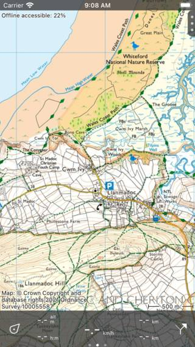
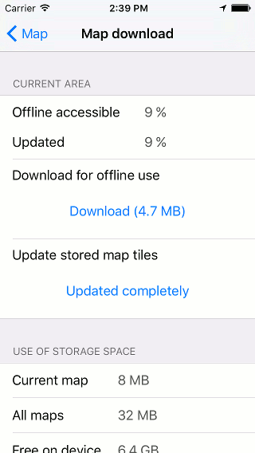
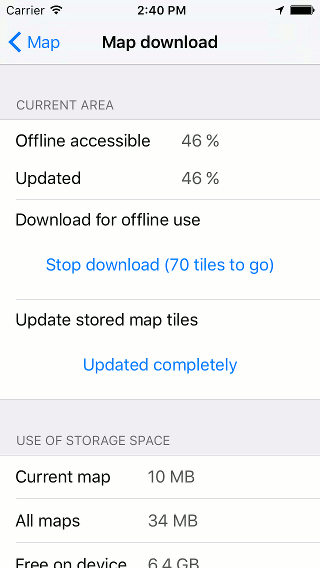
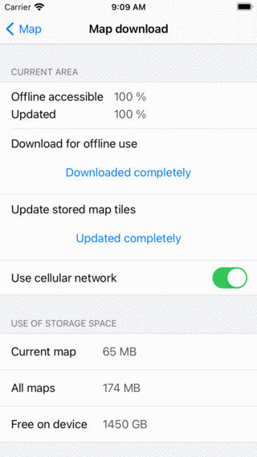

.. meta::
   :description: Describes how to make map tiles offline available in Topo GPS.

.. _sec-cache:

Making maps offline accessible
==============================
To ensure that the maps are accessible when your are not connected to internet (offline) you can make maps offline accessible. Offline accessible means that the maps are stored on your device and that you can view them without a internet connection.

Map tiles
~~~~~~~~~
The maps in Topo GPS are composed out of map tiles. A small number of map tiles is required to fill the map screen. If one or more of these required tiles are not stored on your device, they will be downloaded automatically. This only succeeds if you are connected to the internet.

If you are connected via a cellular network, downloading of map tiles can only occur if you have enabled cellular access for Topo GPS in the iOS Settings > Topo GPS. In Topo GPS you have to enable :ref:`Menu <sec-menu>` > More > Settings > Map tiles downloading > Cellular network.

On the top left of the :ref:`main screen <sec-main-screen>` the percentage offline accessible map tiles of the currently visible area is shown. This percentage percentage is the number of offline accessible tiles at all zoom levels relative to the total number of all possible tiles at all zoom levels. An example is shown in the figure below:

   *On the top left of the main screen you can view the percentage of the currently visible area that is offline accessible: 22%*

In the figure above the percentage of offline accessible map tiles is 22%. By looking at the map screen you might think that all map tiles are already accessible, since the whole map screen is covered with tiles. However, if you zoom in, map tiles with a higher resolution will be loaded. If the percentage is not 100% it can happen that when you zoom in grey tiles or unsharp tiles are shown instead of the higher resolution map tiles.

.. _ss-cache-download:

Downloading map tiles
~~~~~~~~~~~~~~~~~~~~~
If you tap the label ‘Offline accessible:‘ on the top left of the map screen the map download screen will appear. In this screen you can download map tiles of the area that is currently visible in the map screen.

An example of the map download screen is displayed below:

   *The map download screen with which you can download map tiles.*

To download all map tiles of the current area, you have to press ‘Download’. The amount of MB indicates an estimate of the size of the download in megabytes.

If downloading of map tiles has been started, the download button shows how many tiles still need to be downloaded, as you can see below:

   *Downloading map tiles.*

While downloading map tiles, the percentage offline accessible will increase to 100%. You can cancel the downloading of map tiles at any time by pressing ‘Stop download’.

If you wait the percentage off-line accessible will become 100% automatically, as in the figure below:

   *The current area has been made completely offline accessible.*

If you return to the map screen and do not move or zoom out on the map, you will see that the percentage offline accessible is 100%. In that case you are certain that you have all map tiles off the area stored on your device.

We recommend you to download only areas you really will need, instead of very large regions. This will save you storage space and download time. If you really need to download a very large area it sometimes helps to split it the download into smaller regions.

In the bottom of the 'Current area' section in the map download screen is the button 'Use cellular network'. If you have enabled this switch, you can use the cellular network for downloading map tiles. You also need to give permission to use the cellular network in the iOS Settings > Topo GPS. If these settings are enabled, and you are viewing a part of the map on which map tiles are not stored offline, they will be downloaded automatically over the cellular network.
If you have disabled the 'Use cellular network' setting, the cellular network will never be used to download map tiles. This can save you data transfer costs. It might happen however that grey tiles are shown in the map if you had not made all tiles of the area offline accessible.

Instead of downloading the map tiles of a specific region, it is also possible to only :ref:`download the map tiles over which a route is going <sec-route-map-tiles>`. For that open the :ref:`route details screen of a route <sec-route-details>`, scroll down to the section 'Tiles on current map' and tap 'Download'.

Updating map tiles
~~~~~~~~~~~~~~~~~~
Sometimes the map tiles will be updated. If updated map tiles have appeared and you view them in the map screen, they will be redownloaded and updated automatically.

You can update all map tiles of a certain area in the map download screen. For this you have to press ‘Update (.. MB)’ in the map download screen. When the percentage updated map tiles equals the percentage offline accessible map tiles, you have updated all offline accessible map tiles. This is the case in the figure above, therefore the ‘Update’ button says ‘Updated completely’.

Storage space
~~~~~~~~~~~~~
Storing of map tiles on your device costs disk space. In the map download screen you can see how much space has been used.

‘Current map’ means the total storage of the complete current map. So in the case of the figure above it means that the complete map of Great Britain uses currently 65 MB of the storage space.

‘All maps’ means the total storage of all maps together. So suppose you have also stored map tiles of New Zealand and France, ‘All maps’ indicates the total size used by France, New Zealand and Great Britain. In the figure above this is 174 MB.

‘Free on device’ means the amount of available storage space on your device. In the figure above this is 1450 GB (This is not a real iPhone, but an iPhone run on a simulator on MacOS).

Removing map tiles
~~~~~~~~~~~~~~~~~~
If you need storage space, you can remove map tiles in the bottom of the map download screen.

For example, suppose you return from a nice vacation on the Shetland Islands. You have no plans to return in the near future, and do not need the maps anymore. Then you move the map such that only the Shetland Islands are visible. Next you press the ‘Offline accessible’ button on the top left of the screen to open the map download screen.’

If you scroll to the bottom of the map download screen you will find a ‘Remove’ button as you can see below:

.. figure:: ../_static/map-offline5.png  
   :height: 568px
   :width: 320px
   :alt: Making map offline accessible Topo GPS

   *Removing map tiles.*

By pressing the ‘Remove’ button you delete all map tiles of the currently visible area in the map screen. In the example above these are all map tiles of the Shetland Islands. 
