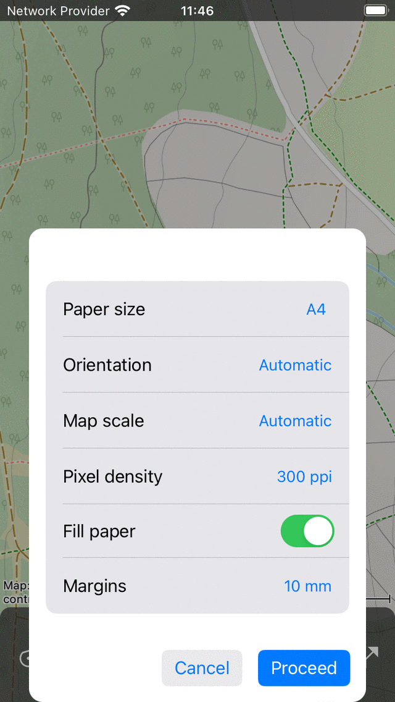

.. _ss-map-print:

Printing maps
=============

If you plan to make an outdoor trip, it could be advisable to print a map of the surroundings. So that you can find your way, even in the case your device breaks down.

To print a map, first :ref:`select the part of the map <ss-map-select>` that needs to be printed. You can do this by pressing long with two fingers simultaneously on the map.
Moving the fingers can change the selection. If you release your fingers, tap 'Print' in the pop-up. Sometimes it could be useful to first :ref:`rotate the map <ss-map-rotate>`, before making a selection.

Alternatively, if you want to print the area which is currently visible in the maps screen, you could tap Menu > Maps > Print map. On MacOS you could also press Command-P.

If you want to display content on the printed map, like a route, points, or a layer, first load the contents on the main map. Then tap the print button. It might be also useful to add a coordinates grid, in order to be able to read off and find coordinates on the printed map.

If the print button is pressed, in both cases a print pop-up appears, like in the figure below:

   
   *The print pop-up.*

In the print pop-up you can set the following options:

- *Paper format*: Here you can choose the paper format which is used by your printer.
- *Orientation*: You could choose to print the map in portrait or landscape orientation, or let the orientation be determined automatically.
- *Map scale*: Here you could choose the map scale. If you choose for the option automatically the selected region will be scaled, so that it fits on the paper. If you choose a custom map scale, for example the scale 1:25,000 the map will be printed exactly to scale, so that 1 cm on the printed map is 25,000 cm = 250 m in reality. A commonly used map scale allows you to read off and find coordinates on the printed map if you have added a coordinates grid. Sometimes the selected region will be too large to be fitted on one page, then the region will be splitted into multiple pages. If the number of generated pages will become too large, you need to choose a smaller map scale or a smaller region.
- *Pixel density*: Here you can choose the pixel density. A larger pixel density leads to a sharper map, but the file size also becomes larger, and maybe the pixel density might become too high for your printer. Typically 300 dpi or 600 dpi should be ok. You could expiriment which this value.
- *Fill paper*: If you enable this option, the paper will be completely filled with a map. If you disable this option, only the selected area will be printed. This could save some ink.
- *Margins*: Here you can set the paper margins (white space near edges). The margins are the same on top, bottom, left and right and can be choosen between 5 mm, 10 mm, 15 mm and 20 mm. On MacOS you can also set different margins for each edge.

If you have set the options in the print pop-up, tap 'Proceed' on the bottom right. Then the printed maps will be generated. This can take a while (be patient) because sometimes map tiles need to be downloaded. After the printed pages are ready, the system print dialog will appear automatically, as in the figure below:

   
   *The print dialog.*

Before you start printing, it is *very important* to make sure that the paper size in the system print dialog is set to the same paper size in the print pop-up. Otherwise parts of the maps could be missing, or the map will not be printed at the scale you inteneded. If you have verified this, you could press 'Print'. Or press the 'Export' icon to save the to be printed pages as a PDF.

Make sure to obey the licensing constraints of a printed map. Some printed maps may only be used for personal purposes. Most printed maps have a open data licenses, which implies that they can be shared freely. But also then, always make sure the copright notice on the bottom left hand side of the printed map stays visible.

Sometimes a map may not be printed due to copyright reasons. In that case the printed map will be the OpenStreetMap.

The printed map always contains a red arrow. This arrow points to the true geographic north. This differs from the magnetic north to which a magnetic compass is pointing.

