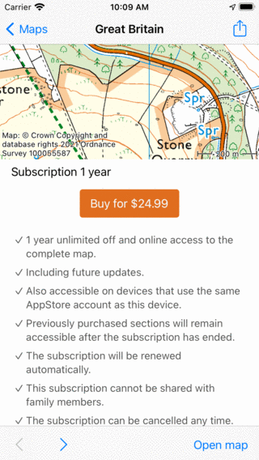

.. _sec-purchase-maps:

Purchasing maps
===============
In the maps screen (:ref:`Menu <sec-menu>` > Maps) you can buy additional maps.
An example of the maps screen is shown below:

.. figure:: ../_static/map-change2.jpg
   :height: 568px
   :width: 320px
   :alt: Map screen Topo GPS
   
   *The maps screen*.

The maps screen has a section 'Store'. The maps displayed in this section can be purchased.
Tap on an item in the 'Store' section to see the details of the map.

There are three kinds of map purchases in Topo GPS. 

- *Full maps*: These maps are a one-time only purchase. You get full access to the entire map including future updates.
- *Partial maps*: In these maps you can select parts of the map and buy the parts you need. This is possible with the topographic maps of Great Britain, France and Belgium.
- *Subscriptions*: In these maps you can purchase a 1 year automatically renewing subscription to get access to the entire map. This is possible with the topographic maps of Great Britain, France, and Belgium.

The differences between the map purchases are due to licensing and royalty constraints. Some maps are provided as open data to us, in that case we do not have to pay royalties to the mapping agency. For other maps we however have to pay licensing fees to the mapping agency depending on the amount of maps sold. Therefore these maps are more expensive. 

Purchasing full maps
--------------------
To purchase a full map, for example Switzerland, go to :ref:`Menu <sec-menu>` > Maps > Store and tap 'Switzerland'.
The information screen of map of Switzerland will be opened:

.. figure:: ../_static/map-purchase-ch1.png
   :height: 568px
   :width: 320px
   :alt: Map information screen Topo GPS
   
   *Map information screen Switzerland*

In the information screen of the map of Switzerland, you see a preview map on the top. You can scroll and zoom this map to see if this map suits your needs. You can get a small tour through the map by tapping the 'Tour' button in the bottom toolbar.
Below the map, you find information about the purchase. If you tap the purchase button with the price a purchase will be initiated. You will be asked by the AppStore to confirm the purchase, and once confirmed you will be return to the main screen and the newly purchased map will be opened:

.. figure:: ../_static/map-purchase-ch2.jpg
   :height: 568px
   :width: 320px
   :alt: Purchase Swiss map Topo GPS
   
   *The map of Swizterland has just been purchased.*

You can zoom in on the purchased map to see it in more detail as in the figure below:

.. figure:: ../_static/map-purchase-ch3.jpg
   :height: 568px
   :width: 320px
   :alt:  Topo GPS
   
   *The purchased map of Switzerland in more detail.*

If you go back to the maps screen (:ref:`Menu <sec-menu>` > Maps) you will see that the map of Switzerland has now moved to the section 'Purchases'.

The purchased maps are available on all devices that use the same Apple ID on which the purchase was made. If you have enabled family sharing, the purchased maps are also available to your family members. Sometimes you need to tap 'Restore previous purchases' in the bottom of the map screen (:ref:`Menu <sec-menu>` > Maps) to make these purchases available.

Purchasing parts of maps
------------------------
Maps of Great Britain, France and Belgium can be bought by part.
To purchase part of the map first go to :ref:`Menu <sec-menu>` > Maps > Store and tap on the desired map.
If no purchases have been made yet, the map information screen will be opened, as in the example below:

.. figure:: ../_static/map-purchase-gb-area1.png
   :height: 568px
   :width: 320px
   :alt: Map information Great Britain Topo GPS
   
   *Map information screen Great Britain*
   
Tap the 'Select part of map' button to return to the main screen. Then zoom in to the desired area. As you can see in the example below the map is divided in squares with a price:

.. figure:: ../_static/map-purchase-gb-area2.jpg
   :height: 568px
   :width: 320px
   :alt: Topo GPS
   
   *Prices are shown on squares which have not been bought.*

The prices are only shown on parts which have not been bought. To buy a part of the map, you can simply tap it to select it. In the bottom bar the price will be shown as you can see in the figure below:

.. figure:: ../_static/map-purchase-gb-area3.jpg
   :height: 568px
   :width: 320px
   :alt: Topo GPS
   
   *A square has been selected for purchase.*
  
In the example a square of 8 x 8 km is selected. If you need more squares, you can select more, and the price in the bottom bar will increase accordingly. If you zoom in, the squares will become smaller, so that you can select a region more accurately. If you zoom out, the squares will become larger, so that you can select a larger region faster. If you buy a larger region at once, most often a discount is applied.

If you tap the info button (i) in the bottom purchase bar the map information screen will be opened and you can lookup the conditions of the purchase. 

If you want to change the selected squares, you can simply tap a selected tile to deselect it. You can also tap the cross in the bottom purchase bar to deselect all tiles at once.

If you want to buy the squares over which a route is going, load the route on the map, and tap the route to open the route details screen. Then scroll down in the route details to the section 'To be purchased map tiles'. Tap 'Put into shopping cart'. Then you will return to the main map and the squares of the route will be selected.

If you tap the purchase button in the example above, an AppStore pop-up will ask you to confirm the purchase:

.. figure:: ../_static/map-purchase-gb-area4.jpg
   :height: 568px
   :width: 320px
   :alt: AppStore pop-up confirming purchase Topo GPS
   
   *An AppStore pop-up asks to confirm the purchase of 64 km2 of Great Britain.*

If you tap 'Confirm' in the AppStore pop-up the selected area will be purchased. The area will be accessible immediately as you can see in the example below:

.. figure:: ../_static/map-purchase-gb-area5.jpg
   :height: 568px
   :width: 320px
   :alt: Tile purchase Topo GPS
   
   *The selected area has been purchased.*

After purchasing an area, all map tiles of the purchased area will be downloaded automatically, so that they are offline accessible. 
Tiles of areas that are not purchased, cannot be made offline accessible. Therefore you can only get Offline accessible to 100% if you zoom in to an area that is fully bought.

The purchases of parts of maps are synchronized with other devices via iCloud. You need to enable the iOS settings Account > iCloud > iCloud Drive > Topo GPS on your devices to see the purchases on your other devices.

Purchasing subscriptions
------------------------
In addition to buying parts of the map, it is also possible to purchase a 1 year subscription to the maps of Great Britain, France, and Belgium.
If you need large areas of the map it might be cheaper to purchase a subscription then to buy parts of the map.

To purchase a subscription, first open the maps screen via :ref:`Menu <sec-menu>` > Maps. Then tap the info button (i) next to a map. Scroll down to the subscription section. In the example of Great Britain the subscription section looks like:

   
   *Subscription information topographic map Great Britain*
   
In the subscription section, you can read the conditions of the subscription. If you press the buy button you are asked to confirm the purchase. Once confirmed, 
you will return to the main screen and the whole map is accessible. 

Subscriptions are accessible on all devices that use the same Apple ID. Subscriptions cannot be shared via family sharing. To enable a subscription on another device, you might need to tap :ref:`Menu <sec-menu>` > Maps > Restore previous purchases.

Cancel subscriptions
~~~~~~~~~~~~~~~~~~~~
To cancel a subscription, go to  :ref:`Menu <sec-menu>` > Maps. Then tap the info button (i) next to a map on which you are subscribed. Scroll down to the subscription section. Then tap 'Cancel subscription'. You will be brought to an AppStore page on which you can manage your subscription, and also cancel them.
If you cancel a subscription, the map will remain accessible until the end of the current subscription period.

