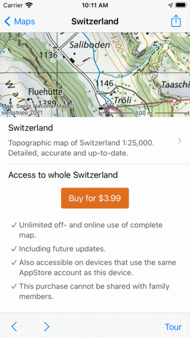
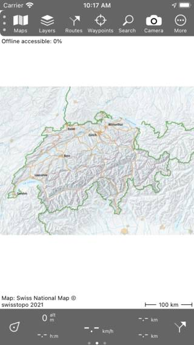
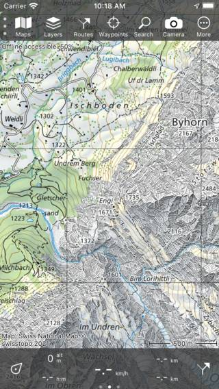
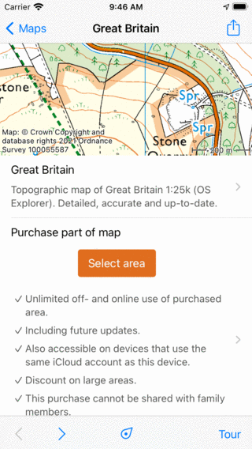
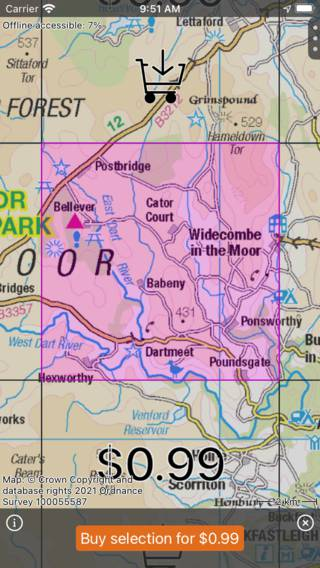
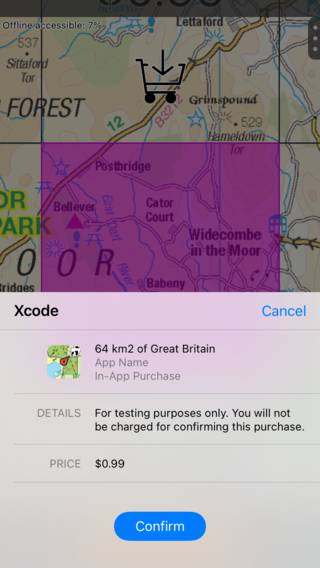
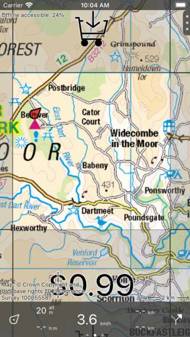

.. _sec-purchase-maps:

Purchasing maps
===============
In the maps screen (:ref:`Menu <sec-menu>` > Maps) you can purchase additional maps.
An example of the maps screen is shown below:

.. figure:: ../_static/map-change2.jpg
   :height: 568px
   :width: 320px
   :alt: Map screen Topo GPS
   
   *The maps screen*.

The maps screen has a section 'Store'. The maps displayed in this section can be purchased.
Tap on an item in the 'Store' section to see the details of the map.

There are three kinds of map purchases in Topo GPS. 

- *Full maps*: These maps are a one-time only purchase. You get full access to the entire map including future updates.
- *Partial maps*: In these maps you can select parts of the map and buy the parts you need. This is possible with the topographic maps of Great Britain, France and Belgium.
- *Subscriptions*: In these maps you can purchase a 1 year automatically reneweing subscription to get access to the entire map. This is possible with the topographic maps of Great Britain, France, and Belgium.

The differences between the map purchases are due to licensing and royalty constraints. Some maps are provided as open data to us, in that case we do not have to pay royalties to the mapping agency. For other maps we however have to pay licensing fees to the mapping agency depending on the amount of maps sold. Therefore these maps are more expensive. 

Purchasing full maps
--------------------
To purchase a full map, for example Switzerland, go to :ref:`Menu <sec-menu>` > Maps > Store and tap 'Switzerland'.
The information screen of map of Switzerland will be opened:

   
   *Map information screen Switzerland*

In the information screen of the map of Switzerland, you see a preview map on the top. You can scroll and zoom this map to see if this map suits your needs. You can get a small tour through the map by tapping the 'Tour' button in the bottom toolbar.
Below the map, you find information about the purchase. If you tap the purchase button with the price a purchase will be initiated. You will be asked by the AppStore to confirm the purchase, and once confirmed you will be return to the main screen and the newly purchased map will be opened:

   
   *The map of Swizterland has just been purchased.*

You can zoom in on the purchased map to see it in more detail as in the figure below:

   
   *The purchased map of Switzerland in more detail.*

If you go back to the maps screen (:ref:`Menu <sec-menu>` > Maps) you will see that the map of Switzerland has now moved to the section 'Purchases'.

The purchased maps are available on all devices that use the same Apple ID on which the purchase was made. If you have enabled family sharing, the purchased maps are also available to your family members. Sometimes you need to tap 'Restore previous purchases' in the bottom of the map screen (:ref:`Menu <sec-menu>` > Maps) to make these purchases available.

Purchasing parts of maps
------------------------

   
   **

.. figure:: ../_static/map-purchase-gb-area2.jpg
   :height: 568px
   :width: 320px
   :alt: Topo GPS
   
   **

   
   **

   
   **

   
   **

Purchasing subscriptions
------------------------

.. figure:: ../_static/map-purchase-gb-subscription1.jpg
   :height: 568px
   :width: 320px
   :alt: Topo GPS
   
   **

