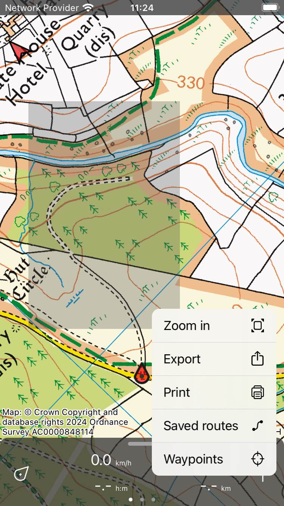

.. _ss-map-select:

Selecting part of map
=====================
If you press and hold two fingers simultaneously on the map a gray overlay will appear between the two fingers. If you move your fingers around you can change the size and position of this overlay. In MacOS, press and hold the command key and press and hold the trackpad or mouse button and move the pointer.

If you release your fingers you have selected a part of the map indicated by the overlay area. Now a pop-up will automatically appear as in the image below. In this pop-up you have the following options:

- *Zoom in*: This will zoom the map to the selected area.
- *Export*: This allows you to share the points and routes shown on the map in the selected area. You can also use it to share a map of the selected area.
- *Print*: With this option you can print the selected area. 
- *Saved routes*: This will show you your saved routes which have either the start or end point or both in the selected area.
- *Waypoints*: This will show you the list of waypoints in the selected area.

   *A part of the map has been selected.*
