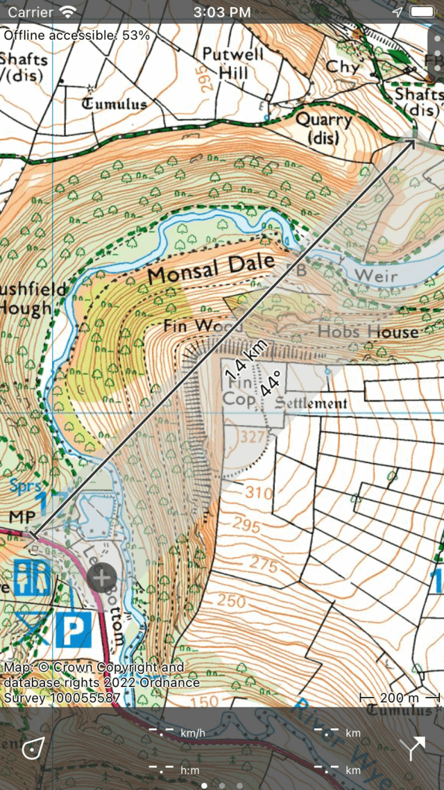
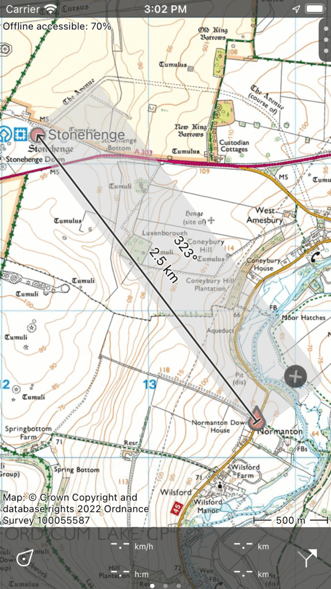
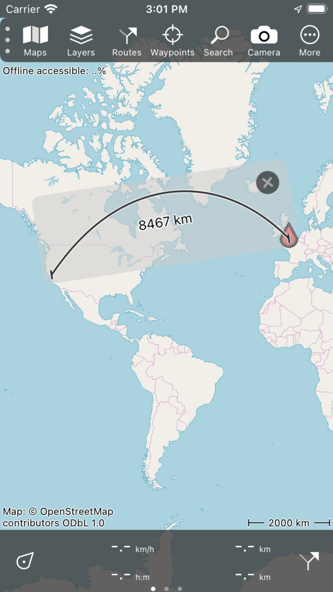

.. _sec-measure:

Measuring distances and angles
==============================

.. _ss-map-ruler:

Map ruler
~~~~~~~~~
To measure distances and angles between two points in the main map screen you can use the map ruler. 
To show the map ruler, first press long on the map until the icon for waypoint creation appears. Then add a second finger (possibly with your other hand). Immediately a ruler will be shown between the two fingers.<APPLE> On MacOS tap the ruler icon on the top right of the window.</APPLE>

If you move your fingers around you can change the start and endpoint of the ruler. 
If you put the start or end point near a waypoint or your current location, it will snap to it automatically. If you release your fingers, the ruler will remain at its location. An example of the ruler is shown in the figure below:

   *The map ruler (press long on map with one finger, then add second finger).*

In the middle of the ruler the distance between the two points is shown. If there is space, also the compas direction (with respect to the true north) from the start to the end point is displayed. The endpoint has a arrow head so that you can infer the direction of the ruler.

You can change the length and angle unit in the :ref:`settings <sec-settings-units>`.

Modifying map ruler
-------------------
You can modify the position, length and direction of the map ruler in several ways.

- Change start point: Put your finger on the ruler (light grey) near the starting point and move it around. 
- Change end point: Put your finger on the ruler near the end point and move it around. 
- Move the ruler withouth changing length: Put your finger on the ruler in the center, and move it around.
- Change length: Put two fingers on the ruler and move them apart to increase the length of the ruler. Move the two fingers towards each other to decrease the length. Only the end point will change, the starting point will remain at the same position.
- Rotate: Put two fingers on the ruler, keep the finger nearest to the starting point fixed. Move only the second finger to rotate the ruler. The length of the ruler stays the same, only the direction will change. While the length of the ruler stays the same, the measured distance can vary by rotating. This is due to the used map projection, especially when using the mercator projection (as is the case for OpenStreetMap), you might see clear differences.

If you move or zoom the map, the map ruler will stay at the same location. If you zoom in our out too far, the map ruler will disappear temporarily. It will reappear if you zoom back.

Removing map ruler
------------------
To remove the map ruler, tap the close button with the cross on the ruler. 

.. _ss-map-ruler-navigate:

Navigate to a point
-------------------
You can use the map ruler to navigate to a point. First add the ruler on the map as is explained above. Then move the begin point to the position marker icon, and the end point to the desired destination as in the figure below. The distance and angle will be updated automatically while you are moving.

   *Using the map ruler to navigate to a point.*

Measuring long distances
------------------------
The shortest path between two points on the earth is called a geodesic. Only short separations this is a straight line on a map, but on longer distances it is a curve. The map ruler will always show a geodesic. An example is shown below.

   *The curve on the map ruler is not a straight line but a geodesic.*

Sometimes the geodesic does not fit on the ruler. If you want to make it visible, it can sometimes help to rotate the map ruler. If it still is not what you want, the use the route planner to plan a route with the transportation mode set to 'Crow fly'.

On a geodesic the compass direction varies. We therefore only display the compass direction if it varies little. If it varies more than one unit of measurement, we show an error margin, that indicates between which values the compass direction varies along the geodesic. If the error is too large, the compass direction is not shown at all.
