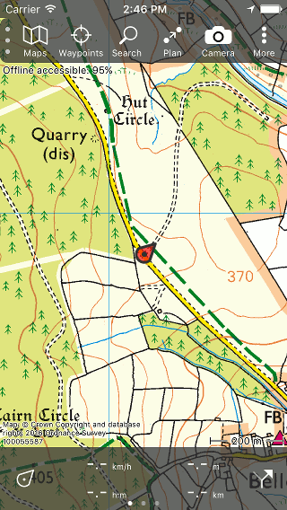
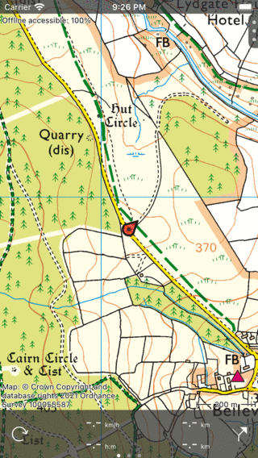

.. _sec-menu:

Menu
====
The menu of Topo GPS can be used to access the most important functions of Topo GPS. It is shown in the top of the main map screen.

You can open the menu by pressing the handle with the three dots on the top left of the main screen. Or you can drag this handle to the left.

The menu then appears as in the screen below.

   *The opened menu.*

As you can see in the figure above, the menu contains the following items:

- :ref:`Maps <sec-maps>` - If you tap this item, the maps screen will be opened. In this screen you can change the current map and buy additional maps. 
- :ref:`Waypoints <sec-wp>` - If you tap this item, the waypoints screen will be opened. 
Here you can manage everything with waypoints like loading them on the map.
- :ref:`Search <sec-searching>` - If you tap this item you can search addresses and places and enter and scan coordinates.
- :ref:`Routes <sec-routes>` - If you tap this item, the routes screen will be opened. In this screen you can manage everything with routes like loading, recording, planning, generating and importing routes. While routes are very important in Topo GPS you can also access the routes screen from the dashboard by pressing the route button on the bottom right of the screen. 
- :ref:`Camera <subsec-camera>` - To take photos.
- :ref:`More` - If you tap this item the more screen will be opneed. With the tabbar in the bottom you can access the various screens, like changing the :ref:`settings <sec-settings>`, view the :ref:`legend <sec-legend>`, and look up information about Topo GPS.

To close the menu you have to move the handle with the three dots to the right. If the menu is closed the main screen looks as follows:

   *The closed menu.*
