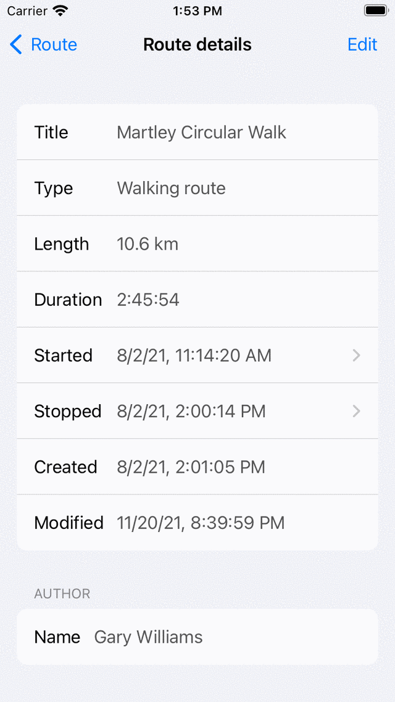

.. _ss-route-details:

Route details
=============
By pressing the information button on the right hand side
of a route title in the :ref:`routes screen <ss-route-load>`
the route details screen appears. 

If you have loaded the route on the map, you can also open
the route details screen by tapping the route.

The route details screen of the route ‘Gower Hike’ is
shown below:

.. figure:: _static/route-details1.png
   :height: 568px
   :width: 320px
   :alt: Route details Topo GPS

   *Figure 1. The route details screen of the route ‘Gower Hike’.*

In the top of the screen a map with the route is displayed.

You can see, a title, the route type, distance, time and author.

A description and photos will be shown if they are present.

At the bottom of the screen you can find the ‘Show waypoints’ switch.
By enabling this switch, waypoints that are part of the route will be displayed
on the map. If you disable this switch, these waypoints will not be shown.

With the button on the top right of the screen you load a route on the map
or unload a route from the map.

.. _ss-route-map-tiles:

Downloading map tiles of a route
~~~~~~~~~~~~~~~~~~~~~~~~~~~~~~~~
The percentage offline accessible map tiles indicates the percentage of map tiles relevant to the route that are stored on your device. This percentage only applies to the map that is currently visible in the map screen. 100% means that all map tiles necessary to display the route on the map are offline accessible.

You can download the map tiles of a route by pressing the ‘Download’ button in the route details screen. It is recommended to download all map tiles on a WiFi connection before you go outdoors to follow the route. In that case you can be certain that the part of the map relevant to the route is accessible on all zoom levels, even if you are not connected to the internet.

On the download button it is estimated how many megabyte (MB) the downloading of map tiles will be, and how much storage space the download would require. 

If you have pressed the download button, the button will indicate how much tiles remain to be downloaded. You can abort downloading by pressing ‘Stop download’. If all map tiles relevant to the route have been downloaded, the button will read ‘Downloaded completely’, as you can see below: 

.. figure:: _static/route-details2.png
   :height: 568px
   :width: 320px
   :alt: Route details Topo GPS

   *Figure 2. All map tiles relevant to the route have been made offline accessible.*

Route details toolbar
~~~~~~~~~~~~~~~~~~~~~
In the bottom of the route detail screen you can find a toolbar which
contains the following buttons:

- ‘<‘ and ‘>’: With these buttons you can browse through the list of routes
or through the loaded routes.
- Wastebasket icon: With this button you can remove a route from your device.
- Share/Export icon: With this button you can :ref:`share/export <ss-route-share>` a route.
- ‘Edit’: With this button you can edit the route details and the course of a route.

Additional route details
~~~~~~~~~~~~~~~~~~~~~~~~
By pressing the cell with the title in the route detail screen you obtain additional information about the route. An example is shown in the figure below:

   *Figure 3. Additional route details (top).*

.. figure:: _static/route-details4.png
   :height: 568px
   :width: 320px
   :alt: Route details Topo GPS

   *Figure 4. Additional route details (bottom).*

In this screen you could find an URL to the source of the route if available.

Moreover you can find the author details, copyright details and license.

Pay attention to the license if you want to use the route for non-personal reasons.

In the bottom of the screen you can see when the route has been created and when it was last modified. 