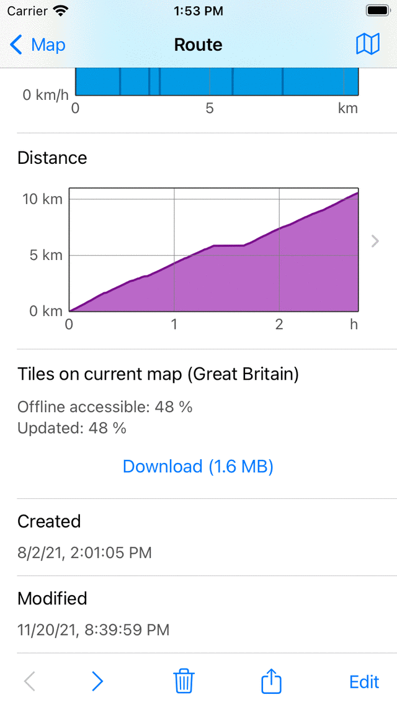

.. _sec-route-map-tiles:

Downloading map tiles of a route
~~~~~~~~~~~~~~~~~~~~~~~~~~~~~~~~
You can download the map tiles of a route by scrolling down in the :ref:`route details screen <sec-route-details>` to the section 
'Tiles on current map'. The current map is the map currently used in the main screen. If the route does not lie in the coverage region of the map, the 'Tiles on current map' section will not be shown. An example is shown below:

The percentage offline accessible map tiles indicates the percentage of map tiles relevant to the route that are stored on your device. This percentage only applies to the map that is currently visible in the map screen. If the percentage is 100% it means that all map tiles necessary to display the route on the map are offline accessible.

Tap the ‘Download’ button to start downloading the map tiles. It is recommended to download all map tiles on a WiFi connection before you go outdoors to follow the route. In that case you can be certain that the part of the map relevant to the route is accessible on all zoom levels, even if you are not connected to the internet.

On the download button an estimate of the size of the download and the required amount of storage space is shown.

If you have tapped the download button, the button will indicate how much tiles remain to be downloaded. You can abort downloading by tapping ‘Stop download’. If all map tiles relevant to the route have been downloaded, the button will read ‘Downloaded completely’.

Although the percentage offline accessible calculation is very reliable, you can always verify if the tiles are really accessible offline. Just put the device to airplane mode, load the route on the main map, and see if all maps around the route are shown.
