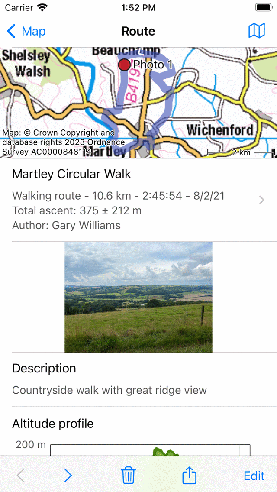
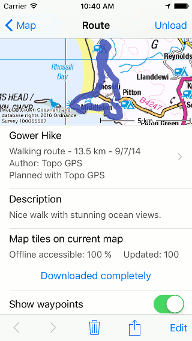
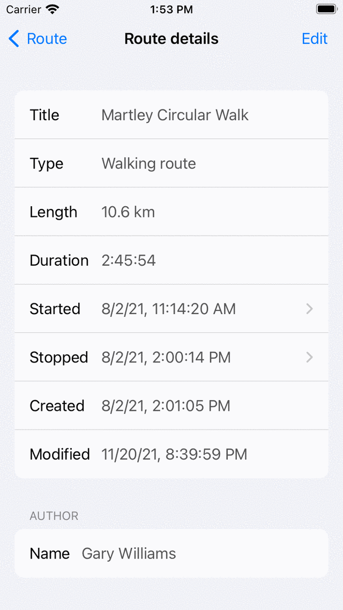

.. _sec-route-details:

Route details
=============
To open the route details screen, tap the route curve of a route that is loaded on the map in the main screen.
You can also open the route details screen by tapping the information button (i) on the right hand side of a route title in :ref:`saved routes screen <sec-routes-load>` (Menu > Routes > Saved routes) and the shared routes screen (Menu > Routes > Shared routes).

An example of the route details screen is shown below.

   *An example of the route details screen.*

In the top right of the route details screen a map icon is shown. If you tap the map icon, the route will be loaded on the main map, the map will be zoomed to the route and you will return to the main screen. If a slash is shown on the map icon, the route is already loaded on the map. If you tap the slashed map icon, you will remove the route from the map.

In the top of the route details screen a map with the route is displayed. The white arrow on the route line indicates the direction of the route.

Directly below the map you can find the title, the route type, length, duration (if the route is recorded), :ref:`total ascent <ss-total-ascent>` (if available) and author. If you tap this item, you can view :ref:`additional information about the route <ss-additional-route-details>`.

A description and photos will be shown if they are present. If you tap a photo, it will be shown full screen and you can browse through the photos by swiping the photos to the left and right.

Next, if present an altitude/elevation profile, a slope profile, a speed and a distance profile are shown. You can tap these profiles to view the :ref:`profile in more detail <sec-route-profiles>` and obtain additional height, slope and speed information.

   *An example of the bottom of the route details screen.*

If the route is within the coverage region of the main map, the section 'Tiles on current map' will appear as in the figure above. Here you can :ref:`download the map tiles of a route <sec-route-map-tiles>`.

In the bottom of the screen you also find the creation and last modified date and time of the route.

In the bottom of the routes details screen you can find a toolbar with the following buttons:

- *‘<‘ and ‘>’ buttons*: With these buttons you can browse backward and forward through the route details of a collection of routes.
- *Trash button*: If you tap this button you can :ref:`remove the currently shown route from your device <sec-route-remove>`.
- *Export button*: If you tap this button you can :ref:`export the route <sec-routes-export>`.
- *Edit button*: If you tap this button an pop-up will be shown which you can use to :ref:`edit the route <ss-route-edit>`.

.. _ss-additional-route-details:

Additional route details
------------------------
If you tap on the title section just below the map, in the :ref:`route details screen <sec-route-details>`, the additional route details screen will be opened. Here you can find additional information about the route, like author, and copyright information.  An example is shown in the figure below:

   *An example of the additional route details screen.*
   
In the additional route details screen, also the exact time and date of a start and finish of a recording is shown. If you tap one of these items, a graph of the distance versus time is shown, together with a map. Here you can read off every timestamp of every point on a recorded route. The time is displayed in the time zone used on the device.

If you have shared a route with Topo GPS, a special section about shared routes will appear in the additional route details screen. Here you can remove the shared route by tapping 'Remove shared route', and confirming the removal. Other users can then no longer download this shared route, but it will remain stored on your device.
