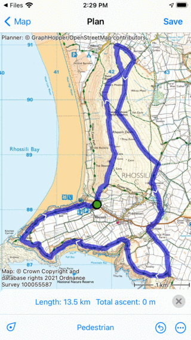
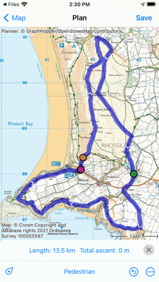
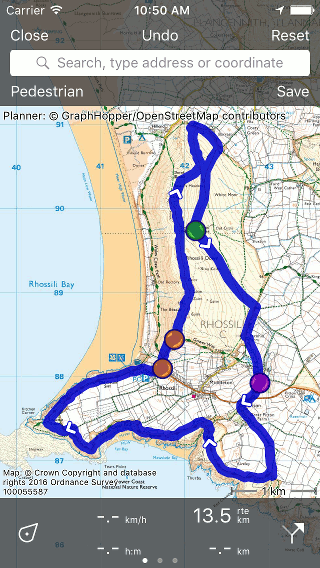

.. _ss-route-edit-replace:

Editing route track
~~~~~~~~~~~~~~~~~~~~
To replace a part of a route, first :ref:`load the route in the route planner <ss-route-track-edit>` as explained above. 

As an example we will now change the ‘Gower Hike’ so that the middle part of the route will go over the ‘Gower Way’. Initially the route looks as follows:

   *The northern part of the route is to be replaced.*

If you want to replace part of a route you have to insert two route points, one at the point the point the route needs to deviate, and one at the point the deviation will return to the original route. You can insert a route point by pressing long on the route. A blue route point will appear which you can move along the route to the desired location.

Since we want to change the route, so that the middle part runs over the 'Gower way' we have inserted two route points at the Gower way, as you can see below:

   *Two route points have been inserted.*

The route between the orange and the green route point needs to be modified. We now have to insert a third routepoint in between the orange and the green route point by pressing long on the route. The result is shown below:

   *The green route point is inserted in the route.*

By pressing long on the green route point you can drag it to the bottom or the top of the screen to remove it. The route between the previous and next point will be recomputed so that is runs over the 'Gower way' as is shown below:

   *The northern part of the 'Gower Hike' route is replaced.*

You can now save the shortened route by pressing ‘Save’ in the route planner 
window.
