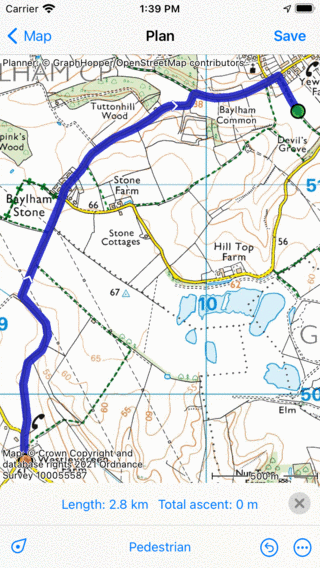
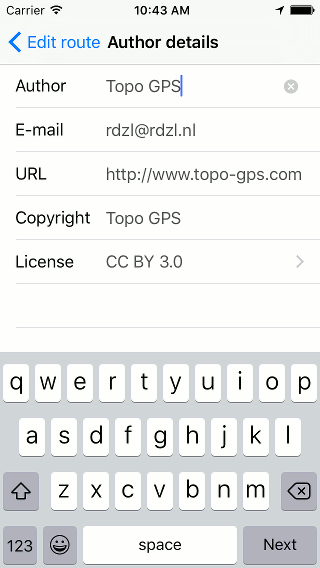

.. _ss-route-track-edit:

Editing route track
~~~~~~~~~~~~~~~~~~~
To change the track of a route, open the :ref:`route details screen <sec-route-details>` and tap 'Edit > Edit track'.
Alternatively, open the :ref:`route planner <sec-route-plan>` and tap 'More > Add route'. Tap a route in the list with routes and choose 'Join to planner'.

The route will be loaded in the route planner as can be shown from the example above.

   *Editing the route track in the route planner.*
   
Just like with manually planning a route you can add, move, insert and remove route points to modify the route.
If you are done editing the route track you can press 'Save' to save the result. The modified route will be saved a new route, the existing route will not be changed. Optionally you could :ref:`remove <sec-route-remove>` the original route later.   
   
Below we will give the following examples:

- :ref:`ss-route-edit-extend`

- :ref:`ss-route-edit-shorten`

- :ref:`ss-route-edit-replace`

- :ref:`ss-route-edit-merge`

.. _ss-route-edit-extend:

Extending a route
~~~~~~~~~~~~~~~~~
To extend a route, first :ref:`load the route in the route planner <ss-route-track-edit>` as explained above. 
Then tap the last route point so that it becomes selected and green. 
You can now can add a route point by pressing long on the map. A blue route point will appear.
As long as you hold your finger on the map, you can drag the blue 
route point to the desired location. If you release your finger a route
will be drawn from the green route point to the added route point. The added
route point will be selected and colored green. An example of extending the route in the figure above
is shown below.

   *The route is extended to the added route point.*

You can now save the extended route by pressing ‘Save’ in the route planner 
window. A saved route will be always stored as a new route.
