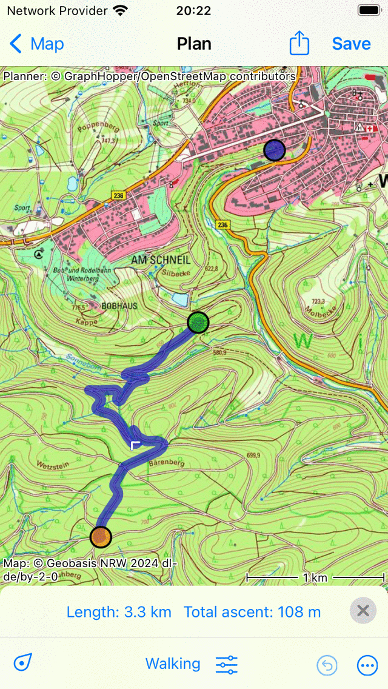
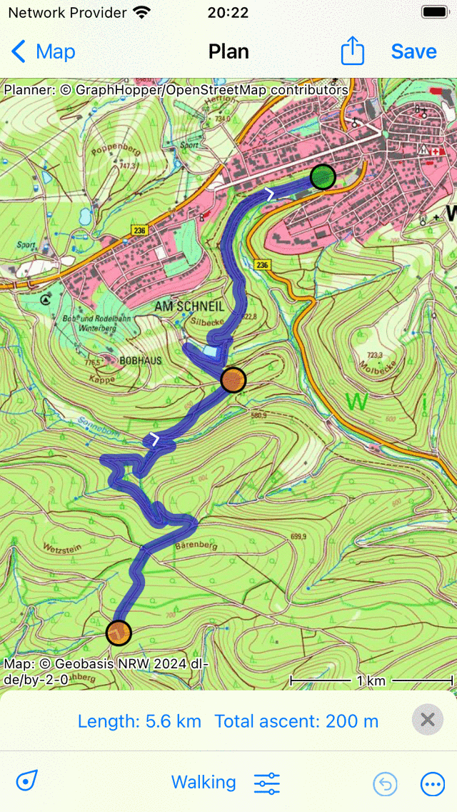
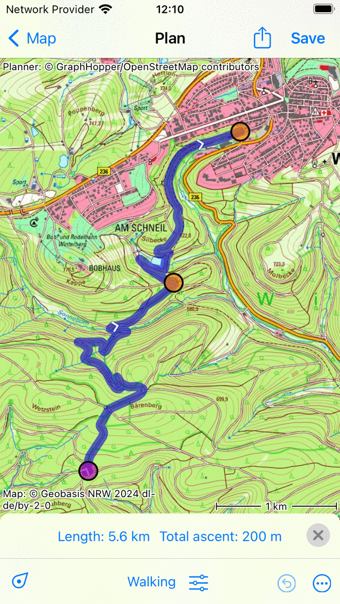
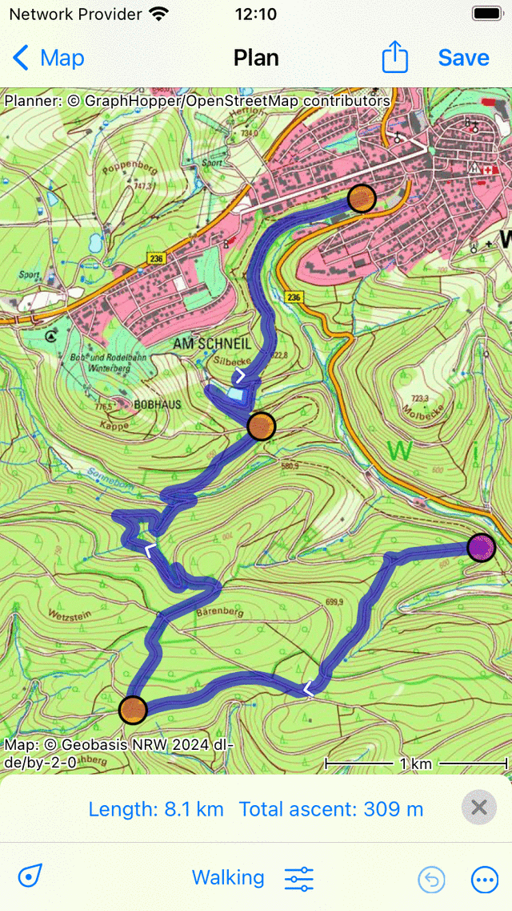

.. _sec-route-extend:

Extending a route
=================
To extend a route, first go to the route details screen and tap :ref:`Edit > Edit route track <ss-route-edit>` in the bottom right of the screen.

The route will be loaded in the route planner. Make sure that the transportation means is set correctly.

Extending route at end
----------------------
To extend a route at the end, tap the last route point so that it becomes selected and green. 
You can now can add a route point by pressing long on the map. A blue route point will appear as in the example below:

As long as you hold your finger on the map, you can drag the blue route point to the desired location. 

If you release your finger a route will be drawn from the green route point to the added route point. The added
route point will be selected and colored green. An example of extending the route in the figure above
is shown below.

   *The route is extended to the added route point.*

If you wish you can extend the route even more by adding more route points.

You can now save the extended route by pressing ‘Save’ in the top right of the screen. A saved route will be always stored as a new route.

Extending route at beginning
----------------------------
To extend a route at the beginning, select the first route point by tapping it so that it becomes green. Then tap the first route point a second time, so that it becomes purple as in the figure below:

   *The first route point is purple.*

Then add a new route point by pressing long on the map. A route will be drawn from the added point to the original starting point. 

   *The route is extended at the beginning.*

The added point will automatically be colored purple after the route has appeared. You can then continue adding route points to extend the route at the beginning further.

If you are ready editing the route you can tap ‘Save’ in the top right of the screen.
