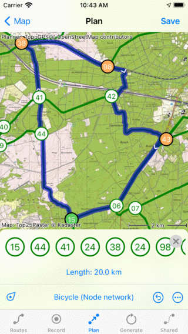
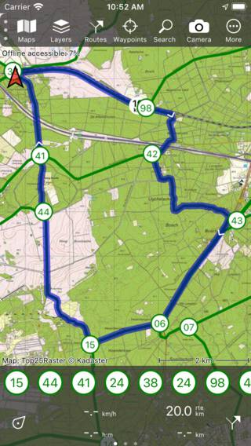

.. _sec-route-plan-bnn:

Planning a route over a bicycle node network
============================================

A bicycle node network is a collection of numbered nodes and connections between them. A sign with the node number is placed a the location of a node. It also shows the direction to the nearby nodes. The connections are also marked with signs. A bicycle node network allows for easy navigation, because a route can be described by the node numbers.

Bicycle node networks can be found in the Netherlands, Belgium and Germany.

To plan a route over a bicycle node network, first load the bicycle node network on the map via :ref:`Menu <sec-menu>` > Layers > Bicycle node network. Then tap a bicycle node and tap 'Plan a route'.

Alternatively open the :ref:`route planner <sec-route-plan>` and set the transportation means to 'Bicycle node network'.

Tap subsequently the desired bicycle nodes to plan a route. An example is shown below:

   
   *Planning a route over a bicycle node network.*

The route is planned on your device, that is why you do not need an internet connection for planning routes over a bicycle node network.

Like with :ref:`route planning by creating route points manually on the map <sec-route-plan-map>`, it is also possible to :ref:`move <ss-route-point-move>`, :ref:`insert <ss-route-point-insert>` and :ref:`remove <ss-route-point-remove>` route points

If you press long on a connection between the nodes, you can also add a route point on a connection.

In the route planner overlay you can see the list of the nodes you have to follow. You can slide this list to the left and the right.

If you are done planning a route you can press 'Save' to save the route. If you tap '< Map', the route will not be saved. You will return to the main screen and the map will zoom to the planned route.

   
   *The planned bicycle node network route on the main screen.*
