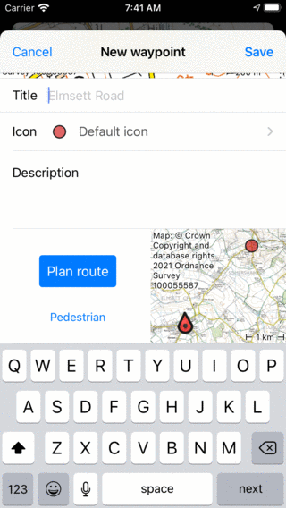
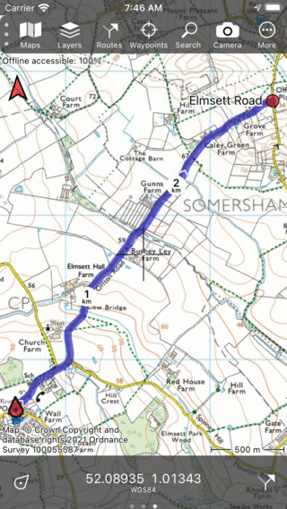

.. _sec-route-plan-current-location-point:

Planning a route from your current location to a point
======================================================

You can plan a route from your current location to a point in several ways.

.. _ss-route-plan-cur-loc-map:

Planning from current location to a point on the map
~~~~~~~~~~~~~~~~~~~~~~~~~~~~~~~~~~~~~~~~~~~~~~~~~~~~
If you want to plan a route from your current location to a point on the map, the fastest way is to press long on the map. An icon will appear which you can drag to the desired location. If you release your finger the waypoint creation screen will appear. Scroll down in this screen to see the route plan section, as in the example below.

   
   *Planning a route to a point on the map.*

Below the plan button you can see the current transportation means. If you tap it, you can change it to the desired means of transportation. Next to the plan button you see an overview map with the current location and the point. If you tap the plan button, a route will be planned from your current location to the point and you will return to the main screen as you can see in the figure below:

   
   *A route was planned from your current location to a point on the map.*

If you tap the route curve, the :ref`route planner <sec-route-plan>` will be opened. There you can tap More > Reset to remove the planned route, or 'Save' to save it.

.. _ss-route-plan-cur-loc-wp:

Planning from current location to a waypoint
~~~~~~~~~~~~~~~~~~~~~~~~~~~~~~~~~~~~~~~~~~~~
To plan a route from your current location to a waypoint, first open the :ref:`waypoint details screen <sec-waypoint-details>` by for example tapping on a waypoint that is loaded on the map. Then scroll down in the waypoint details screen to the plan section. Check the transportation means, and tap 'Plan' to plan a route from your current location to the waypoint, as in the example above.

.. _ss-route-plan-cur-loc-name:

Planning from current location by entering a location name
~~~~~~~~~~~~~~~~~~~~~~~~~~~~~~~~~~~~~~~~~~~~~~~~~~~~~~~~~~
It is possible to plan a route from the current location by :ref:`entering a location name in the route planner screen <sec-route-plan-search-bar>`.

Alternatively, tap :ref:`Menu <sec-menu>` > Search > Address and enter a location in the seach bar. In the search results that appear, tap the info button to view more information about a search result. Scroll down to the plan section.  Check the transportation means, and tap 'Plan' to plan a route from your current location to the search result, as in the example above.

.. _ss-route-plan-cur-loc-coordinate:

Planning from current location to a coordinate
~~~~~~~~~~~~~~~~~~~~~~~~~~~~~~~~~~~~~~~~~~~~~~
To plan a route from your current location to a coordinate, first enter a coordinate, via :ref:`Menu <sec-menu>` > Search > Coordinate. Then return to the map, tap on the created waypoint and plan the route as :ref:`explained above <ss-route-plan-cur-loc-wp>`.

