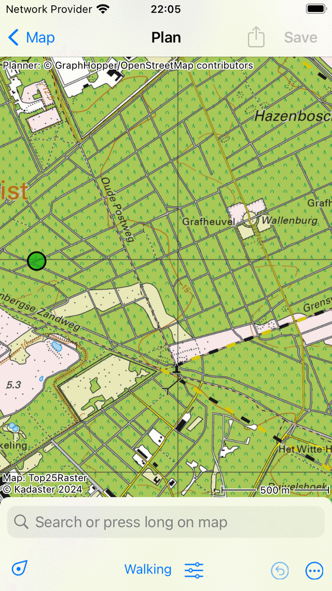
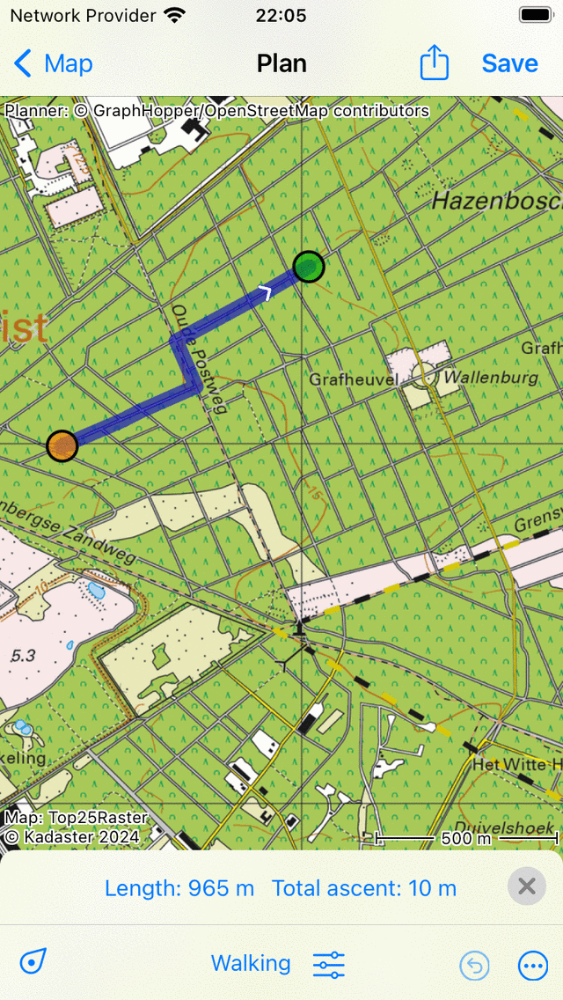
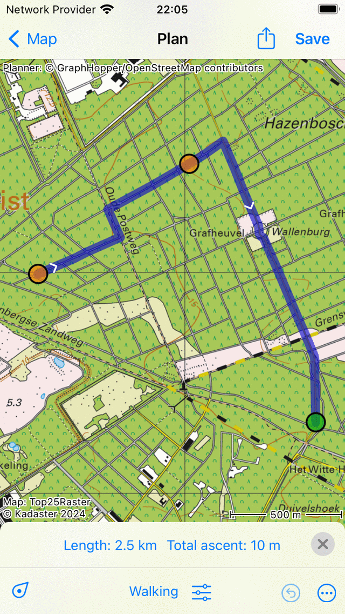
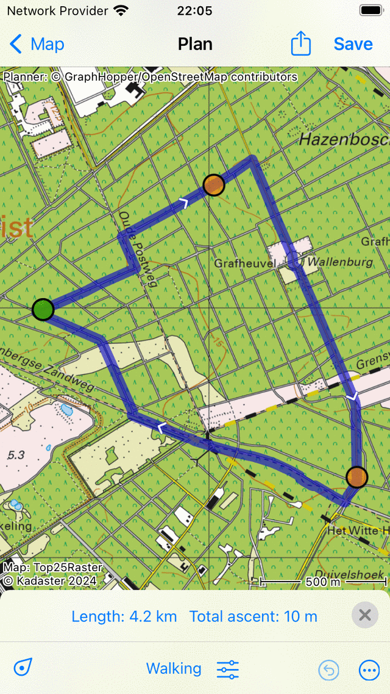
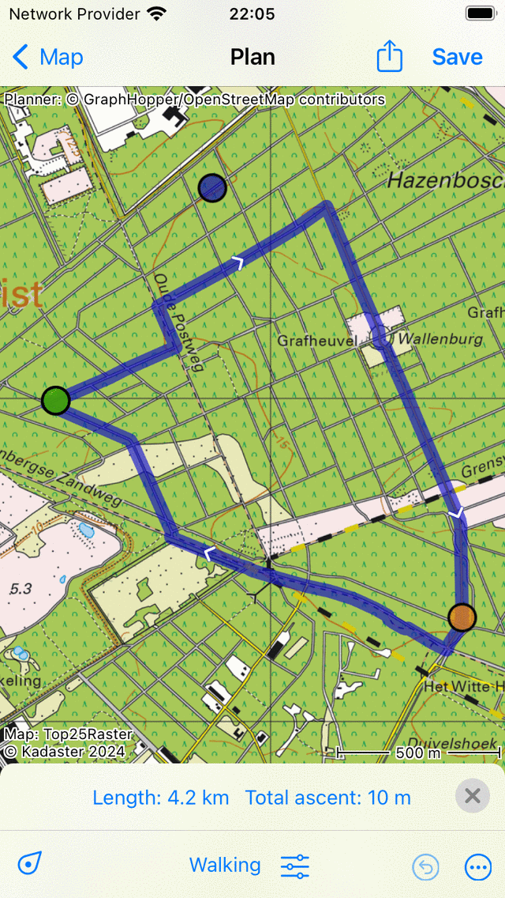
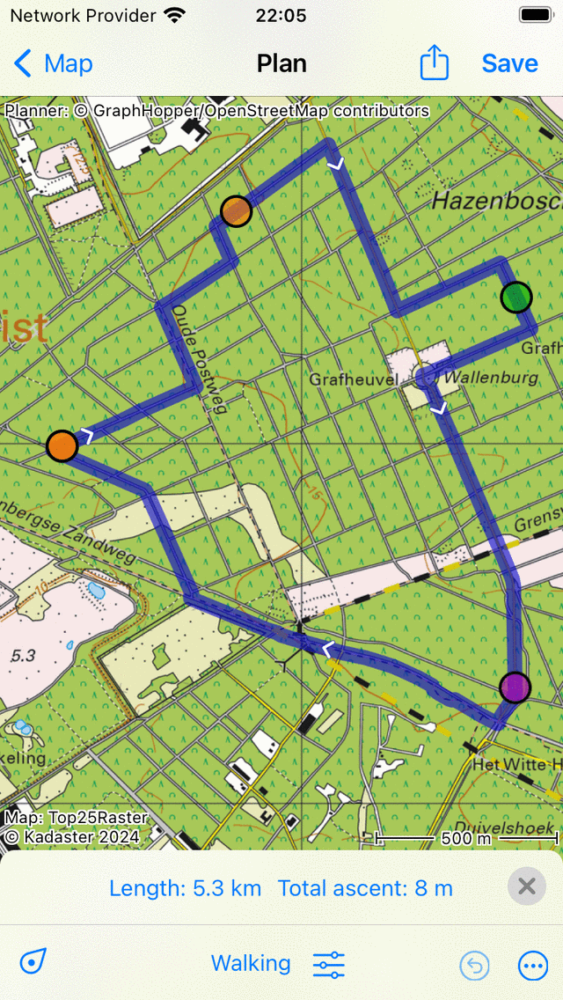
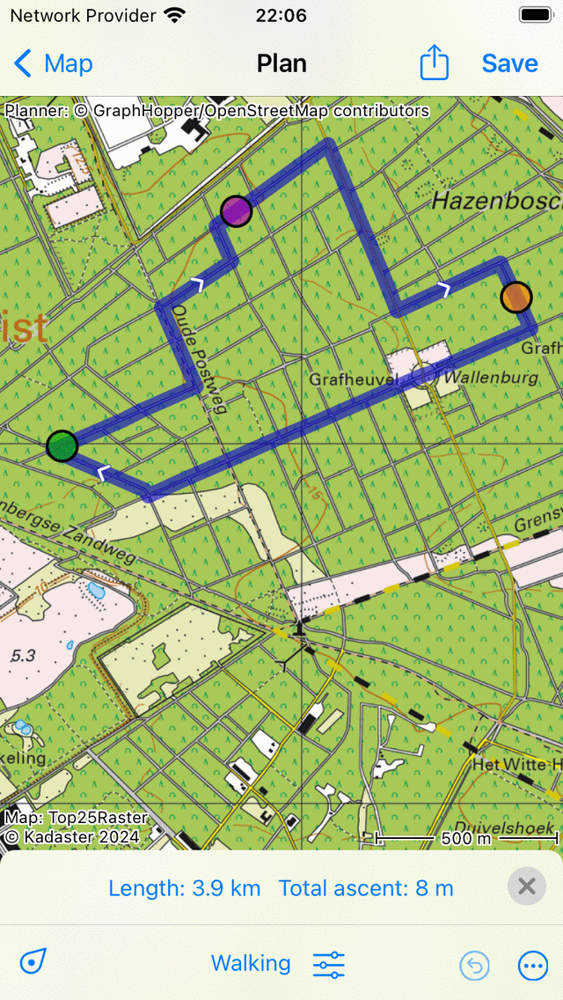

.. _sec-route-plan-map:

Planning a route by manually creating route points on the map
=============================================================

To plan a route by manually creating route points on the map, first open the :ref:`route planner <sec-route-plan>`.
If a route is present, tap More > Reset to reset the route planner.

If you press long on the map, a route point will appear. If you hold you finger on the map, you can drag the route point to the desired position. If you then release your finger, the route point will be positioned.
An example is displayed below:

   
   *A route point is added manually to the map.*

The added route point is colored green. The green color indicates that the route point is selected.

You can add a second route point by pressing long on the map. This one will be colored blue and indicates a route point that is being added. A blue route point will always follow a green one. You now have to drag the blue route point to the desired position. If you release your finger a route will be planned from the green to the blue route point as you can see below:

   *A route is planned between two manually added route points.*

By planning a route the route points will be moved automatically to the closest road.

By releasing the blue route point, it will be selected automatically and colored green. The originally selected route point will be deselected and becomes orange.

The length of the planned route is indicated on the route planner overlay in the bottom. If you tap the length, the map will zoom to the planned route.

To extend the route you have to add a third route point, by pressing long on the map. An example is displayed below:

   *A route is planned via three route points.*
   

Planning a round-trip
~~~~~~~~~~~~~~~~~~~~~
To plan a round trip, you first have to add several route points as in the example above. Then tap the first route point. A pop-up will appear in which you are asked to to plan to or select the start point. Tap 'Plan to start point' and the route will be closed, as you can see in the example below:

   *A round-trip route is planned via three route points.*
   
.. _ss-route-point-select:

Selecting route points
~~~~~~~~~~~~~~~~~~~~~~
You can select a route point by tapping it. The tapped route point will become green. A route point that immediately follows a selected route point will be colored purple. In this way you can always recover the direction of the route. All other route points will be colored orange.

.. _ss-route-point-move:

Moving route points
~~~~~~~~~~~~~~~~~~~
To move a route point, you first :ref:`select <ss-route-point-select>` the desired route point by tapping it. 
The route point will become green. Next, you press long on the selected route point.  Hold your finger on the screen and drag the route point to the new position. An example is displayed below:

   *Moving a route point.*

If you release the moved route point, the new route will be calculated automatically
as you can see in the figure below: 

   *Newly planned route after moving a route point.*

.. _ss-route-point-insert:

Inserting route points
~~~~~~~~~~~~~~~~~~~~~~
To insert a route point in between two existing route points, you first have to
:ref:`select <ss-route-point-select>` the route point that lies just before the route point
that you intend to insert.

If the selected route point is not the last route point, you will 
see a purple route point. That is the route point that directly follows
the green route point. An inserted route point will be inserted between
the green and the purple point.

If you press long on the map, a blue route point will appear. If you
hold your finger on the map, you can drag this point to
the desired position. An example is displayed below:

  
   *A new route point (blue) will be inserted between the selected (green) and the following route point (purple).*

If you release you finger from the screen, the route between the green and
purple route point will now go via the inserted route point. This is illustrated in the figure below:
 

 
   *The newly planned route goes via the inserted route point.*

If the new route has been computed, the inserted route point will be automatically selected
and colored green.

It is also possible to insert a route point on the current route. Press long on the route, a new blue route point will appear. 
If you move your finger around, the new route point will move along the route. If you release your finger, the route point will be inserted.

.. _ss-route-point-remove:

Removing route points
~~~~~~~~~~~~~~~~~~~~~
To remove a route point, you first have to :ref:`select <ss-route-point-select>` the desired route point by tapping it.
Next, press long on this route point, hold your finger on the screen and drag it to the top or bottom of the screen. 
You will see that the route point disappears. An example is displayed below:

  
   *Removing a route point by dragging it to the top or bottom of the screen.*

If you have dragged the route point to the route plan window you can release it. The
route point will be removed and the route will be recalculated as you can see
below:

   *The route after removing a route point.*

