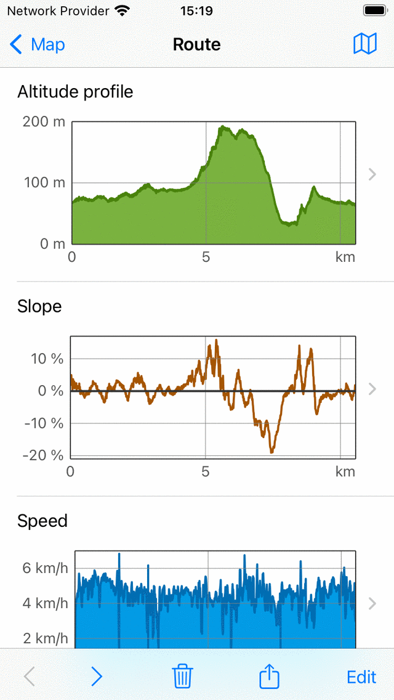
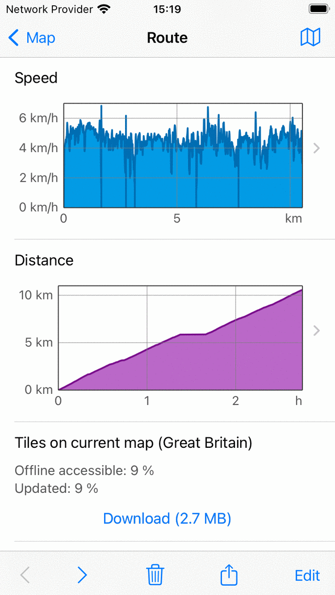
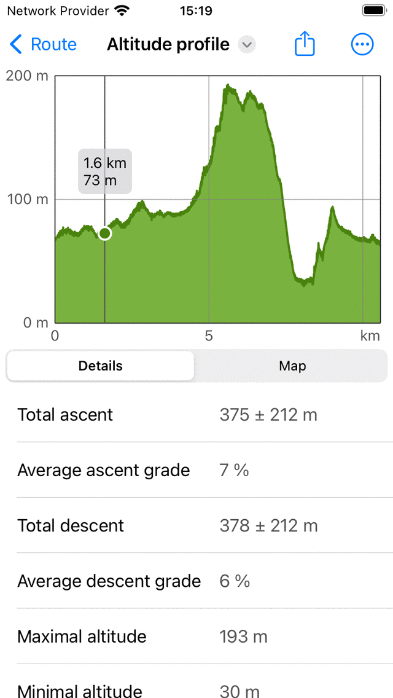
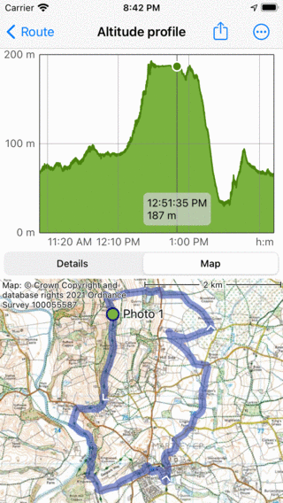

.. _sec-route-profiles:

Route profiles
==============

When height information is available you can find a altitude or elevation, and a slope profile by scrolling down in the :ref:`route details screen <sec-route-details>`. When timing information is available you can also find a speed and a distance profile in the :ref:`route details screen <sec-route-details>`. When :ref:`recording a route <sec-route-record>`, you can tap the route line of the recorded route to open the record screen. There you also find an altitude and a speed profile. When :ref:`planning a route <sec-route-plan>` or :ref:`generating a route <sec-route-generate>`, you can tap the 'Total ascent' label to see the elevation and slope profiles of the planned route.

   
   *An example of altitude, slope, speed and distance profiles in the route details screen.*
   
Height profiles
---------------
Both an altitude and elevation profile are height profiles. Altitude is the height of the device with respect to the mean sea level. Elevation is the height of the ground with respect to the mean sea level and is most often derived from a digital elevation model. If somebody is walking on the ground, the altitude is approximately equal to the elevation. But if somebody is flying, altitude and elevation are different. The height profiles of recorded routes in Topo GPS are always altitude profiles, i.e. measured with use of the GPS and barometer (when available).

Slope profile
--------------
The slope profile gives a you a quick look on the difficulty of a route. The slope percentage (also called grade) is the amount of vertical displacement compared to the horizontal displacement. Although the slope profile might be fluctuating a lot, the grade of the steepest parts can be easily found from the slope profile. And also the length of the steepest parts can be read off quickly. Together with the length and the :ref:`total ascent <ss-total-ascent>`, this gives you quickly an idea of the difficulty of the route.

We would advise you to figure out what slopes you can handle. This you can do by investigating slope graphs of routes you :ref:`recorded <sec-route-record>` previously. Then always check the slope graph before you would like to follow a route. If it has steep parts for longer distances, which are above your abilities, you better choose another route to follow.

In the slope profile in Topo GPS the slopes are computed between points that are about 200 m away from each other, in order to smooth out smooth out fluctuations. 

.. _ss-profile-screen:

Profile screen
---------------
You can tap a profile in the :ref:`route details screen <sec-route-details>`, to open the profile screen. Below we discus only the altitude profile screen, the other profiles show other information, but their profile screens function similarly.

An example of the altitude profile screen is shown in the figure below:

   
   *Altitude profile of a route in more detail*
   
The altitude profile screen contains a graph and information. The graph contains a pointer which you can drag around to read off a value from the profile. By putting two fingers on the profile and moving them away from each other you can zoom in to the profile to see more details. If you are zoomed in you can also move the profile with one finger. To zoom out, put two fingers on the profile and move them towards each other.

In the bottom you can select between the tabs 'Details' and 'Map'. In the example above the 'Details' tab is opened. This gives detailed information about the altitude profile, such as 'Total ascent', 'Average ascent grade' and 'Total descent'. 

If you select the tab 'Map' a map of the route will be shown in combination with the altitude profile, as you can see in the example below:

   
   *Altitude profile of a route with the map of a route*

The position of the pointer in the graph is shown with a green point on the map. If you drag the green point along the route, the pointer in the altitude profile will move as well. In this way you can easily find interesting points in the altitude profile on the map.

If you tap 'More' you can change the horizontal axis. You can choose between 'Distance', 'Duration' and 'Time'. An example with showing the time on the horizontal axis is shown below:

   
   *Altitude profile of a route as a function of time.*

If you tap the export icon on the top, you can export and share the profile in PDF format.

.. _ss-total-ascent:

Total ascent and descent
------------------------
The total ascent is the cumulative altitude gain of a route. Alternatively said, it is the sum off all vertical upwards displacements.
Likewise the total descent is the cumulative altitude loss of a route, or the sum of all vertical downwards displacements. 
The total ascent of a route is shown in the :ref:`route details screen <sec-route-details>`, in the title section just below the map. Also the total ascent and total descent can be found in the :ref:`height profile screen <ss-profile-screen>`.

Especially the total ascent gives you together with the length and the slope profile an idea of the difficulty of a route. Routes with a larger total ascent are typically more difficult.

In theory the total ascent and descent are quite simple to understand. For example, suppose you start a route at an elevation of 100 m. First you walk up a hill along a path of 1 km to a height of 150 m. Then you walk 2 km downwards to a height of 120 m. The total ascent is in this example (150 - 100) m = 50 m. The total descent is (150 - 120) m = 30 m.

In practice, computing the total ascent/descent of a recorded route is more difficult. The route with altitudes is in reality a set of points which all have their measurement errors. If we would simply add up all positive vertical gains, then we also would include measurement fluctations, resulting in an unreasonable large total ascent. Therefore we estimate the accuracy of the height determination in Topo GPS, and use that as a cut-off for including gains in the total ascent. In practice this means approximately that gains are only included in the total ascent if the gain is at least about 10 m. We also compute the error. Therefore the total ascent is presented as a value ± the error. If the value of the total ascent is for example 320 m ± 50 m you should read it as, most likely the total ascent is between 270 m and 370 m.

In fact other programs/apps will compute the total ascent differently and hence can give values which can differ (widely) from Topo GPS. Therefore it is best to compare only total ascents between routes if they are computed in the same way. So you might perfectly compare total ascent of Route A in Topo GPS with that of Route B in Topo GPS. However be careful, if you would compare the total ascent of Route A in Topo GPS with Route A in another app.

