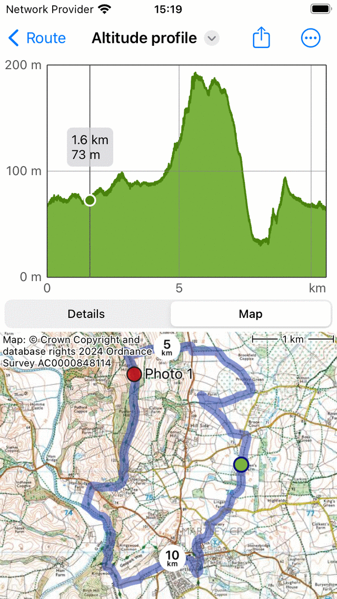

.. _sec-route-profiles:

Route profiles
==============

When height information is available you can find a altitude or elevation profile by scrolling down in the :ref:`route details screen <sec-route-details>`.
When timing information is available you can also find a speed and a distance profile in the :ref:`route details screen <sec-route-details>`.
When recording a route, you can tap the route line of the recorded route to open the record screen. There you also find an altitude and a speed profile.
When planning a route, you can tap the 'Total ascent' label to see the elevation profile of the planned route.

   
   *An example of altitude, speed and distance profiles in the route details screen.*
   
Altitude or elevation profile
~~~~~~~~~~~~~~~~~~~~~~~~~~~~~
Both an altitude and elevation profile are height profiles. Altitude is the height of the device with respect to the mean sea level. Elevation is the height of the ground with respect to the mean sea level and is most often derived from a digital elevation model. If somebody is walking on the ground, the altitude is approximately equal to the elevation. But if somebody is flying, altitude and elevation are different.

You can tap the altitude or elevation profile in the route details screen, to open the height profile screen. An example is shown in the figure below:

   
   *Altitude profile of a route in more detail*
   
The height profile screen contains a graph and information. The graph contains a pointer which you can drag around to read off a value from the profile.

In the bottom you can select between the tabs 'Details' and 'Map'.In the example above the 'Details' tab is opened. This gives detailed information about the height profile, such as 'Total ascent', 'Average ascent grade' and 'Total descent'. 

If you select the tab 'Map' a map of the route will be shown in combination with the height profile, as you can see in the example below:

   
   *Altitude profile of a route with the map of a route*

The position of the pointer in the graph is shown with a green point on the map. If you drag the green point along the route, the pointer in the height profile will move as well. In this way you can easily find interesting points in the height profile on the map.

If you tap 'More' you can change the horizontal axis. You can choose between 'Distance', 'Duration' and 'Time'. An example with showing the time on the horizontal axis is shown below:

   
   *Altitude profile of a route as a function of time.*

If you tap the export icon on the top, you can export and share the height profile in PDF format.

Speed profile
-------------

Distance profile
----------------
