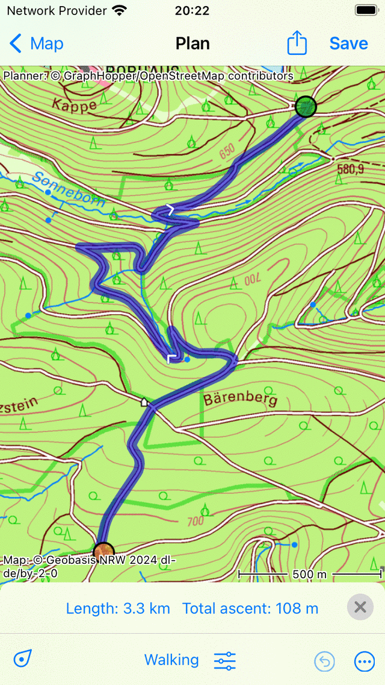
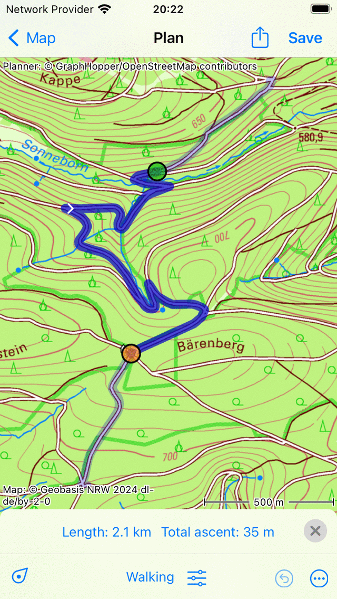

.. _sec-route-shorten:

Shortening a route
==================
To shorten a route, first go to the route details screen and tap :ref:`Edit <ss-route-edit> > Edit route track` in the bottom right of the screen.

The route will be loaded into the route planner in a special way, as is in the example below

   *A route that needs to be shortened.*
   
To shorten the route, first press long on the first or the last point of the route. Hold your finger on the screen and move the point to the desired location. The point can only be moved along the route. If you release your finger the route will be shortened as in the example below:

   *A route that is shortened by moving both the start and end point.*

If you have shortened the route, the original route is shown on the map with a lighter color. You can correct the shortening by moving the first or last route point again.

If you are ready shortening the route you can press 'Save' to save the shortened route as a new route.
