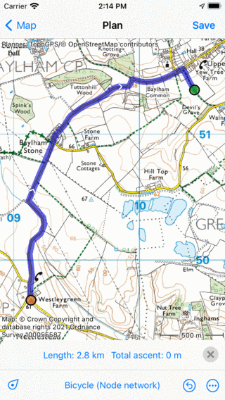
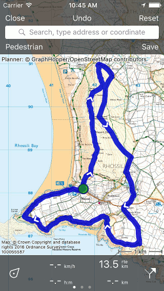
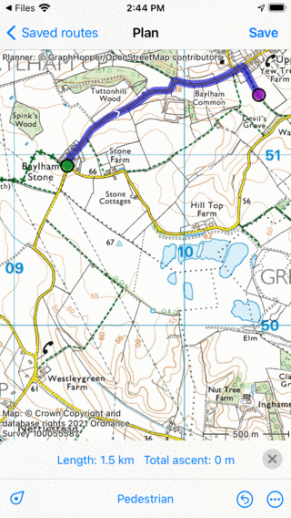

.. _sec-route-shorten:

Shortening a route
==================
To shorten a route, first :ref:`load the route in the route planner <ss-route-track-edit>` as explained above. 
As an example we want to shorten the following route:

   *A route that needs to be shortened.*
   
We want to start the route in Baylham Stone. Press long on the route to insert a route point on the route. When you move your finger the route point will move on the route. Move the route point to Baylham Stone and release your finger. 

   *The green route point is inserted into the route.*

Next you have to press long on the first route point, drag it to the bottom or top of the screen and release your finger. The first route point will be removed and the route will be shortened from the inserted route point to the last route point. This is illustrated in the figure below:
 

   *The first route point has been removed and the route is shortened.*

You can now save the shortened route by tapping ‘Save’ on the top right. 

