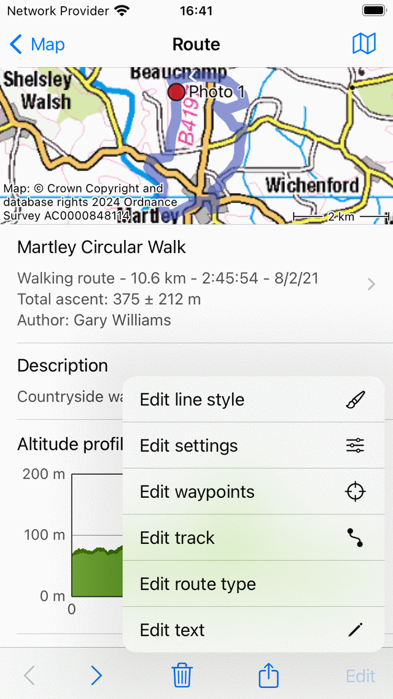

.. _ss-route-edit:

Editing routes
--------------
To edit a route, first open the :ref:`route details screen <sec-route-details>`.
Then tap the button 'Edit' in the bottom toolbar. A pop-up appears as you can see in the example below:

   *Edit options pop-up route details screen.*

In the edit pop-up you can choose between the following options:

- *Edit text*. If you tap this option, a screen will appear in which you can edit the title, author details and description.
- *Edit route type*. If you tap this option, a screen will appear in which you can change the route type.
- *Edit track*. If you tap this option, the route will be loaded in the route planner, which allows you to :ref:`modify the route track <ss-route-track-edit>`.
- *Edit waypoints*. If you tap this option, the waypoints belonging to the route will be shown in a waypoints screen. You can modify and remove waypoints just like you do with normal waypoints.
- *Edit settings*. If you tap this option, you can alter the settings of a route. You can determine whether to enable showing the waypoints of a route. Furthermore you can enable 'Reverse direction', which reverses the direction of a route.

.. _ss-route-track-edit:

Editing route track
~~~~~~~~~~~~~~~~~~~
To change the track of a route, open the route :ref:`route details screen <ss-route-track-edit-details>` and tap 'Edit > Edit track'.
Alternatively, open the :ref:`route planner <sec-route-plan>` and tap 'More > Add route'. Tap a route in the list with routes and choose 'Join to planner'.

The route will be loaded in the route planner as can be shown from the example above.

.. figure:: ../_static/route-edit2.png
   :height: 568px
   :width: 320px
   :alt: Editing route track Topo GPS

   *Editing the route track in the route planner.*
   
Just like with manually planning a route you can add, move, insert and remove route points to modify the route.
If you are done editing the route track you can press 'Save' to save the result. The modified route will be saved a new route, the existing route will not be changed. Optionally you could :ref:`remove <sec-routes-remove>` the original route later.   
   
Below we will give the following examples:

- :ref:`ss-route-edit-extend`

- :ref:`ss-route-edit-shorten`

- :ref:`ss-route-edit-replace`

- :ref:`ss-route-edit-merge`

.. _ss-route-edit-extend:

Extending a route
~~~~~~~~~~~~~~~~~
To extend a route, first :ref:`load the route in the route planner <ss-route-track-edit>` as explained above. 
Then tap the last route point so that it becomes selected and green. 
You can now can add a route point by pressing long on the map. A blue route point will appear.
As long as you hold your finger on the map, you can drag the blue 
route point to the desired location. If you release your finger a route
will be drawn from the green route point to the added route point. The added
route point will be selected and colored green. An example of extending the route in the figure above
is shown below

.. figure:: ../_static/route-edit3.png
   :height: 568px
   :width: 320px
   :alt: Extending route Topo GPS

   *The route is extended to the added route point.*

You can now save the extended route by pressing ‘Save’ in the route planner 
window. A saved route will be always stored as a new route.

.. _ss-route-edit-shorten:

Shortening a route
~~~~~~~~~~~~~~~~~~
To shorten a route, first :ref:`load the route in the route planner <ss-route-track-edit>` as explained above. 
As an example we want to shorten the following route:

.. figure:: ../_static/route-edit4.png
   :height: 568px
   :width: 320px
   :alt: Editing route track Topo GPS

   *A route that needs to be shortened.*
   
We want to start the route in Baylham Stone. Press long on the route to insert a route point on the route. When you move your finger the route point will move on the route. Move the route point to Baylham Stone and release your finger. 

.. figure:: ../_static/route-edit5.png
   :height: 568px
   :width: 320px
   :alt: Shortening route Topo GPS

   *The green route point is inserted into the route.*

Next you have to press long on the first route point, drag it to the bottom or top of the screen and release your finger. The first route point will be removed and the route will be shortened from the inserted route point to the last route point. This is illustrated in the figure below:
 
.. figure:: ../_static/route-track-edit6.png
   :height: 568px
   :width: 320px
   :alt: Shortening route Topo GPS

   *The first route point has been removed and the route is shortened.*

You can now save the shortened route by tapping ‘Save’ on the top right. 

.. _ss-route-edit-replace:

Replacing part of a route
~~~~~~~~~~~~~~~~~~~~~~~~~
To replace part of a route, first :ref:`load the route in the route planner <ss-route-track-edit>` as explained above. 

As an example we will now change the ‘Gower Hike’ so that the middle part of the route will go over the ‘Gower Way’. Initially the route looks as follows:

.. figure:: ../_static/route-track-replace1.png
   :height: 568px
   :width: 320px
   :alt: Replacing track Topo GPS

   *The northern part of the route is to be replaced.*

If you want to replace part of a route you have insert two route points, one at the point the point the route needs to deviate, and one at the point the deviation will return to the original route. You can insert a route point by pressing long on the route. A blue route point will appear which you can move along the route to the desired location.

Since we want to change the route, so that the middle part runs over the 'Gower way' we have inserted two route points at the Gower way, as you can see below:

.. figure:: ../_static/route-track-replace2.png
   :height: 568px
   :width: 320px
   :alt: Replacing route Topo GPS

   *Two route points have been inserted.*

The route between the orange and the green route point needs to be modified. We now have to insert a third routepoint in between the orange and the green route point by pressing long on the route. The result is shown below:

.. figure:: ../_static/route-track-replace3.png
   :height: 568px
   :width: 320px
   :alt: Replacing route Topo GPS

   *The green route point is inserted in the route.*

By pressing long on the green route point you can drag to the botom or the top of the screen to remove it. The route between the previous and next point will be recomputed so that is runs over the 'Gower way' as is shown below:

.. figure:: ../_static/route-track-replace4.png
   :height: 568px
   :width: 320px
   :alt: Shortening route Topo GPS

   *The northern part of the 'Gower Hike' route is replaced.*

You can now save the shortened route by pressing ‘Save’ in the route planner 
window.

.. _ss-route-edit-merge:

Merging routes
~~~~~~~~~~~~~~
To merge routes, first open the :ref:`route planner <sec-route-plan>`. Add one route to the planner by tapping 'More > Add route'. Tap the desired route and choose 'Join to planner'. Repeat the previous step to add more routes to the planner.

If you press ‘Save’ in the route planner window, the saved route will be the combination of all added routes. 
