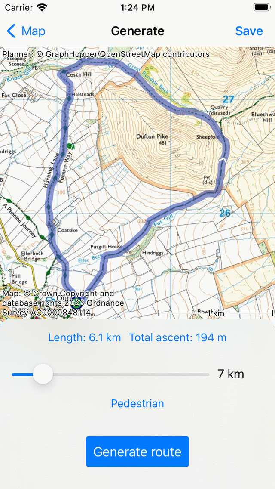
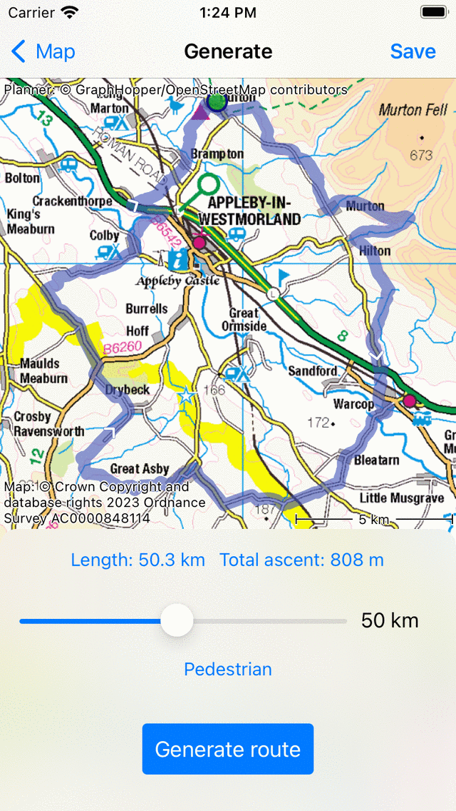
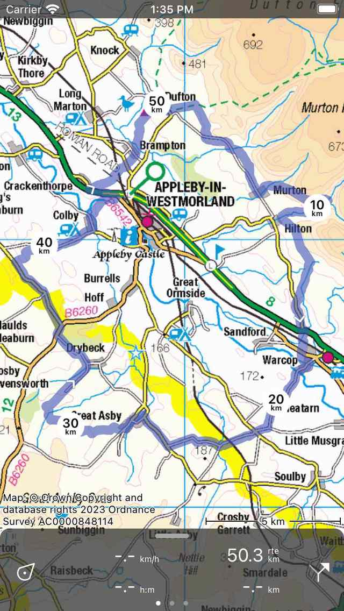

.. _sec-route-generate:

Generating routes
=================

Suppose you want to walk or cycle a route of a certain length from a certain point. You could try to :ref:`plan a route <sec-route-plan>`, and by trial and error you will probably end up with a nice round trip route of the desired length. However, in such situation it might be much easier to letting Topo GPS generate a route for you.

Generating a route is the automatic creation of a round-trip route. The only inputs are the starting point, the desired length and the transportation means.

To generate a route, first open the 'Generate' tab in the :ref:`routes screen <sec-routes-screen>`. A route will be immediately generated as in the example below:

   *The route generation screen with a generated route.*

The generated route is shown on the map.

The green point on the map is the start and end point of the route. By pressing long on the green point, you can drag it to another location on the map. Immediately a new route will be generated from the new location.

The slider in the bottom determines the desired length of the route. The desired length is displayed on the right hand side of the slider.
If you move the slider, a new route will be generated. The actual length of the generated route is displayed above the slider. In the example above, the desired length is 7 km, but the actual length of the generated route is 7.7 km. The desired and actual length, do not always match exactly.

Next to the actual length, you see the total ascent of the routes. If you tap it, you can view the :ref:`height profile <sec-route-profiles>` of the generated route.

Below the slider there is the transportation means button. In the example above it is set to pedestrian. If you tap this button you can change the transporation means to for example 'Bicycle'.

In the bottom there is the 'Generate' button. If you tap it, you will generate a new route. This can be useful if you want to generate another route, but you do not want to change the starting point or the desired length.

In the example below, we have tapped on the 'Generate button' to generate a new route from the same point:

   *Another route is generated.*
   
Clearly the newly generated route is different from the first route. By pressing multiple times the generate button, you can generate routes until you find a route you like.

As an example we now change the desired length to 50 km. A new longer route is generated, as you can see in the example below:
   

   *A route with a desired length of 50 km is generated.*
   
If you tap 'Save' on the top right of the route generation screen, the generated route will be saved on your device, loaded on the map and you will return to the main screen. Below you see the result of saving the first generated route of the examples above:

   *The generated route was saved and loaded on the main map.*
   
   
   
   
