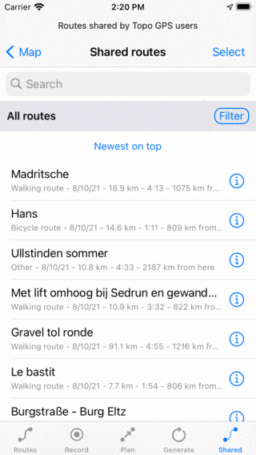
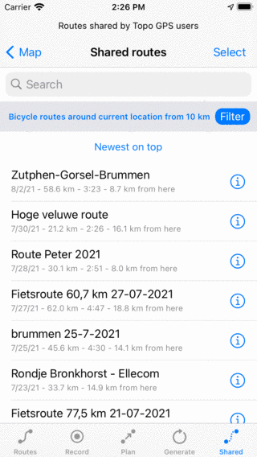
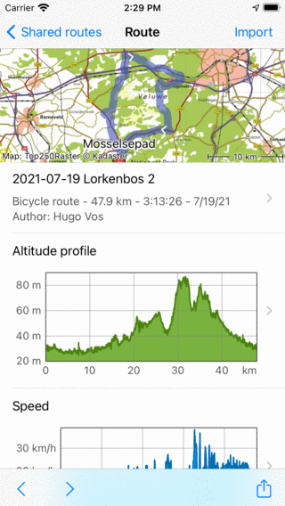

.. _sec-routes-import:

Importing routes
================

In this section it is explained how to :ref:`import a route from a geodata file <ss-routes-import-file>`,
:ref:`from an url <ss-routes-import-url>` and how to :ref:`import routes shared by Topo GPS users <ss-routes-import-shared>`.

.. _ss-routes-import-file:

Importing routes from geodata files
-----------------------------------
It is possible to import routes in Topo GPS in the following file formats: gpx, kml/kmz, and geojson.
Files of these types can also be imported if they are compressed in a zip file.

To import route you could try to tap on a file icon. Most often an app picker will show up. Sometimes you need to scroll through the list of apps or tap More to find 'Topo GPS'. You then  have to select 'Open with Topo GPS' or 'Copy to Topo GPS' and the file will be imported in Topo GPS. 

Alternatively you could open the 'Routes tab' of the :ref:`routes screen <sec-routes-screen>`. Then tap More > Import file. Then the files app will be opened. Here you can select a cloud storage, like iCloud, Dropbox, OneDrive or Google Drive. Then you can browse through your files and select the files you want to import.

If the routes were imported succesfully, you will return to the main screen, and the map will be zoomed to the imported routes. The imported routes will be saved on your device and can be found back in the 'Routes' tab of the :ref:`routes screen <sec-routes-screen>`.

How to import a geodata file from iMessage is explained in a :ref:`separate section <sec-imessage-import>`.

.. _ss-routes-import-url:

Importing route from url
------------------------
If you press long on an url to a geodata file you can copy it to your pasteboard. Then open the :ref:`routes screen <sec-routes-screen>` and select the tab 'Routes'. Tap 'More > Import URL' to open the URL import screen. Here you can paste your URL. Then tap 'Import' to import the URL.

If the routes were imported succesfully, you will return to the main screen, and the map will be zoomed to the imported routes. The imported routes will be saved on your device and can be found back in the 'Routes' tab of the :ref:`routes screen <sec-routes-screen>`.

.. _ss-routes-import-shared:

Importing routes shared by Topo GPS users
-----------------------------------------
To import a route :ref:`shared by other Topo GPS users <sec-routes-share-topo-gps>`, first open the :ref:`routes screen <sec-routes-screen>` and select the tab 'Shared'. The shared routes screen will be shown as in the example below:

   
   *The shared routes screen.*

The shared routes screen displays routes which are stored on the Topo GPS server and shared by other Topo GPS users. You can :ref:`search <ss-route-search-keywords>`, :ref:`filter <ss-route-filter>` and :ref:`sort <ss-route-sort>` these routes just like you can with your saved routes. Applying a filter can help you to find for example bicycle routes near your current location, as in the example below:

   
   *Searching bicycle routes of minimal 10 km length around your current location.*
   
If you tap a route title in the list it will be immediately imported and you will return to the main screen. You can tap long on an item or tap 'Select' on the top right to enter the selection mode. Then you can select multiple routes and import them at once.

If you tap the info button (i) next to a route the :ref:`route details <sec-route-details>` screen of a shared route will be opened. Sometimes it will take a few seconds before all route data is downloaded. An example is shown below.

   
   *The route details screen of a shared route.*

You can use the '<' (previous) and '>' (next) buttons in the bottom toolbar to browse through the list of shared routes. If you want to import a specific route you can tap the 'Import' button on the top right.
