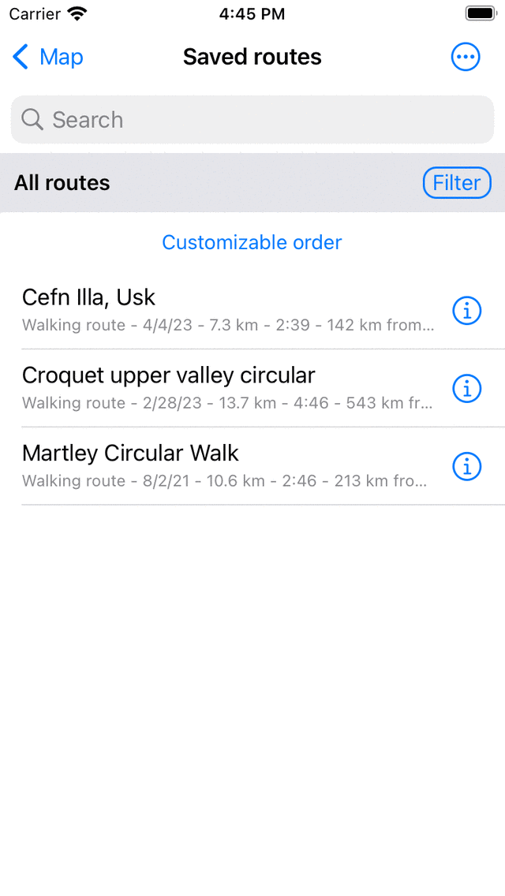
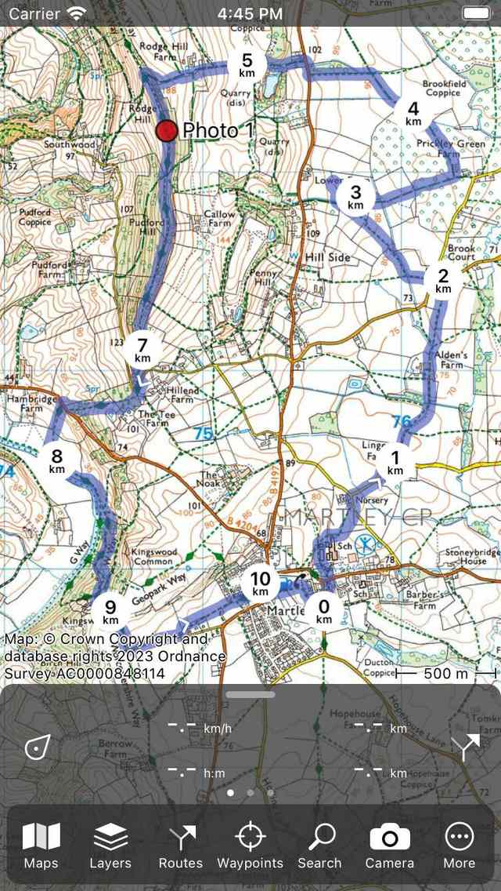
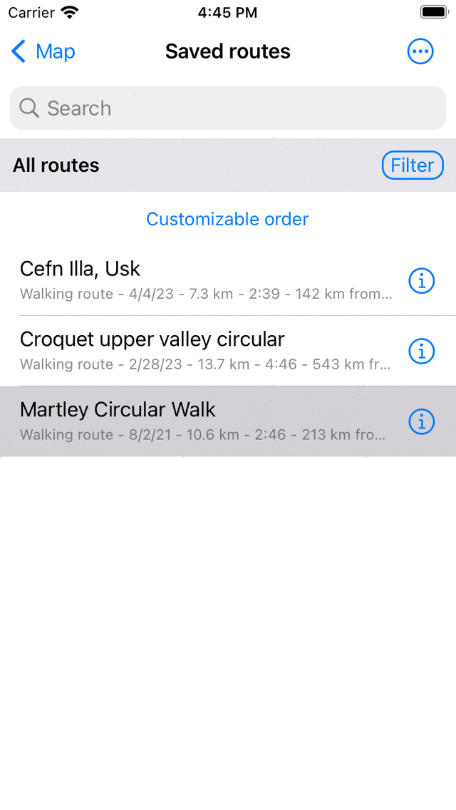

.. _sec-routes-load:

Loading routes
--------------
To load a route on the map, you first have to tap the :ref:`route button <ss-route-button>` on the dashboard or Menu > Routes to open the :ref:`routes pop-up <sec-routes-popup>`. Then tap the 'Saved routes' item to open the saved routes screen. The saved routes screen contains all routes that are locally saved on your device.

An example of the the routes screen is displayed below:

   *An example of the the 'Routes' tab in the routes screen.*

A list of routes appears in the routes screen. In the example above there are three: 
Lake District Walk, Midhurst Fields and Gower Hike.

Directly below the titles of the routes you can see the route type and the length of the route. If the route is recorded, the time is displayed as well. Also it is shown how far away the route is from your current location.

To load a route on the map, you have to tap the title of the preferred route. 

As an example we now will load the route ‘Gower Hike’. The result is shown in the figure below.

   *The route ‘Gower Hike’ has been loaded on the map.*

The map moves and zooms automatically so that the complete route is visible on the map. The blue line indicates the route. The white arrows on the blue line indicate the direction of the route. The circular distance markers on the route line indicate the distance on the route.

The 13.5 km on the top right of the :ref:`dashboard <sec-dashboard>` indicates the sum of the lengths of all routes that are currently loaded on the map. For this the symbol 'rte' is used.

If you want to see the route in more detail, you can :ref:`zoom in <ss-map-zoom>` on the map.

You can alter the color, width, and transparency of the route line in the :ref:`settings <sec-settings-styles>`.

If you open the :ref:`routes screen <sec-routes-screen>` again, you can see that the ‘Gower Hike’ route has obtained a gray background color, as in the example below:

   *In the route screen it can be seen that the route ‘Gower Hike' has been loaded on the map.*

A gray background color in the routes screen indicates that the route is currently loaded on the map.

It is also possible to load multiple routes on the map. This can be useful if you want to combine or compare different routes. If you tap another route in the routes screen it will be added to the map, just as the first loaded route. The route line color will be different from the first route. 

It is also possible to load multiple routes at once. For this :ref:`enable the selection screen <sec-routes-select>` in the routes tab, select the desired routes and tap the map icon in the bottom toolbar.

In the next section it is explained how to :ref:`remove a route from the map <sec-routes-unload>`.

