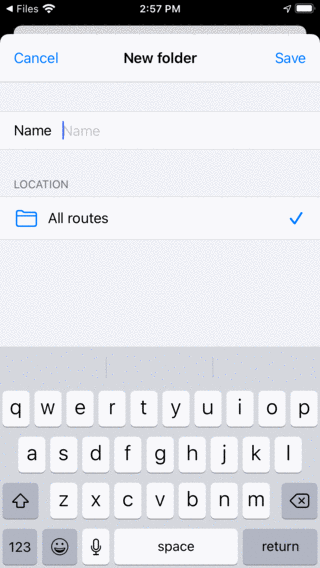
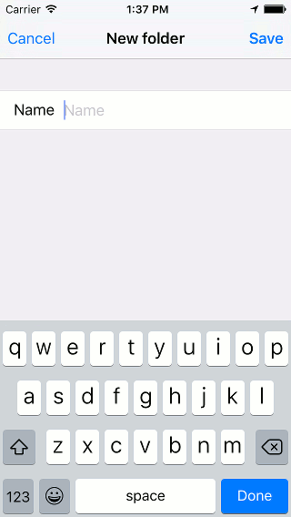
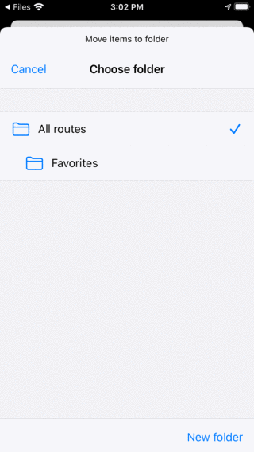
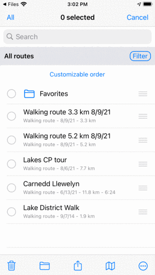
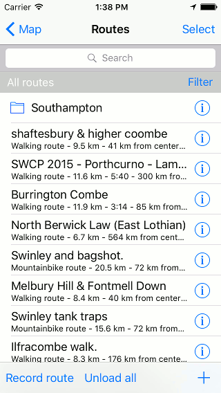
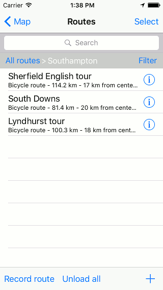

.. _sec-routes-organize:

Organizing routes
=================
You can keep your routes organized by :ref:`creating folders <ss-route-folder-create>` and :ref:`moving routes into folders <ss-route-folder-move>`.
It is also possible to :ref:`change the order of the routes <ss-route-folder-reorder>` appearing in the 'Routes' tab of the routes screen.

Organizing routes is similar to :ref:`organizing waypoints <ss-waypoints-organize>`. 

.. _ss-route-folder-create:

Creating a folder
~~~~~~~~~~~~~~~~~
To create a folder, first open the :ref:`routes screen <sec-route-screen>` and select the tab 'Routes' to show your saved routes.
Then press More (top right) > New Folder. The new folder screen will be opened, an example is shown below:

   
   *The new folder screen*
   
To create a folder, you have to enter a name. Optionally you can choose the location in the folder tree where the new folder is to be added. This is always initially set to the currently opened folder in the route screen. If you press location and select a folder you can change the location to another folder. When you have entered a name you need to press 'Save' to create a new folder. You will return to the routes screen and the newly created folder will be shown in the list.

As an example we will enter 'Favorites' and press 'Save' to create a 'Favorites' folder. The routes screen now looks as follows:

   
   *A 'Favorites' folder has been created.*
   
The 'Favorites' folder is listed in the routes screen with a folder icon.

.. _ss-route-folder-move:

Moving routes into folder
~~~~~~~~~~~~~~~~~~~~~~~~~~~~
To move routes into a folder you have to open the :ref:`selection screen <sec-routes-select>` by pressing More > Select or pressing long on an item in the routes screen. Select the to be moved routes and press the folder icon in the bottom toolbar. Then the 'Move items to folder' screen will be shown, example is shown below:

   
   *Move items to folder screen.*

In the 'Move items to folder' screen, the folder tree is shown. If you tap on a folder the selected items will be moved to that folder and you will return to the routes screen.

As an example we now will move the waypoints 'Gower Hike' and 'Midhurst Fields' to the 'Favorites' folder. After moving the two routes as indicated above the routes screen looks as follows:

   
   *The routes screen after moving two routes into the folder 'Favorites'.*

In the routes screen the routes 'Gower Hike' and 'Midhurst Fields' have disappeared. They now can be found in the folder 'Favorites'.

.. _ss-route-folder-open:

Opening a folder
~~~~~~~~~~~~~~~~
To open a folder, just tap the folder item in the routes screen. As an example we now open the folder 'Favorites'. The routes screen will then look as follows:

.. figure:: ../_static/route-folder5.png
   :height: 568px
   :width: 320px
   :alt: An opened folder Topo GPS
   
   *The contents of the 'Favorites' folder.*

The 'Gower Hike' and 'Midhurst Fields' routes now can be found in the 'Favorites' folder. 

Below the search bar you can see the current location in the folder tree. If you press 'All routes' you will return to the root folder.

.. _ss-route-folder-load:

Loading contents of folder
~~~~~~~~~~~~~~~~~~~~~~~~~~
To load all routes in a folder and its descendant folders, press long on a folder item in the routes screen to enter the selection mode and to select the folder. Then press the map icon in the bottom toolbar to load the contents of the folder on the map.

Alternatively tap the info button next to a folder in the routes screen. Then press 'Show on map' on the top right to load all routes on the map. You will return to the main map screen and the map will be zoomed to the contents of the folder. 

.. _ss-route-folder-unload:

Removing contents of folder from map
~~~~~~~~~~~~~~~~~~~~~~~~~~~~~~~~~~~~
To remove the routes in a folder and it descendant folders from the map,  press long on a folder item in the routes screen to enter the selection mode and to select the folder. Then tap in the bottom tool bar the more button and then tap 'Remove from map'.

Alternatively, first tap the info button next to a folder in the routes screen to open the folder details screen. Then press 'Remove from map' on the top right to remove all routes from the map. If 'Shown on map' is shown, first tap it to load all routes, then go back to the routes screen to open the folder details screen. Then press 'Remove from map' on the top right.

.. _ss-route-folder-rename:

Renaming folders
~~~~~~~~~~~~~~~~
To rename a folder first open the routes screen and tap the info button next to a folder item to open the folder details screen. Then tap 'Edit' in the bottom toolbar, change the name and press 'Save'.

.. _ss-route-folder-reorder:

Changing the order of routes 
~~~~~~~~~~~~~~~~~~~~~~~~~~~~
Just below the folder tree / filter bar in the 'Routes' tab of the routes screen the current sort method is displayed. If you tap the sort method you can change it. If it is set to 'Customizable order' you can determine the order of the routes.

To change the order of the routes in the 'Favorites' folder, just open that folder. Then press More > Select to enter the selection mode.
The routes screen then looks as follows:

   
   *The 'Favorites' folder in selection mode.*

On the right hand side of each item a handle with three bars is displayed. Drag such a handle to a desired position and release your finger. The route will then be moved in the list to the desired location. In the example below, we have moved 'Gower Hike' to the top.

   
   *The contents of the 'Favorites' folder after moving the 'Gower Hike' route.*
