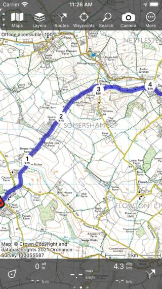

.. _sec-route-plan:

Planning routes
---------------
Planning a route is creating a route between several locations using a means of transportation. 
These locations are called route points in Topo GPS. 

The route planner can be opened by selecting the tab 'Plan' in the bottom of :ref:`routes screen <sec-routes-screen>` (Dashboard > :ref:`Route button <ss-route-button>` or :ref:`Menu <sec-menu>` > Routes). The following screen will appear:

.. figure:: ../_static/route-plan1.png
   :height: 568px
   :width: 320px
   :alt: Route plan screen Topo GPS
   
   *The route planner with no route planned.*

In the bottom of the screen you find an overlay with a search bar and several buttons which you can use to control the route planner.

To reset the route planner, you have to press 'More > Reset' in the planner overlay. The route points and the routes will then be removed.

To undo an action you have to press the ‘Undo’ button (circle with return arrow) in the planner. You can undo all actions in the planner until the
undo button becomes light blue.

To save a planned route, you have to press :ref:`'Save' <ss-route-plan-save>` button on the top right.

To zoom the map to your location, you can tap the position button in the bottom left of the overlay.

You can obtain more information about the route planner, by pressing 'Planner: Copyright', in the top left of the route planner screen.

Transportation means
~~~~~~~~~~~~~~~~~~~~
To plan a route, first check the transportations means in the bottom center. In the example above, it is set to 'Pedestrian'.
By tapping 'Pedestrian' a screen will appear in which you can change the transportation means to for example bicycling, car or as the crow flies.

If you plan a route as the crow flies or over a layer, you can do this without an internet connection. 
For the other ways of transportation an internet connection is required, because the routes are calculated externally. 

Adding route points
~~~~~~~~~~~~~~~~~~~
To plan a route you need to add route points. You can add route points in three ways:

- By entering an address or coordinates in the search bar.
- By pressing long on the map and dragging the icon to the desired location.
- By tapping waypoints, the position marker, or nodes from a node network.

Below we show several examples of planning routes.

Planning a route by entering the name of a location
~~~~~~~~~~~~~~~~~~~~~~~~~~~~~~~~~~~~~~~~~~~~~~~~~~~
If you tap the search bar in the route planner overlay a screen will appear in which you can enter the starting point
and the destination. An example is shown below:

.. figure:: ../_static/route-plan2.png
   :height: 568px
   :width: 320px
   :alt: Planning route to location Topo GPS
   
   *Screen in which you can enter a starting point and a destination.*
   
Your current location is automatically filled in as the starting point, you only need to enter the destination. If you wish to use another starting point just enter another location in the 'From:' field. As an example we now enter 'Sommersham' as our destination:

.. figure:: ../_static/route-plan3.png
   :height: 568px
   :width: 320px
   :alt: Planning route to location Topo GPS
   
   *Entered the destination 'Sommersham'.*
 
If you now tap 'Plan' on the top right or tap the location in the list of search results, you will return to the plan screen and a pedestrian route will be planned from your current location to 'Sommersham' as you can see in the example below:

.. figure:: ../_static/route-plan4.png
   :height: 568px
   :width: 320px
   :alt: Planning route to location Topo GPS
   
   *Planned a route from your current location to 'Sommersham'.*
   
In the route planner overlay the destination and origin of the planned route are shown as you can see in the figure above. If you tap them, they can be changed. 
Furthermore, the length of the route is shown. If you tap the length, the map will be zoomed to the planned route. Also the total ascent is displayed, if you tap it you can view a :ref:`height profile <sec-route-profiles>` of the planned route.

If you press 'Save' on the top right, you can :ref:`save the planned route <ss-route-plan-save>`.

If you do not want to save the route, you can press '< Map' on the top left to return to the :ref:`main screen <sec-main-screen>`.
The planned route will then also be visible on the map as in the example below:

   
   *The planned route is shown in the main screen.*

If you tap the route line of a planned route in the main screen, you will return to the route planner.

