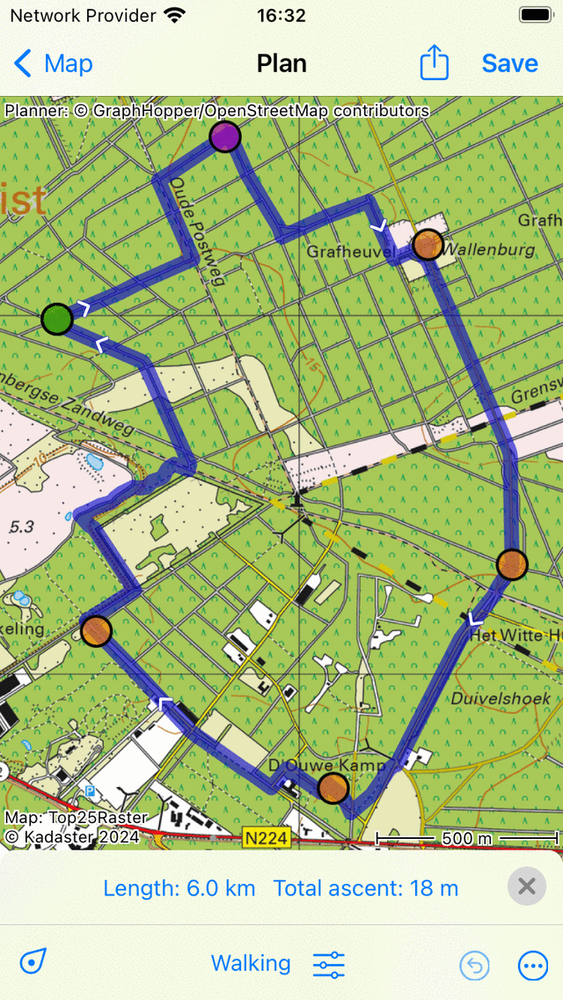

.. _sec-route-plan:

Planning routes
---------------
Planning route is creating a route between several locations using a means of transportation. 
These locations are called route points. 

The route planner can be opened by selecting the tab 'Plan' in the bottom of :ref:`routes screen <sec-routes-screen>` (Dashboard > :ref:`Route button <ss-route-button>` or :ref:`Menu <sec-menu>` > Routes). The following screen will appear:

.. figure:: ../_static/route-plan1.png
   :height: 568px
   :width: 320px
   :alt: Route plan screen Topo GPS
   
   *The route planner with no route planned.*

In the bottom of the screen you find an overlay with a search bar and several buttons with which you can use to control the route planner.

To reset the route planner, you have to press More > Reset in the planner overlay. The route points and the routes will then be removed.

To undo an action you have to press the ‘Undo’ button (circle with return arrow) in the planner. You can undo all actions in the planner until the
undo button becomes light blue.

To save a planned route, you have to press :ref:`'Save' <ss-route-plan-save>` button on the top right.

To zoom the map to your location, you can tap the position button in the bottom left of the overlay.

You can obtain more information about the route planner, by pressing 'Planner: Copyright', in the top left of the route planner screen.

Transportation means
~~~~~~~~~~~~~~~~~~~~
To plan a route, first check the transportations means in the bottom center. In the example above, it is set to 'Pedestrian'.
By tapping 'Pedestrian' a screen will appear in which you can change the transportation means to for example bicycling, car or as the crow flies.

If you plan a route as the crow flies or over a layer, you can do this without an internet connection. 
For the other ways of transportation an internet connection is required, because the routes are calculated externally. 

Adding route points
~~~~~~~~~~~~~~~~~~~
To plan a route you need to add route points. You can add route points in three ways:

- By entering an address or coordinates in the search bar.
- By pressing long on the map and dragging the icon to the desired location.
- By tapping waypoints, the position marker, or nodes from a node network.

Below we show several examples of planning routes.

Planning a route by entering the name of a location
~~~~~~~~~~~~~~~~~~~~~~~~~~~~~~~~~~~~~~~~~~~~~~~~~~~
If you tap the search bar in the route planner overlay a screen will appear in which you can enter the starting point
and the destination. An example is shown below:

   
   *Screen in which you can enter a starting point and a destination.*
   
Your current location is automatically filled in as the starting point, you only need to enter the destination. If you wish to use another starting point just enter another location in the 'From:' field. As an example we now enter 'Sommersham' as our destination:

.. figure:: ../_static/route-plan3.png
   :height: 568px
   :width: 320px
   :alt: Planning route to location Topo GPS
   
   *Entered the destination 'Sommersham'.*
 
If you now tap 'Plan' on the top right or tap the location in the list of search results, you will return to the plan screen and a pedestrian route will be planned from your current location to 'Sommersham' as you can see in the example below:

.. figure:: ../_static/route-plan4.png
   :height: 568px
   :width: 320px
   :alt: Planning route to location Topo GPS
   
   *Planned a route from your current location to 'Sommersham'.*
   
In the route planner overlay the destination and origin of the planned route are shown as you can see in the figure above. If you tap them, they can be changed. 
Furthermore, the length of the route is shown. If you tap the length, the map will be zoomed to the planned route. Also the total ascent is displayed, if you tap it you can view a :ref:`height profile <sec-route-profiles>` of the planned route.

If you press 'Save' on the top right, you can :ref:`save the planned route <ss-route-plan-save>`.

If you do not want to save the route, you can press '< Map' on the top left to return to the :ref:`main screen <sec-main-screen>`.
The planned route will then also be visible on the map as in the example below:

.. figure:: ../_static/route-plan5.png
   :height: 568px
   :width: 320px
   :alt: Planning route to location Topo GPS
   
   *The planned route is shown in the main screen.*

If you tap the route line of a planned route in the main screen, you will return to the route planner.

Adding route points manually
~~~~~~~~~~~~~~~~~~~~~~~~~~~~~~
If you press long on the map, a route point will appear. If you hold you finger on the map, you
can drag the route point to the desired position. If you then release your finger, the route point
will be positioned.
An example is displayed below:

.. figure:: _static/route-plan3.png
   :height: 568px
   :width: 320px
   :alt: Route planner Topo GPS add route point.
   
   *Figure 3. A route point is added to the map.*

The added route point is colored green. The green color indicates that the route point is selected.

You can add a second route point by pressing long on the map. This one will be colored blue and indicates a route point that is being added. A blue route point will always follow a green one as you can see in the figure below.

.. figure:: _static/route-plan4.png
   :height: 568px
   :width: 320px
   :alt: Route planner Topo GPS add route point

   *Figure 4. A second route point is added to the map.*

You now have to drag the blue route point to the desired position. If you
release your finger a route will be planned from the green to the blue route point
as you can see below:

.. figure:: _static/route-plan5.png
   :height: 568px
   :width: 320px
   :alt: Route planner Topo GPS add route point.

   *Figure 5. A route is planned between two route points.*

By planing a route the route points will be moved automatically to the closest road.

By releasing the blue route point, it will be selected automatically and colored green. The originally selected route point will be deselected and becomes orange.

The length of the planned route is indicated on the :ref:`route distance meter <subsec-routeafstand>` of the dashboard. In Fig. 5 the route has a length of 1.6 km.

To extend the route you have to add a new route point, by pressing
long on the map. An example is displayed below:

.. figure:: _static/route-plan6.png
   :height: 568px
   :width: 320px
   :alt: Route planner Topo GPS add route points.”

   *Figure 6. A route is planned via three route points.*

.. _ss-rsel:

Selecting route points
~~~~~~~~~~~~~~~~~~~~~~
You can select a route point by tapping it. The tapped route point will become green.
A route point that immediately follows a selected route point will be colored purple.
In this way you can always recover the direction of the route. All other
route points will be colored orange.

To move, insert, and remove route points, you need to select route points
as is explained below.

Moving route points
~~~~~~~~~~~~~~~~~~~
To move a route point, you first :ref:`select <ss-rsel>` the desired route point by
tapping on it. The route point will become green. Next, you press long on the
selected route point.  Hold your finger on the screen and drag the route point to the new position. An example is displayed below:

.. figure:: _static/route-plan7.png
   :height: 568px
   :width: 320px
   :alt: Route plan Topo GPS add route point."

   *Figure 7. Moving a route point.*

If you release the moved route point, the new route will be calculated automatically
as you can see in the figure below: 

.. figure:: _static/route-plan8.png
   :height: 480px
   :width: 320px
   :alt: Route plan Topo GPS move route point.

   *Figure 8. Newly planned route after moving a route point.*

.. _ss-rins:

Inserting route points
~~~~~~~~~~~~~~~~~~~~~~
To insert a route point in between two existing route points, you first have to
:ref:`select <ss-rsel>` the route point that lies just before the route point
that you intend to insert.

If the selected route point is not the last route point, you will 
see a purple route point. That is the route point that directly follows
the green route point. An inserted route point will be inserted between
the green and the purple point.

If you press long on the map, a blue route point will appear. If you
hold your finger on the map, you can drag this point to
the desired position. An example is displayed below:

.. figure:: _static/route-plan9.png
   :height: 568px
   :width: 320px
   :alt: Routeplanner Topo GPS routepunt invoegen.
  
   *Figure 9. A new route point (blue) will be inserted between the selected (green) and the following route point (purple).*

If you release you finger from the screen, the route between the green and
purple route point will now go via the inserted route point. This is illustrated in the figure below:
 
.. figure:: _static/route-plan10.png
   :height: 568px
   :width: 320px
   :alt: Routeplanner Topo GPS routepunt toevoegen.
 
   *Figure 10. The newly planned route goes via the inserted route point.*

If the new route has been computed, the inserted route point will be automatically selected
and colored green.

It is also possible to insert a routepoint on the current route. Press long on the route, a new blue route point will appear. If you move your finger around, the new route point will move along the route. If you release your finger, the route point will be inserted.

.. _ss-rrem:

Removing route points
~~~~~~~~~~~~~~~~~~~~~
To remove a route point, you first have to :ref:`select <ss-rsel>` the desired route point by tapping it.
Next, you press long on this route point, hold your finger on the screen and drag it to
the route planner window (top). You will see the route point disappears in the route plan window. An example is displayed below:

.. figure:: _static/route-plan11.png
   :height: 568px
   :width: 320px
   :alt: Routeplanner Topo GPS routepunt toevoegen.
  
   *Figure 11. Removing a route point by dragging it to the route planner window.*

If you have dragged the route point to the route plan window you can release it. The
route point will be removed and the route will be recalculated as you can see
below:

.. figure:: _static/route-plan12.png
   :height: 568px
   :width: 320px
   :alt: Routeplanner Topo GPS routepunt toevoegen.

   *Figure 12. The route after removing a route point.*

Alternatively you can drag a route point to the dashboard in order to remove it.

.. _ss-hp:

Current position as route point
~~~~~~~~~~~~~~~~~~~~~~~~~~~~~~~~
You can add a route point at your current location by
pressing the search box in the route planner window. Next,
you have to press ‘Current location’ in the ‘Address’ tab.

You can also add a route point at you current position by tapping
the :ref:`position marker <sec-posmarker>`, the marker that indicates your
position on the map.

.. _ss-route-plan-waypoint:

Waypoints as route points
~~~~~~~~~~~~~~~~~~~~~~~~~
You can use a :ref:`waypoint <sec-wp>` that is loaded on the map, as a route point
by tapping the waypoint.

Below you can see an example in which two waypoints are loaded
on the map.

.. figure:: _static/route-plan-wp1.png
   :height: 568px
   :width: 320px
   :alt: Waypoints Topo GPS map planning
    
   *Figure 13. Two waypoints are loaded on the map.*

If you tap subsequently on the position marker and the waypoints, a route will
be planned between these points as you can see in the following figure:

.. figure:: _static/route-plan-wp2.png
   :height: 568px
   :width: 320px
   :alt: Routeplanner Topo GPS routepunt toevoegen.

   *Figure 14. A route planned via your current position and two waypoints.*

.. _ss-route-plan-address:

Address as route point
~~~~~~~~~~~~~~~~~~~~~~
You can enter an address, location name or coordinate as route point
by pressing the search box in the route planner window.
A screen appears in which you can enter an address. 

As an example we now enter ’10 Downing St’ as you
can see in the figure below:

.. figure:: _static/route-plan-address1.png
   :height: 568px
   :width: 320px
   :alt: Route planner Topo GPS address.

   *Figure 15. Planning a route from 10 Downing Street.*

While entering an address results appear in the list below. If you press
on one of these results, you will return to the map and the search result
will be used as a route point, as you can see in the example below:

.. figure:: _static/route-plan-address2.png
   :height: 568px
   :width: 320px
   :alt: Route planner Topo GPS address.

   *Figure 16. A route is being planned from 10 Downing Street.*

To add the next route point you can press again the search box and
enter an address or location name. An example is displayed below:

.. figure:: _static/route-plan-address3.png
   :height: 568px
   :width: 320px
   :alt: Route planner Topo GPS address.

   *Figure 17. Adding a route point at Buckingham palace.*

If you press a search result, the result will be used as a route point
and you will return to the map. A route will now be computed between
the two route points as you can see in the figure below.

.. figure:: _static/route-plan-address4.png
   :height: 568px
   :width: 320px
   :alt: Route planner Topo GPS address.

   *Figure 18. A route has been planned from 10 Downing Street to Buckingham Palace.*

You can extend this route by adding new route points, either manually by pressing on the map, or
using the search box.

.. _ss-route-plan-save:

Saving planned routes
~~~~~~~~~~~~~~~~~~~~~
If you are ready planning your route, you can save the route by pressing 'Save' on the 
top right of the route planner window.
The following screen will appear:

.. figure:: _static/route-plan13.png
   :height: 568px
   :width: 320px
   :alt: Saving planned route Topo GPS.

   *Figure 19. Saving a planned route.*

In this screen you can subsequently enter the title, the author and a description. 

Based on the start and finish point of the route an automatic suggestion for the route title
will be made. This suggestion appears in the title field if you do not enter a title yourself.
If you do not enter a title, the suggestion will be used when saving the route. In the example above 
the suggestion is ‘Midhurst - Chichester’.

To ensure automatic title suggestion functions properly, the option :ref:`‘Addresses - Find automatically’ <settings-addresses>` should be enabled in the settings.

If you press the '>' on the right hand side of the title you can add an URL.

If you press the '>' on the right hand side of the title you can add contact information, 
and copyright and license details. If you save a route also the author and copyright details
will be saved for future use. If you record or plan a new route, the same author and copyright details
will already be filled in. Therefore you do not have to reenter these details when saving the
next planned route.

You can alter the route type by pressing the route type cell. If you save the route, the current
route type will be used as a suggestion for the next saved route. If you for example only plan bicycle routes
you therefore only have to set the route type once.

Waypoints that are currently shown on the map can be included with the
route by setting the switch 'Include waypoints' on. If you do not want to save the currently displayed waypoints with the route you have to turn this switch off.

If you are ready entering information, you can press 'Save' on the top right to save the planned route.
A planned route will always be saved as a new route. Existing routes will never be overwritten.

If the route has been saved, it will be removed from the planner and loaded on the map as a normal
route.

Be aware, the route will be saved into the folder that is currently opened in the :ref:`routes screen <ss-route-load>`.

If you do not want to save the route you can press 'Cancel' on the top left. In this case the planned route
will not be removed from the planner.

In the section :ref:`ss-routes-organize` it is explained how to move your route to another folder.

In the section :ref;`ss-routes-share` it is explained how you can share your planned route with
Topo GPS, mail, Facebook and other apps.

.. _ss-geplande_route_wijzig:

Editing saved routes
~~~~~~~~~~~~~~~~~~~~~~~~~~~~~~
You can alter the track of a saved route by :ref:`loading <ss-route-load>` the route into the route
planner via the :ref:`route button <subsec-route-button>` in the right hand side of the dashboard.

You can modify the route as you wish, in the same way as you plan a route and is described above.
If you save the modified route, it will be saved as a new route. The original route will not be
overwritten.

