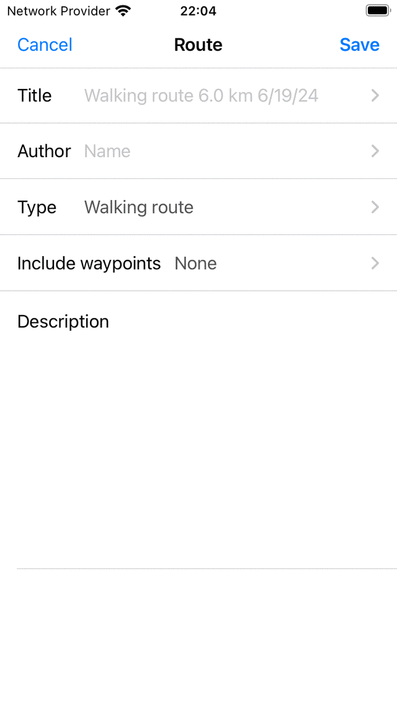

.. _sec-route-plan:

Planning routes
---------------
Planning a route is creating a route between two or more locations. These locations are called route points in Topo GPS. The route points have to be manually created by pressing long on the map. An alternative to route planning is :ref:`route generation <sec-route-generate>`. With route generation you do not have to create route points, but you only have to give a starting point and a desired length.

The route planner can be opened by first opening the :ref:`routes pop-pup <sec-routes-popup>` (Menu > Routes). Then tap the 'Plan a route' item. (In MacOS tap the 'Plan' mode selector on the top of the window, or Command-K'). An example of the route planner screen is shown below:

.. figure:: ../_static/route-plan1.png
   :height: 568px
   :width: 320px
   :alt: Route plan screen Topo GPS
   
   *The route planner with no route planned.*

In the route planner screen you can find an overlay. In this overlay the :ref:`transportation means button <ss-route-plan-transportation-means>` is displayed,
and there are several other buttons that you can use to control the route planner.

To zoom the map to your location, you can tap the position button in the bottom left of the overlay.

To undo an action you have to press the ‘Undo’ button (circle with return arrow) in the overlay. You can undo all actions in the planner until the undo button becomes light blue.

Next to the undo button, you find the more Button (circle with points, iOS only). If you tap the more button a menu will appear with the following options:

- *Change map*: You can change the map of the planner with this option.
- *Add route*: This can be used to join a saved route to the planned route, or to add a saved route to the map.
- *Search*: With this option you can create a route point by entering a location name.
- *Reset*: This will reset the route planner. The planned route and the route points will disappear.

If there is a route planned, a circle with a cross will appear on the overlay. If you press this button, you will reset the route planner. By tapping the undo button, you can undo a reset action.

To save a planned route, you have to press :ref:`'Save' <ss-route-plan-save>` button on the top right of the screen. 
To share the planned route, you can tap the export icon left of the save button.

In the Topo GPS settings you can modify the :ref:`style of the planned route line <ss-settings-lines>`.

You can obtain more information about the route planner, by pressing 'Planner: Copyright', in the top left of the route planner screen.

.. _ss-route-plan-transportation-means:

Transportation means
~~~~~~~~~~~~~~~~~~~~
To plan a route, first verify the current transportation means in the overlay. In the example above, it is set to 'Walking'.
By tapping 'Walking' a screen will appear in which you can change the transportation means to for example 'Bicycling', 'Car' or 'Crow fly (straight line)'.

On the right hand side of the transportation means button there is a settings icon. If you tap this icon you can fine tune the behavior of the transportation means. For example for 'Walking' you can enable or disable the following options: Prefer more scenic roads, prefer paved roads, prefer unpaved roads, avoid hills, avoid stairs, and avoid ferries. Depending on the settings the route will be optimized. Enabling any of these options could result in a longer route.

If you plan a route with the transportation means 'Crow fly' or using a layer, you can do this without an internet connection. For the other ways of transportation an internet connection is required, because the routes are calculated externally. 

Adding route points
~~~~~~~~~~~~~~~~~~~
To plan a route you need to add route points. You can add route points in three ways:

- By pressing long on the map and dragging the icon to the desired location. If you are using MacOS you can also put the pointer on the desired location and press Command-A.
- By entering a location in the search bar of the route planner overlay.
- By tapping waypoints, the position marker, or nodes from a node network.

If you have added at least two route points, a route will be computed between the two route points. Thereafter, you could add other route points.

Below several examples of planning routes are discussed.

.. toctree::
   :maxdepth: 2
   
   route_plan_search_bar
   route_plan_map
   route_plan_current_location
   route_plan_bicycle_node_network
   
.. _ss-route-plan-finish:

Finishing route planning
~~~~~~~~~~~~~~~~~~~~~~~~
If your are ready with planning a route, you can return to the main map by tapping '< Map' on the top left of the screen. The planned route will then be shown on the map in the main screen, but it will not be saved. If you tap a planned route in the main screen, you will return to the route planner.

.. _ss-route-plan-save:

Saving planned route
~~~~~~~~~~~~~~~~~~~~
If you want to save a planned route tap 'Save' in the top right of the route planner screen. A screen will appear in which you can enter the details of the route as is illustrated below:

   
   *Saving a planned route*

You can enter the title, author, route type, and description. You can also decide to include waypoints that are currently loaded on the map in the route. Then tap 'Save' to save the planned route. You will return to the :ref:`main screen <sec-main-screen>` and the map will be zoomed the planned route. 
