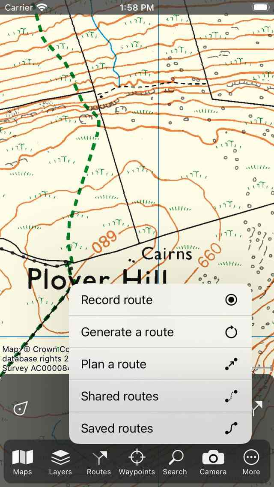

.. _sec-routes-popup:
 
Routes pop-up
=============
 
Routes can be created, imported and shown on the map via the routes pop-up. 
The routes pop-up can be opened by tapping the :ref:`route button <ss-route-button>` on the dashboad. 
This is the button in the bottom right of the :ref:`main screen <sec-main-screen>`. Alternatively you can open the routes pop-up by tapping :ref:`Menu <sec-menu>` > Routes.

   *The routes pop-up (Menu > Routes).*
   
The routes pop-up contains the following items:

- *Record route / Stop recording*: If you tap this item you can :ref:`start or stop recording a route <sec-route-record>`.
- *Generate a route*: If you tap this item you can :ref:`generate a route <sec-route-generate>`.
- *Plan a route*: If you tap this item you can :ref:`plan a route <sec-route-plan>`.
- *Shared routes*: If you tap this item you can find :ref:`routes shared by other Topo GPS users <ss-routes-import-shared>`. You can browse through these routes and import them on your device.
- *Saved routes*: If you tap this item, the routes screen is opened. This screen shows the routes that are stored on your device locally. Using this screen you can for example :ref:`load routes on the map <sec-routes-load>` and export your routes.

To quickly interact with the routes pop-up, press the the route button or Menu > Routes, then hold your finger on the screen and move it to the desired item in the pop-up. Then release your finger.
