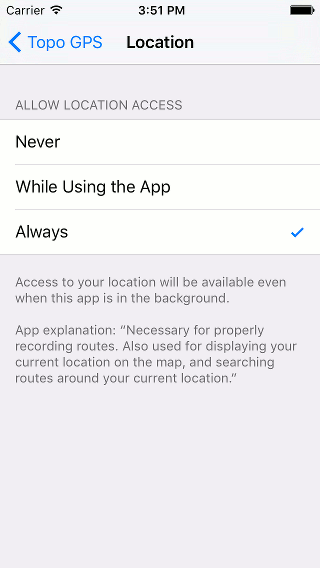

.. _sec-route-record:

Recording routes
----------------

By pressing the :ref:`record timer <subsec-klok>` on the :ref:`dashboard <sec-dashboard>`, you
can start and finish the recording of a route. You can also start a recording by pressing 'Record' in the :ref:`routes screen <ss-route-load>`.

If you are recording a route and you are moving, a red line will appear on the map. This
red line indicates your movement. An example is displayed in the figure below:

.. figure:: ../_static/route-record1.png
   :height: 568px
   :width: 320px
   :alt: Recording route Topo GPS

   *Recording a route. The red line indicates your movement.*

The :ref:`record clock <subsec-klok>` on the dashboard indicates the time you are recording.
In the figure above this is 0h17m.

The :ref:`route distance meter <subsec-opneemafstand>`  on the dashboard indicates
the length of a recorded route. In the example above this is 778 m.

You can modify the color, width and transparency of the record line in the 
:ref:`settings <ss-settings-lines>`.

While recording you can safely lock your device or switch to another app.
This will not interrupt the recording.

   *The iPhone/iPad setting > Topo GPS > Location should be set to ‘Always’ to ensure correct recording in the background.*

Warning: To ensure that a route is recorded properly it is very important to set the
iPhone/iPad setting > Topo GPS > location to ‘Always’ (Fig. 2). With this setting you give
Topo GPS the possibility to process your location if Topo GPS is running in the background. If this 
setting is incorrect you will be shown a warning when you start recording a route.

Showing a route while recording
~~~~~~~~~~~~~~~~~~~~~~~~~~~~~~~
If you have :ref:`loaded <ss-route-load>` one or more routes on the map, you
can record a route at the same time. An example is shown below:

.. figure:: ../_static/route-record3.png
   :height: 568px
   :width: 320px
   :alt: Recording route Topo GPS

   *Recording and showing a route.*

The blue line indicates the loaded route with a length of 1.9 km, the red line the recorded route
with a length of 778 m.

Finish recording
~~~~~~~~~~~~~~~~
To finish a recording you have to press the :ref:`record clock <subsec-klok>` on the dashboard.
Alternatively you can press 'Stop recording' in the bottom left 
of the :ref:`routes screen <ss-route-load>`. The following pop-up will then appear:

.. figure:: ../_static/route-record4.png
   :height: 568px
   :width: 320px
   :alt: Routes opnemen stoppen Topo GPS

   *Interrupting recording a route.*

If you press 'Stop' the recording will be finished. A screen that gives you the possibility to save
:ref:`save the recorded route <ss-record-save>` will appear.

Pause recording
~~~~~~~~~~~~~~~
If you press 'Pause' in the pop-up of Figure 4, the recording of a route
will be paused. Your movement will be no longer recorded.

The :ref:`record clock <subsec-klok>` will be set to --:--
during a pause, while the record distance meter will show
the recorded distance as you can see below:

.. figure:: ../_static/route-record5.png
   :height: 568px
   :width: 320px
   :alt: Route recording paused Topo GPS

   *Figure 5. The recording of a route is paused, which can be seen from the record clock and record distance meter.*

Restart recording
~~~~~~~~~~~~~~~~~
To restart a recording you have to press the :ref:`record clock <subsec-klok>` or
the ‘Restart recording’ button in the bottom of the :ref:`routes screen <ss-route-load>`. 
The following pop-up will then appear:

.. figure:: ../_static/route-record6.png
   :height: 568px
   :width: 320px
   :alt: Routes opnemen herstarten Topo GPS

   *Figure 6. Restarting the recording of a route.*

If you press 'Restart' the recording will be continued. If you press 'Stop'
the recording of a route will be finished and you will be
given the possibility to :ref:`save the recorded route <ss-record-save>`.

.. _ss-record-save:

Saving recorded route
~~~~~~~~~~~~~~~~~~~~~
If you have finished the recording of a route a screen will appear
in which you can save the recorded route. An example is displayed below:

.. figure:: ../_static/route-record7.png
   :height: 568px
   :width: 320px
   :alt: Opgenomen routes opslaan Topo GPS

   *Figure 7. Saving a recorded route.*

In this screen you can subsequently enter the title, the author and a description. 

Based on the start and finish point of the route an automatic suggestion for the route title
will be made. This suggestion appears in the title field if you do not enter a title yourself.
If you do not enter a title, the suggestion will be used when saving the route. In the example above 
the suggestion is ‘Seascale’.

To ensure automatic title suggestion functions properly, the option :ref:`‘Addresses - Find automatically’ <settings-addresses>` should
be enabled in the settings.

If you press the '>' on the right hand side of the title you can add an URL.

If you press the '>' on the right hand side of the title you can add contact information, 
and copyright and license details. If you save a route also the author and copyright details
will be saved for future use. If you record or plan a new route, the same author and copyright details
will already be filled in. Therefore you do not have to reenter these details when saving the
next recorded route.

You can alter the route type by pressing the route type cell. If you save the route, the current
route type will be used as a suggestion for the next saved route. If you for example only record bicycles routes
you therefore only have to set the route type once.

Waypoints that are currently shown on the map can be included with the
route by setting the switch 'Include waypoints' on. If you do not want to save the currently displayed waypoints with the route you have to turn this switch off.

If you are ready, you can press 'Save' on the top right to save the recorded route.
If you do not want to save the route you can press 'Cancel' on the top left.

Be aware, the route will be saved into the folder that is currently opened in the :ref:`routes screen <ss-route-load>`.

After you have saved the recorded route, a pop-up will appear that ask you if you
would like to share your route with Topo GPS, or with Twitter/Facebook (only if you have installed these apps).
If you choose Topo GPS you can share your route with other Topo GPS users, so that they can :ref:`import your recorded
route <ss-routes-import>`.  You can also choose ‘Cancel’.
It is also possible to :ref:`share the recorded route <ss-routes-share>` later.

The screen that appears is the :ref:`route details screen <ss-route-details>`. You can load the 
recorded route on the map by pressing ‘Load’ on the top right of this screen.

If you would like to load the saved recorded route on the map later, you have to press the :ref:`route button <subsec-route-button>`
on the :ref:`dashboard <sec-dashboard>`.
If you did not go to another folder, you will see the saved route on the top of the list. 
You can :ref:`load <ss-route-load>` your route by pressing the title.

In the section :ref:`organizing routes and waypoints <ss-routes-organize>` it is explained how to move your route to another folder.

